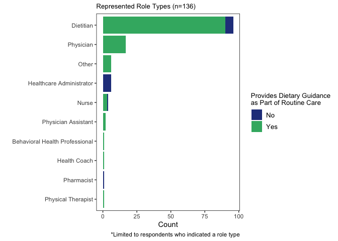
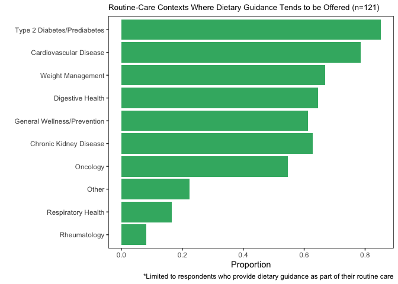
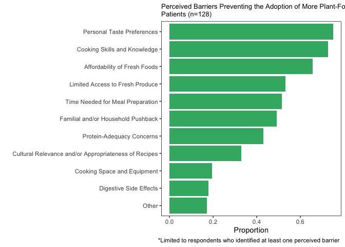
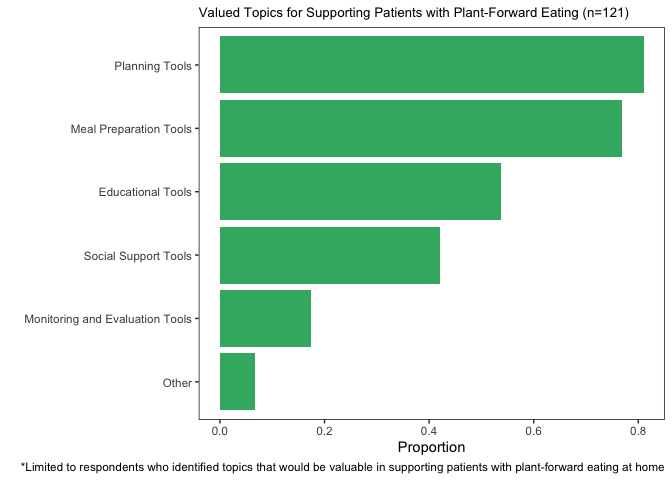
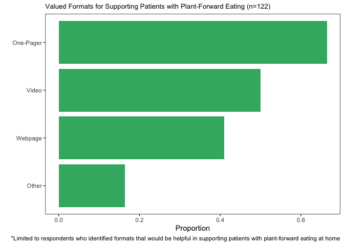
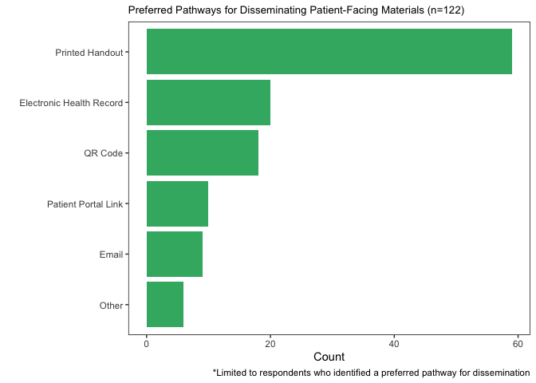
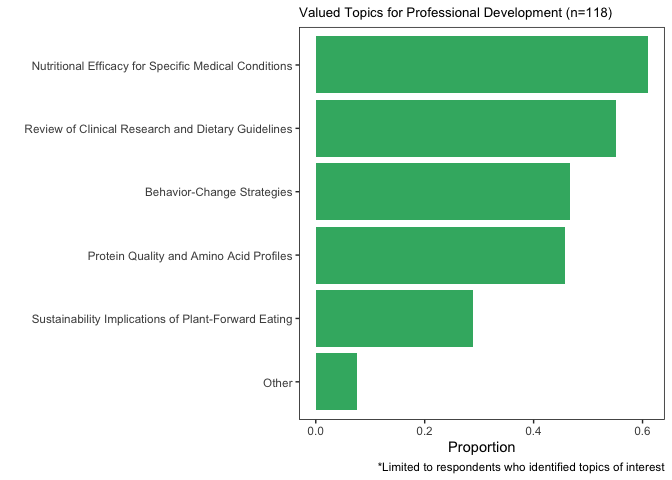

cleaning+analysis
================

## packages

``` r
library(tidyverse)
```

    ## ── Attaching core tidyverse packages ──────────────────────── tidyverse 2.0.0 ──
    ## ✔ dplyr     1.1.4     ✔ readr     2.1.5
    ## ✔ forcats   1.0.0     ✔ stringr   1.5.1
    ## ✔ ggplot2   3.5.1     ✔ tibble    3.2.1
    ## ✔ lubridate 1.9.3     ✔ tidyr     1.3.1
    ## ✔ purrr     1.0.2     
    ## ── Conflicts ────────────────────────────────────────── tidyverse_conflicts() ──
    ## ✖ dplyr::filter() masks stats::filter()
    ## ✖ dplyr::lag()    masks stats::lag()
    ## ℹ Use the conflicted package (<http://conflicted.r-lib.org/>) to force all conflicts to become errors

``` r
library(scales)
```

    ## 
    ## Attaching package: 'scales'
    ## 
    ## The following object is masked from 'package:purrr':
    ## 
    ##     discard
    ## 
    ## The following object is masked from 'package:readr':
    ## 
    ##     col_factor

``` r
library(ggpubr)
library(forcats)
```

## data

``` r
patient_education <- read.csv("/Users/kenjinchang/github/change-management-materials/data/closed-patient-education-survey.csv")
```

selecting VOIs, renaming variables, trimming non-response rows, adding
row IDs and count variables

``` r
patient_education <- patient_education %>%
  select(StartDate,Progress,SI1,SI1_23_TEXT,SI2,SI3,SI3_8_TEXT,SI4,SI4_10_TEXT,SI5_1,SI5_11,SI5_2,SI5_3,SI5_4,SI5_5,SI5_6,SI5_7,SI5_8,SI5_9,SI5_10,SI5_10_TEXT,SI6,SI7,SI7_5_TEXT,SI8,SI8_4_TEXT,SI9,SI9_5_TEXT,SI10,SI10_5_TEXT,SI11,SI12) %>%
  rename(date=StartDate,completion=Progress,role=SI1,role_other=SI1_23_TEXT,routine_care=SI2,care_context=SI3,care_context_other=SI3_8_TEXT,barriers=SI4,barriers_other=SI4_10_TEXT,cooking_ranking=SI5_1,equipment_ranking=SI5_11,affordability_ranking=SI5_2,protein_ranking=SI5_3,taste_ranking=SI5_4,household_ranking=SI5_5,cultural_ranking=SI5_6,time_ranking=SI5_7,access_ranking=SI5_8,digestion_ranking=SI5_9,other_ranking=SI5_10,other_ranking_text=SI5_10_TEXT,patient_concerns=SI6,supportive_topics=SI7,supportive_topics_other=SI7_5_TEXT,format=SI8,format_other=SI8_4_TEXT,dissemination=SI9,dissemination_other=SI9_5_TEXT,professional_development=SI10,professional_develpoment_other=SI10_5_TEXT,source_nutrition_materials=SI11,suggestions=SI12) %>%
  slice(3:n()) %>%
  mutate(id=row_number(),.before=date) %>%
  mutate(count=1,.before=date)
```

reviewing quality of incomplete forms to determine inclusion criteria

``` r
patient_education %>%
  filter(completion!="100")
```

    ##     id count                date completion                     role role_other
    ## 1  108     1 2026-02-02 10:13:03          7                                    
    ## 2  113     1 2026-02-02 12:23:59          7                                    
    ## 3  114     1 2026-02-02 12:25:16          7                                    
    ## 4  115     1 2026-02-02 12:26:30          7                                    
    ## 5  117     1 2026-02-02 12:52:43          7                                    
    ## 6  118     1 2026-02-02 13:56:28         27               Pharmacist           
    ## 7  119     1 2026-02-02 14:35:22         47 Healthcare Administrator           
    ## 8  120     1 2026-02-02 16:09:13          7                                    
    ## 9  126     1 2026-01-30 16:08:03         57                Dietitian           
    ## 10 128     1 2026-02-04 06:29:44          7                                    
    ## 11 129     1 2026-02-04 11:22:35          7                                    
    ## 12 130     1 2026-02-04 11:33:03         27 Healthcare Administrator           
    ## 13 131     1 2026-02-04 12:14:37          7                                    
    ## 14 133     1 2026-02-04 16:42:59         53                Dietitian           
    ## 15 134     1 2026-02-04 16:54:04         47                    Nurse           
    ## 16 136     1 2026-02-04 22:34:31         27                Physician           
    ## 17 138     1 2026-02-05 12:42:36         53 Healthcare Administrator           
    ## 18 139     1 2026-02-05 16:39:59         87                Dietitian           
    ## 19 140     1 2026-02-05 20:55:18         27                Dietitian           
    ## 20 141     1 2026-02-06 04:23:11          7                                    
    ## 21 142     1 2026-02-06 07:00:56         27                Dietitian           
    ## 22 143     1 2026-02-06 07:37:46         27                                    
    ## 23 144     1 2026-02-06 07:55:00          7                                    
    ## 24 145     1 2026-02-06 09:03:33          7                                    
    ## 25 146     1 2026-02-06 10:10:28          7                                    
    ## 26 147     1 2026-02-06 10:24:24          7                                    
    ## 27 148     1 2026-02-06 11:38:30         47                Dietitian           
    ## 28 149     1 2026-02-06 07:02:58         53                Dietitian           
    ## 29 150     1 2026-02-06 13:14:54          7                                    
    ## 30 151     1 2026-02-02 15:52:33          7                                    
    ## 31 152     1 2026-02-06 16:32:42         27                Dietitian           
    ## 32 153     1 2026-02-07 17:22:24          7                                    
    ## 33 154     1 2026-02-08 12:03:19         47                Dietitian           
    ## 34 155     1 2026-02-09 09:21:11          7                                    
    ##    routine_care
    ## 1              
    ## 2              
    ## 3              
    ## 4              
    ## 5              
    ## 6            No
    ## 7            No
    ## 8              
    ## 9           Yes
    ## 10             
    ## 11             
    ## 12           No
    ## 13             
    ## 14          Yes
    ## 15           No
    ## 16          Yes
    ## 17           No
    ## 18          Yes
    ## 19          Yes
    ## 20             
    ## 21           No
    ## 22             
    ## 23             
    ## 24             
    ## 25             
    ## 26             
    ## 27          Yes
    ## 28          Yes
    ## 29             
    ## 30             
    ## 31          Yes
    ## 32             
    ## 33          Yes
    ## 34             
    ##                                                                                                                                                   care_context
    ## 1                                                                                                                                                             
    ## 2                                                                                                                                                             
    ## 3                                                                                                                                                             
    ## 4                                                                                                                                                             
    ## 5                                                                                                                                                             
    ## 6                                                                                                                                  Type 2 Diabetes/Prediabetes
    ## 7                                                                                                                                                             
    ## 8                                                                                                                                                             
    ## 9                                                                                                                                  Type 2 Diabetes/Prediabetes
    ## 10                                                                                                                                                            
    ## 11                                                                                                                                                            
    ## 12                                                                                                                                      Other (Please Specify)
    ## 13                                                                                                                                                            
    ## 14                                                                                                 Cardiovascular Disease,Type 2 Diabetes/Prediabetes,Oncology
    ## 15                                                                                                                                      Other (Please Specify)
    ## 16                                      Cardiovascular Disease,Type 2 Diabetes/Prediabetes,Chronic Kidney Disease,Digestive Health,General Wellness/Prevention
    ## 17                                                                                                                                                            
    ## 18       Cardiovascular Disease,Type 2 Diabetes/Prediabetes,Weight Management,Chronic Kidney Disease,Oncology,Digestive Health,Rheumatology,Respiratory Health
    ## 19                                                                               Cardiovascular Disease,Type 2 Diabetes/Prediabetes,Weight Management,Oncology
    ## 20                                                                                                                                                            
    ## 21                                                                                                                                                            
    ## 22                                                                                                                                                            
    ## 23                                                                                                                                                            
    ## 24                                                                                                                                                            
    ## 25                                                                                                                                                            
    ## 26                                                                                                                                                            
    ## 27                                                                                                                                                            
    ## 28           Cardiovascular Disease,Type 2 Diabetes/Prediabetes,Weight Management,Chronic Kidney Disease,Oncology,Digestive Health,General Wellness/Prevention
    ## 29                                                                                                                                                            
    ## 30                                                                                                                                                            
    ## 31 Cardiovascular Disease,Type 2 Diabetes/Prediabetes,Weight Management,Chronic Kidney Disease,Digestive Health,Respiratory Health,General Wellness/Prevention
    ## 32                                                                                                                                                            
    ## 33                                                Cardiovascular Disease,Type 2 Diabetes/Prediabetes,Weight Management,Chronic Kidney Disease,Digestive Health
    ## 34                                                                                                                                                            
    ##                    care_context_other
    ## 1                                    
    ## 2                                    
    ## 3                                    
    ## 4                                    
    ## 5                                    
    ## 6                                    
    ## 7                                    
    ## 8                                    
    ## 9                                    
    ## 10                                   
    ## 11                                   
    ## 12 Availability in outpatient setting
    ## 13                                   
    ## 14                                   
    ## 15                               None
    ## 16                                   
    ## 17                                   
    ## 18                                   
    ## 19                                   
    ## 20                                   
    ## 21                                   
    ## 22                                   
    ## 23                                   
    ## 24                                   
    ## 25                                   
    ## 26                                   
    ## 27                                   
    ## 28                                   
    ## 29                                   
    ## 30                                   
    ## 31                                   
    ## 32                                   
    ## 33                                   
    ## 34                                   
    ##                                                                                                                                                                                                  barriers
    ## 1                                                                                                                                                                                                        
    ## 2                                                                                                                                                                                                        
    ## 3                                                                                                                                                                                                        
    ## 4                                                                                                                                                                                                        
    ## 5                                                                                                                                                                                                        
    ## 6                                                                                                                                                                                                        
    ## 7                                                                                                                                                                                                        
    ## 8                                                                                                                                                                                                        
    ## 9                                                                                                  Lack of cooking skills and/or knowledge,Affordability of healthy foods,Concerns about protein adequacy
    ## 10                                                                                                                                                                                                       
    ## 11                                                                                                                                                                                                       
    ## 12                                                                                                                                                                                                       
    ## 13                                                                                                                                                                                                       
    ## 14                                           Lack of cooking skills and/or knowledge,Concerns about protein adequacy,Personal taste preferences,Familial and/or household pushback,Digestive side effects
    ## 15                                                                                                                                                                             Personal taste preferences
    ## 16                                                                                                                                                                                                       
    ## 17                                  Lack of cooking skills and/or knowledge,Lack of tools, space, and/or equipment,Affordability of healthy foods,Limited access to fresh produce (i.e., food insecurity)
    ## 18                           Concerns about protein adequacy,Personal taste preferences,Familial and/or household pushback,Time needed for meal preparation,Digestive side effects,Other (Please Specify)
    ## 19                                                                                                                                                                                                       
    ## 20                                                                                                                                                                                                       
    ## 21                                                                                                                                                                                                       
    ## 22                                                                                                                                                                                                       
    ## 23                                                                                                                                                                                                       
    ## 24                                                                                                                                                                                                       
    ## 25                                                                                                                                                                                                       
    ## 26                                                                                                                                                                                                       
    ## 27                                                                                                                                                                                                       
    ## 28                                                                                                               Time needed for meal preparation,Limited access to fresh produce (i.e., food insecurity)
    ## 29                                                                                                                                                                                                       
    ## 30                                                                                                                                                                                                       
    ## 31                                                                                                                                                                                                       
    ## 32                                                                                                                                                                                                       
    ## 33 Affordability of healthy foods,Concerns about protein adequacy,Personal taste preferences,Cultural relevance and/or appropriateness of recipes,Limited access to fresh produce (i.e., food insecurity)
    ## 34                                                                                                                                                                                                       
    ##                                                        barriers_other
    ## 1                                                                    
    ## 2                                                                    
    ## 3                                                                    
    ## 4                                                                    
    ## 5                                                                    
    ## 6                                                                    
    ## 7                                                                    
    ## 8                                                                    
    ## 9                                                                    
    ## 10                                                                   
    ## 11                                                                   
    ## 12                                                                   
    ## 13                                                                   
    ## 14                                                                   
    ## 15                                                                   
    ## 16                                                                   
    ## 17                                                                   
    ## 18 Needing to depend on others after discharge or while on treatment 
    ## 19                                                                   
    ## 20                                                                   
    ## 21                                                                   
    ## 22                                                                   
    ## 23                                                                   
    ## 24                                                                   
    ## 25                                                                   
    ## 26                                                                   
    ## 27                                                                   
    ## 28                                                                   
    ## 29                                                                   
    ## 30                                                                   
    ## 31                                                                   
    ## 32                                                                   
    ## 33                                                                   
    ## 34                                                                   
    ##    cooking_ranking equipment_ranking affordability_ranking protein_ranking
    ## 1                                                                         
    ## 2                                                                         
    ## 3                                                                         
    ## 4                                                                         
    ## 5                                                                         
    ## 6                                                                         
    ## 7                                                                         
    ## 8                                                                         
    ## 9                2                                       3               1
    ## 10                                                                        
    ## 11                                                                        
    ## 12                                                                        
    ## 13                                                                        
    ## 14               2                                                       5
    ## 15                                                                        
    ## 16                                                                        
    ## 17               4                 3                     1                
    ## 18                                                                       1
    ## 19                                                                        
    ## 20                                                                        
    ## 21                                                                        
    ## 22                                                                        
    ## 23                                                                        
    ## 24                                                                        
    ## 25                                                                        
    ## 26                                                                        
    ## 27                                                                        
    ## 28                                                                        
    ## 29                                                                        
    ## 30                                                                        
    ## 31                                                                        
    ## 32                                                                        
    ## 33                                                       1               4
    ## 34                                                                        
    ##    taste_ranking household_ranking cultural_ranking time_ranking access_ranking
    ## 1                                                                              
    ## 2                                                                              
    ## 3                                                                              
    ## 4                                                                              
    ## 5                                                                              
    ## 6                                                                              
    ## 7                                                                              
    ## 8                                                                              
    ## 9                                                                              
    ## 10                                                                             
    ## 11                                                                             
    ## 12                                                                             
    ## 13                                                                             
    ## 14             1                 3                                             
    ## 15                                                                             
    ## 16                                                                             
    ## 17                                                                            2
    ## 18             2                 3                             4               
    ## 19                                                                             
    ## 20                                                                             
    ## 21                                                                             
    ## 22                                                                             
    ## 23                                                                             
    ## 24                                                                             
    ## 25                                                                             
    ## 26                                                                             
    ## 27                                                                             
    ## 28                                                                             
    ## 29                                                                             
    ## 30                                                                             
    ## 31                                                                             
    ## 32                                                                             
    ## 33             3                                  2                           5
    ## 34                                                                             
    ##    digestion_ranking other_ranking other_ranking_text
    ## 1                                                    
    ## 2                                                    
    ## 3                                                    
    ## 4                                                    
    ## 5                                                    
    ## 6                                                    
    ## 7                                                    
    ## 8                                                    
    ## 9                                                    
    ## 10                                                   
    ## 11                                                   
    ## 12                                                   
    ## 13                                                   
    ## 14                 4                                 
    ## 15                                                   
    ## 16                                                   
    ## 17                                                   
    ## 18                 5             6   4, 2, 5, 1, 3, 6
    ## 19                                                   
    ## 20                                                   
    ## 21                                                   
    ## 22                                                   
    ## 23                                                   
    ## 24                                                   
    ## 25                                                   
    ## 26                                                   
    ## 27                                                   
    ## 28                                                   
    ## 29                                                   
    ## 30                                                   
    ## 31                                                   
    ## 32                                                   
    ## 33                                                   
    ## 34                                                   
    ##                                                                                                patient_concerns
    ## 1                                                                                                              
    ## 2                                                                                                              
    ## 3                                                                                                              
    ## 4                                                                                                              
    ## 5                                                                                                              
    ## 6                                                                                                              
    ## 7                                                                                                              
    ## 8                                                                                                              
    ## 9                                                                                                              
    ## 10                                                                                                             
    ## 11                                                                                                             
    ## 12                                                                                                             
    ## 13                                                                                                             
    ## 14 Soy and its relation to breast cancer. It is too different from their normal for patients to take seriously 
    ## 15                                                                                                             
    ## 16                                                                                                             
    ## 17                                                                                                             
    ## 18                                                              Difficult to meet protein and vitamin B12 needs
    ## 19                                                                                                             
    ## 20                                                                                                             
    ## 21                                                                                                             
    ## 22                                                                                                             
    ## 23                                                                                                             
    ## 24                                                                                                             
    ## 25                                                                                                             
    ## 26                                                                                                             
    ## 27                                                                                                             
    ## 28                                                                                             adequate protein
    ## 29                                                                                                             
    ## 30                                                                                                             
    ## 31                                                                                                             
    ## 32                                                                                                             
    ## 33                                                                                                             
    ## 34                                                                                                             
    ##                                                                                                                                                                                                                                          supportive_topics
    ## 1                                                                                                                                                                                                                                                         
    ## 2                                                                                                                                                                                                                                                         
    ## 3                                                                                                                                                                                                                                                         
    ## 4                                                                                                                                                                                                                                                         
    ## 5                                                                                                                                                                                                                                                         
    ## 6                                                                                                                                                                                                                                                         
    ## 7                                                                                                                                                                                                                                                         
    ## 8                                                                                                                                                                                                                                                         
    ## 9                                                                                                                                                                                                                                                         
    ## 10                                                                                                                                                                                                                                                        
    ## 11                                                                                                                                                                                                                                                        
    ## 12                                                                                                                                                                                                                                                        
    ## 13                                                                                                                                                                                                                                                        
    ## 14                                                                                                                                                                                                                                                        
    ## 15                                                                                                                                                                                                                                                        
    ## 16                                                                                                                                                                                                                                                        
    ## 17                                                                                                                                                                                                                                                        
    ## 18 Planning Tools (e.g., example meal plans, grocery lists, substitution guides, etc.),Support with Meal Preparation (e.g., recipes, cooking demonstrations, etc.),Educational Tools (e.g., interactive nutrition modules, informational one-pagers, etc.)
    ## 19                                                                                                                                                                                                                                                        
    ## 20                                                                                                                                                                                                                                                        
    ## 21                                                                                                                                                                                                                                                        
    ## 22                                                                                                                                                                                                                                                        
    ## 23                                                                                                                                                                                                                                                        
    ## 24                                                                                                                                                                                                                                                        
    ## 25                                                                                                                                                                                                                                                        
    ## 26                                                                                                                                                                                                                                                        
    ## 27                                                                                                                                                                                                                                                        
    ## 28                                                                                                                                                                                                                                                        
    ## 29                                                                                                                                                                                                                                                        
    ## 30                                                                                                                                                                                                                                                        
    ## 31                                                                                                                                                                                                                                                        
    ## 32                                                                                                                                                                                                                                                        
    ## 33                                                                                                                                                                                                                                                        
    ## 34                                                                                                                                                                                                                                                        
    ##    supportive_topics_other          format format_other    dissemination
    ## 1                                                                       
    ## 2                                                                       
    ## 3                                                                       
    ## 4                                                                       
    ## 5                                                                       
    ## 6                                                                       
    ## 7                                                                       
    ## 8                                                                       
    ## 9                                                                       
    ## 10                                                                      
    ## 11                                                                      
    ## 12                                                                      
    ## 13                                                                      
    ## 14                                                                      
    ## 15                                                                      
    ## 16                                                                      
    ## 17                                                                      
    ## 18                         One-Pager/Brief              Printed Handouts
    ## 19                                                                      
    ## 20                                                                      
    ## 21                                                                      
    ## 22                                                                      
    ## 23                                                                      
    ## 24                                                                      
    ## 25                                                                      
    ## 26                                                                      
    ## 27                                                                      
    ## 28                                                                      
    ## 29                                                                      
    ## 30                                                                      
    ## 31                                                                      
    ## 32                                                                      
    ## 33                                                                      
    ## 34                                                                      
    ##    dissemination_other                             professional_development
    ## 1                                                                          
    ## 2                                                                          
    ## 3                                                                          
    ## 4                                                                          
    ## 5                                                                          
    ## 6                                                                          
    ## 7                                                                          
    ## 8                                                                          
    ## 9                                                                          
    ## 10                                                                         
    ## 11                                                                         
    ## 12                                                                         
    ## 13                                                                         
    ## 14                                                                         
    ## 15                                                                         
    ## 16                                                                         
    ## 17                                                                         
    ## 18                     Nutritional Efficacy for Specific Medical Conditions
    ## 19                                                                         
    ## 20                                                                         
    ## 21                                                                         
    ## 22                                                                         
    ## 23                                                                         
    ## 24                                                                         
    ## 25                                                                         
    ## 26                                                                         
    ## 27                                                                         
    ## 28                                                                         
    ## 29                                                                         
    ## 30                                                                         
    ## 31                                                                         
    ## 32                                                                         
    ## 33                                                                         
    ## 34                                                                         
    ##    professional_develpoment_other source_nutrition_materials suggestions
    ## 1                                                                       
    ## 2                                                                       
    ## 3                                                                       
    ## 4                                                                       
    ## 5                                                                       
    ## 6                                                                       
    ## 7                                                                       
    ## 8                                                                       
    ## 9                                                                       
    ## 10                                                                      
    ## 11                                                                      
    ## 12                                                                      
    ## 13                                                                      
    ## 14                                                                      
    ## 15                                                                      
    ## 16                                                                      
    ## 17                                                                      
    ## 18                                                                      
    ## 19                                                                      
    ## 20                                                                      
    ## 21                                                                      
    ## 22                                                                      
    ## 23                                                                      
    ## 24                                                                      
    ## 25                                                                      
    ## 26                                                                      
    ## 27                                                                      
    ## 28                                                                      
    ## 29                                                                      
    ## 30                                                                      
    ## 31                                                                      
    ## 32                                                                      
    ## 33                                                                      
    ## 34

taking a maximal approach to data collection by proceeding with
item-level response samples

``` r
patient_education %>% 
  select(count,role,routine_care) %>%
  filter(routine_care=="Yes"|routine_care=="No") %>%
  group_by(role) %>%
  summarise(total=sum(count)) %>%
  arrange(desc(total))
```

    ## # A tibble: 10 × 2
    ##    role                           total
    ##    <chr>                          <dbl>
    ##  1 Dietitian                         96
    ##  2 Physician                         17
    ##  3 Healthcare Administrator           6
    ##  4 Other (Please Specify)             6
    ##  5 Nurse                              4
    ##  6 Physician Assistant                2
    ##  7 Behavioral Health Professional     1
    ##  8 Health Coach                       1
    ##  9 Pharmacist                         1
    ## 10 Physical Therapist                 1

``` r
patient_education %>%
  select(role,role_other) %>%
  filter(role=="Other (Please Specify)")
```

    ##                     role                                   role_other
    ## 1 Other (Please Specify)                          Nurse practitioner 
    ## 2 Other (Please Specify) Wellness Manager, Doctorate in Public Health
    ## 3 Other (Please Specify)                        Clinical Nutritionist
    ## 4 Other (Please Specify)               Social Worker and Health Coach
    ## 5 Other (Please Specify)     Director for Food and Clinical Nutrition
    ## 6 Other (Please Specify)                            nutrition manager

``` r
patient_education %>%
  select(role) %>%
  filter(role!="")
```

    ##                               role
    ## 1               Physical Therapist
    ## 2         Healthcare Administrator
    ## 3                        Dietitian
    ## 4                        Physician
    ## 5                        Dietitian
    ## 6                            Nurse
    ## 7                        Physician
    ## 8                     Health Coach
    ## 9           Other (Please Specify)
    ## 10                           Nurse
    ## 11          Other (Please Specify)
    ## 12                       Physician
    ## 13                       Physician
    ## 14                       Physician
    ## 15                       Physician
    ## 16        Healthcare Administrator
    ## 17                       Dietitian
    ## 18  Behavioral Health Professional
    ## 19                       Dietitian
    ## 20             Physician Assistant
    ## 21                       Physician
    ## 22          Other (Please Specify)
    ## 23          Other (Please Specify)
    ## 24                       Physician
    ## 25                       Physician
    ## 26                       Dietitian
    ## 27        Healthcare Administrator
    ## 28                       Dietitian
    ## 29                       Physician
    ## 30                       Dietitian
    ## 31                       Dietitian
    ## 32          Other (Please Specify)
    ## 33                       Dietitian
    ## 34          Other (Please Specify)
    ## 35                       Dietitian
    ## 36                       Dietitian
    ## 37                       Dietitian
    ## 38                       Dietitian
    ## 39                       Dietitian
    ## 40                       Dietitian
    ## 41                       Dietitian
    ## 42                       Dietitian
    ## 43                       Dietitian
    ## 44                       Dietitian
    ## 45                       Dietitian
    ## 46                       Dietitian
    ## 47                       Dietitian
    ## 48                       Dietitian
    ## 49                       Dietitian
    ## 50                       Dietitian
    ## 51                       Dietitian
    ## 52                       Dietitian
    ## 53                       Dietitian
    ## 54                       Dietitian
    ## 55                       Dietitian
    ## 56                       Dietitian
    ## 57                       Dietitian
    ## 58                       Dietitian
    ## 59                       Dietitian
    ## 60                       Dietitian
    ## 61                       Dietitian
    ## 62                       Dietitian
    ## 63                       Dietitian
    ## 64                       Dietitian
    ## 65                       Dietitian
    ## 66                       Dietitian
    ## 67                       Dietitian
    ## 68                       Dietitian
    ## 69                       Dietitian
    ## 70             Physician Assistant
    ## 71                       Dietitian
    ## 72                       Dietitian
    ## 73                       Dietitian
    ## 74                       Dietitian
    ## 75                       Dietitian
    ## 76                       Dietitian
    ## 77                       Dietitian
    ## 78                       Dietitian
    ## 79                       Dietitian
    ## 80                       Dietitian
    ## 81                       Physician
    ## 82                       Dietitian
    ## 83                       Physician
    ## 84                       Dietitian
    ## 85                       Dietitian
    ## 86                       Dietitian
    ## 87                       Physician
    ## 88                       Dietitian
    ## 89                       Dietitian
    ## 90                           Nurse
    ## 91                       Dietitian
    ## 92                       Dietitian
    ## 93                       Dietitian
    ## 94                       Dietitian
    ## 95                       Dietitian
    ## 96                       Dietitian
    ## 97                       Dietitian
    ## 98                       Dietitian
    ## 99                       Dietitian
    ## 100                      Dietitian
    ## 101                      Dietitian
    ## 102                      Physician
    ## 103                      Dietitian
    ## 104                      Dietitian
    ## 105                      Dietitian
    ## 106                      Dietitian
    ## 107                      Dietitian
    ## 108                      Dietitian
    ## 109                      Dietitian
    ## 110                     Pharmacist
    ## 111       Healthcare Administrator
    ## 112                      Dietitian
    ## 113                      Dietitian
    ## 114                      Dietitian
    ## 115                      Dietitian
    ## 116                      Dietitian
    ## 117                      Dietitian
    ## 118                      Physician
    ## 119       Healthcare Administrator
    ## 120                      Dietitian
    ## 121                      Dietitian
    ## 122                          Nurse
    ## 123                      Dietitian
    ## 124                      Physician
    ## 125                      Dietitian
    ## 126       Healthcare Administrator
    ## 127                      Dietitian
    ## 128                      Dietitian
    ## 129                      Dietitian
    ## 130                      Dietitian
    ## 131                      Dietitian
    ## 132                      Dietitian
    ## 133                      Dietitian
    ## 134                      Dietitian
    ## 135                      Dietitian
    ## 136                      Physician

``` r
role_distribution <- patient_education %>% 
  select(count,role,routine_care) %>%
  filter(routine_care=="Yes"|routine_care=="No") %>%
  ggplot(aes(x=count,y=role,fill=routine_care)) +
  geom_col() + 
  scale_fill_manual(values=c("royalblue4","mediumseagreen"),name="Provides Dietary Guidance\nas Part of Routine Care") + 
  scale_y_discrete(limits=c("Physical Therapist","Pharmacist","Health Coach","Behavioral Health Professional","Physician Assistant","Nurse","Healthcare Administrator","Other (Please Specify)","Physician","Dietitian"),labels=c("Physical Therapist","Pharmacist","Health Coach","Behavioral Health Professional","Physician Assistant","Nurse","Healthcare Administrator","Other","Physician","Dietitian")) +
  xlab("Count") + 
  ylab("") + 
  labs(title="Represented Role Types (n=136)",caption="*Limited to respondents who indicated a role type") +
  theme(panel.grid=element_blank(),panel.background=element_rect(fill="white"),panel.border=element_rect(fill=NA),legend.title=element_text(size=10),legend.text=element_text(size=10),plot.title=element_text(size=10)) 
ggsave(filename="role_distribution.png",plot=role_distribution,path="/Users/kenjinchang/github/change-management-materials/figures",width=22,height=16,units="cm",dpi=150,limitsize=TRUE)
role_distribution
```

<!-- -->

``` r
patient_education %>%
  select(routine_care,care_context,care_context_other) 
```

    ##     routine_care
    ## 1               
    ## 2               
    ## 3            Yes
    ## 4             No
    ## 5            Yes
    ## 6            Yes
    ## 7            Yes
    ## 8            Yes
    ## 9            Yes
    ## 10           Yes
    ## 11           Yes
    ## 12           Yes
    ## 13           Yes
    ## 14           Yes
    ## 15           Yes
    ## 16           Yes
    ## 17           Yes
    ## 18            No
    ## 19           Yes
    ## 20           Yes
    ## 21           Yes
    ## 22           Yes
    ## 23           Yes
    ## 24           Yes
    ## 25           Yes
    ## 26           Yes
    ## 27           Yes
    ## 28           Yes
    ## 29            No
    ## 30           Yes
    ## 31           Yes
    ## 32           Yes
    ## 33           Yes
    ## 34           Yes
    ## 35           Yes
    ## 36           Yes
    ## 37           Yes
    ## 38           Yes
    ## 39           Yes
    ## 40           Yes
    ## 41           Yes
    ## 42           Yes
    ## 43           Yes
    ## 44           Yes
    ## 45           Yes
    ## 46           Yes
    ## 47           Yes
    ## 48           Yes
    ## 49           Yes
    ## 50           Yes
    ## 51           Yes
    ## 52           Yes
    ## 53           Yes
    ## 54           Yes
    ## 55           Yes
    ## 56           Yes
    ## 57           Yes
    ## 58           Yes
    ## 59           Yes
    ## 60           Yes
    ## 61           Yes
    ## 62           Yes
    ## 63           Yes
    ## 64           Yes
    ## 65           Yes
    ## 66           Yes
    ## 67           Yes
    ## 68           Yes
    ## 69           Yes
    ## 70           Yes
    ## 71           Yes
    ## 72           Yes
    ## 73            No
    ## 74           Yes
    ## 75           Yes
    ## 76            No
    ## 77            No
    ## 78           Yes
    ## 79           Yes
    ## 80           Yes
    ## 81           Yes
    ## 82           Yes
    ## 83           Yes
    ## 84           Yes
    ## 85           Yes
    ## 86              
    ## 87           Yes
    ## 88           Yes
    ## 89           Yes
    ## 90           Yes
    ## 91            No
    ## 92           Yes
    ## 93           Yes
    ## 94           Yes
    ## 95           Yes
    ## 96            No
    ## 97           Yes
    ## 98           Yes
    ## 99           Yes
    ## 100          Yes
    ## 101          Yes
    ## 102          Yes
    ## 103          Yes
    ## 104          Yes
    ## 105             
    ## 106          Yes
    ## 107          Yes
    ## 108             
    ## 109          Yes
    ## 110          Yes
    ## 111          Yes
    ## 112          Yes
    ## 113             
    ## 114             
    ## 115             
    ## 116          Yes
    ## 117             
    ## 118           No
    ## 119           No
    ## 120             
    ## 121          Yes
    ## 122          Yes
    ## 123          Yes
    ## 124          Yes
    ## 125          Yes
    ## 126          Yes
    ## 127          Yes
    ## 128             
    ## 129             
    ## 130           No
    ## 131             
    ## 132          Yes
    ## 133          Yes
    ## 134           No
    ## 135          Yes
    ## 136          Yes
    ## 137          Yes
    ## 138           No
    ## 139          Yes
    ## 140          Yes
    ## 141             
    ## 142           No
    ## 143             
    ## 144             
    ## 145             
    ## 146             
    ## 147             
    ## 148          Yes
    ## 149          Yes
    ## 150             
    ## 151             
    ## 152          Yes
    ## 153             
    ## 154          Yes
    ## 155             
    ## 156          Yes
    ## 157          Yes
    ## 158          Yes
    ##                                                                                                                                                                                    care_context
    ## 1                                                                                                                                                                                              
    ## 2                                                                                                                                                                                              
    ## 3                                                                                                                                                                             Weight Management
    ## 4                                                                                                                                                                                              
    ## 5                      Cardiovascular Disease,Type 2 Diabetes/Prediabetes,Weight Management,Chronic Kidney Disease,Oncology,Digestive Health,General Wellness/Prevention,Other (Please Specify)
    ## 6                                                      Cardiovascular Disease,Type 2 Diabetes/Prediabetes,Weight Management,Chronic Kidney Disease,Digestive Health,General Wellness/Prevention
    ## 7                                                                                                                          Weight Management,General Wellness/Prevention,Other (Please Specify)
    ## 8                                                                                                                          Cardiovascular Disease,Type 2 Diabetes/Prediabetes,Weight Management
    ## 9                                                                Cardiovascular Disease,Type 2 Diabetes/Prediabetes,Weight Management,Digestive Health,Rheumatology,General Wellness/Prevention
    ## 10                                                                                                                    Type 2 Diabetes/Prediabetes,Weight Management,General Wellness/Prevention
    ## 11                                                                                               Weight Management,Oncology,Digestive Health,General Wellness/Prevention,Other (Please Specify)
    ## 12                                                                                                                                           Cardiovascular Disease,General Wellness/Prevention
    ## 13                                                                                                                                                                  General Wellness/Prevention
    ## 14                               Cardiovascular Disease,Type 2 Diabetes/Prediabetes,Weight Management,Chronic Kidney Disease,Oncology,Digestive Health,Rheumatology,General Wellness/Prevention
    ## 15                                                                                                  Cardiovascular Disease,Type 2 Diabetes/Prediabetes,Weight Management,Chronic Kidney Disease
    ## 16                                                                            Cardiovascular Disease,Type 2 Diabetes/Prediabetes,Weight Management,Digestive Health,General Wellness/Prevention
    ## 17                                                                                                                         Cardiovascular Disease,Type 2 Diabetes/Prediabetes,Weight Management
    ## 18                                                                                                                                                                       Other (Please Specify)
    ## 19                                                                                             Cardiovascular Disease,Type 2 Diabetes/Prediabetes,Weight Management,General Wellness/Prevention
    ## 20                                                                                             Cardiovascular Disease,Type 2 Diabetes/Prediabetes,Weight Management,General Wellness/Prevention
    ## 21                                                                                 Cardiovascular Disease,Type 2 Diabetes/Prediabetes,Weight Management,Chronic Kidney Disease,Digestive Health
    ## 22                                                                                                                                                                                     Oncology
    ## 23                                                                                                                                                                       Other (Please Specify)
    ## 24                                                     Cardiovascular Disease,Type 2 Diabetes/Prediabetes,Weight Management,Digestive Health,General Wellness/Prevention,Other (Please Specify)
    ## 25                                                                            Type 2 Diabetes/Prediabetes,Weight Management,Digestive Health,General Wellness/Prevention,Other (Please Specify)
    ## 26                                                      Cardiovascular Disease,Type 2 Diabetes/Prediabetes,Weight Management,Oncology,Digestive Health,Rheumatology,General Wellness/Prevention
    ## 27                                                                                                                                           General Wellness/Prevention,Other (Please Specify)
    ## 28                                            Cardiovascular Disease,Type 2 Diabetes/Prediabetes,Weight Management,Chronic Kidney Disease,Oncology,Digestive Health,General Wellness/Prevention
    ## 29                                                                                                                                                                                             
    ## 30                                                                        Cardiovascular Disease,Type 2 Diabetes/Prediabetes,Weight Management,Chronic Kidney Disease,Oncology,Digestive Health
    ## 31                                                     Cardiovascular Disease,Type 2 Diabetes/Prediabetes,Weight Management,Chronic Kidney Disease,Digestive Health,General Wellness/Prevention
    ## 32            Cardiovascular Disease,Type 2 Diabetes/Prediabetes,Weight Management,Chronic Kidney Disease,Oncology,Digestive Health,Rheumatology,Respiratory Health,General Wellness/Prevention
    ## 33                                                                                         Cardiovascular Disease,Type 2 Diabetes/Prediabetes,Weight Management,Chronic Kidney Disease,Oncology
    ## 34                                                                                                                                                                       Other (Please Specify)
    ## 35                     Cardiovascular Disease,Type 2 Diabetes/Prediabetes,Weight Management,Chronic Kidney Disease,Oncology,Digestive Health,General Wellness/Prevention,Other (Please Specify)
    ## 36                                                                                                                          Type 2 Diabetes/Prediabetes,Chronic Kidney Disease,Digestive Health
    ## 37                                                                                                   Cardiovascular Disease,Type 2 Diabetes/Prediabetes,Chronic Kidney Disease,Digestive Health
    ## 38            Cardiovascular Disease,Type 2 Diabetes/Prediabetes,Weight Management,Chronic Kidney Disease,Oncology,Digestive Health,Rheumatology,Respiratory Health,General Wellness/Prevention
    ## 39                                                     Cardiovascular Disease,Type 2 Diabetes/Prediabetes,Weight Management,Chronic Kidney Disease,Digestive Health,General Wellness/Prevention
    ## 40                                                                        Cardiovascular Disease,Type 2 Diabetes/Prediabetes,Weight Management,Chronic Kidney Disease,Oncology,Digestive Health
    ## 41                                            Cardiovascular Disease,Type 2 Diabetes/Prediabetes,Weight Management,Chronic Kidney Disease,Oncology,Digestive Health,General Wellness/Prevention
    ## 42                                                                                                               Type 2 Diabetes/Prediabetes,Chronic Kidney Disease,Oncology,Respiratory Health
    ## 43                                            Cardiovascular Disease,Type 2 Diabetes/Prediabetes,Weight Management,Chronic Kidney Disease,Oncology,Digestive Health,General Wellness/Prevention
    ## 44  Cardiovascular Disease,Type 2 Diabetes/Prediabetes,Weight Management,Chronic Kidney Disease,Oncology,Digestive Health,Respiratory Health,General Wellness/Prevention,Other (Please Specify)
    ## 45                                                                   Cardiovascular Disease,Type 2 Diabetes/Prediabetes,Chronic Kidney Disease,Oncology,Digestive Health,Other (Please Specify)
    ## 46                                                                                                           Cardiovascular Disease,Type 2 Diabetes/Prediabetes,Chronic Kidney Disease,Oncology
    ## 47                                            Cardiovascular Disease,Type 2 Diabetes/Prediabetes,Weight Management,Chronic Kidney Disease,Oncology,Digestive Health,General Wellness/Prevention
    ## 48                                                                               Cardiovascular Disease,Type 2 Diabetes/Prediabetes,Chronic Kidney Disease,Oncology,General Wellness/Prevention
    ## 49                                                                                                                    Cardiovascular Disease,Type 2 Diabetes/Prediabetes,Chronic Kidney Disease
    ## 50                         Cardiovascular Disease,Type 2 Diabetes/Prediabetes,Weight Management,Chronic Kidney Disease,Oncology,Digestive Health,Respiratory Health,General Wellness/Prevention
    ## 51                                                                                                   Cardiovascular Disease,Type 2 Diabetes/Prediabetes,Chronic Kidney Disease,Digestive Health
    ## 52                                                                      Cardiovascular Disease,Type 2 Diabetes/Prediabetes,Weight Management,General Wellness/Prevention,Other (Please Specify)
    ## 53                                                     Cardiovascular Disease,Type 2 Diabetes/Prediabetes,Weight Management,Digestive Health,General Wellness/Prevention,Other (Please Specify)
    ## 54                                            Cardiovascular Disease,Type 2 Diabetes/Prediabetes,Weight Management,Chronic Kidney Disease,Oncology,Digestive Health,General Wellness/Prevention
    ## 55                                            Cardiovascular Disease,Type 2 Diabetes/Prediabetes,Weight Management,Chronic Kidney Disease,Oncology,Digestive Health,General Wellness/Prevention
    ## 56                                                                   Cardiovascular Disease,Type 2 Diabetes/Prediabetes,Chronic Kidney Disease,Oncology,Digestive Health,Other (Please Specify)
    ## 57                         Cardiovascular Disease,Type 2 Diabetes/Prediabetes,Weight Management,Chronic Kidney Disease,Oncology,Digestive Health,Respiratory Health,General Wellness/Prevention
    ## 58                                            Cardiovascular Disease,Type 2 Diabetes/Prediabetes,Weight Management,Chronic Kidney Disease,Oncology,Digestive Health,General Wellness/Prevention
    ## 59                                                                                                                                                                                     Oncology
    ## 60                         Cardiovascular Disease,Type 2 Diabetes/Prediabetes,Weight Management,Chronic Kidney Disease,Oncology,Digestive Health,Respiratory Health,General Wellness/Prevention
    ## 61                                            Cardiovascular Disease,Type 2 Diabetes/Prediabetes,Weight Management,Chronic Kidney Disease,Oncology,Digestive Health,General Wellness/Prevention
    ## 62            Cardiovascular Disease,Type 2 Diabetes/Prediabetes,Weight Management,Chronic Kidney Disease,Oncology,Digestive Health,Rheumatology,Respiratory Health,General Wellness/Prevention
    ## 63                                            Cardiovascular Disease,Type 2 Diabetes/Prediabetes,Weight Management,Chronic Kidney Disease,Oncology,Digestive Health,General Wellness/Prevention
    ## 64                                                                                                                                                              Oncology,Other (Please Specify)
    ## 65                                                                                          Cardiovascular Disease,Type 2 Diabetes/Prediabetes,Chronic Kidney Disease,Oncology,Digestive Health
    ## 66                                                                                                                                                                  Type 2 Diabetes/Prediabetes
    ## 67                                                                                          Cardiovascular Disease,Type 2 Diabetes/Prediabetes,Chronic Kidney Disease,Oncology,Digestive Health
    ## 68                                                                                 Cardiovascular Disease,Type 2 Diabetes/Prediabetes,Weight Management,Chronic Kidney Disease,Digestive Health
    ## 69                                                                                                   Cardiovascular Disease,Type 2 Diabetes/Prediabetes,Chronic Kidney Disease,Digestive Health
    ## 70                                                                                           Type 2 Diabetes/Prediabetes,Weight Management,Digestive Health,Rheumatology,Other (Please Specify)
    ## 71                                            Cardiovascular Disease,Type 2 Diabetes/Prediabetes,Weight Management,Chronic Kidney Disease,Oncology,Digestive Health,General Wellness/Prevention
    ## 72                                                                                              Cardiovascular Disease,Type 2 Diabetes/Prediabetes,Digestive Health,General Wellness/Prevention
    ## 73                                                                                                                                                                  General Wellness/Prevention
    ## 74                                                     Cardiovascular Disease,Type 2 Diabetes/Prediabetes,Weight Management,Chronic Kidney Disease,Digestive Health,General Wellness/Prevention
    ## 75                                                                   Cardiovascular Disease,Type 2 Diabetes/Prediabetes,Weight Management,Oncology,Digestive Health,General Wellness/Prevention
    ## 76                                                                                                                                                                  General Wellness/Prevention
    ## 77                                                                                                                                                                  Type 2 Diabetes/Prediabetes
    ## 78                                            Cardiovascular Disease,Type 2 Diabetes/Prediabetes,Weight Management,Chronic Kidney Disease,Oncology,Digestive Health,General Wellness/Prevention
    ## 79                                                                                 Cardiovascular Disease,Type 2 Diabetes/Prediabetes,Weight Management,Chronic Kidney Disease,Digestive Health
    ## 80                         Cardiovascular Disease,Type 2 Diabetes/Prediabetes,Weight Management,Chronic Kidney Disease,Oncology,Digestive Health,Respiratory Health,General Wellness/Prevention
    ## 81                                                                                                        Cardiovascular Disease,Weight Management,Digestive Health,General Wellness/Prevention
    ## 82                                                                                                                                                                  Type 2 Diabetes/Prediabetes
    ## 83                                  Cardiovascular Disease,Type 2 Diabetes/Prediabetes,Weight Management,Chronic Kidney Disease,Digestive Health,Respiratory Health,General Wellness/Prevention
    ## 84                    Cardiovascular Disease,Type 2 Diabetes/Prediabetes,Chronic Kidney Disease,Oncology,Digestive Health,Respiratory Health,General Wellness/Prevention,Other (Please Specify)
    ## 85                                                                                                                                                                       Other (Please Specify)
    ## 86                                                                                                                                                                  Type 2 Diabetes/Prediabetes
    ## 87                                                                                                                                                                       Other (Please Specify)
    ## 88                     Cardiovascular Disease,Type 2 Diabetes/Prediabetes,Weight Management,Chronic Kidney Disease,Oncology,Digestive Health,General Wellness/Prevention,Other (Please Specify)
    ## 89                                                                                                   Type 2 Diabetes/Prediabetes,Weight Management,Digestive Health,General Wellness/Prevention
    ## 90                                                                        Cardiovascular Disease,Type 2 Diabetes/Prediabetes,Weight Management,Chronic Kidney Disease,Oncology,Digestive Health
    ## 91                                                                                                                                                                                             
    ## 92                                                                                                                                                Weight Management,General Wellness/Prevention
    ## 93                                                                                             Cardiovascular Disease,Type 2 Diabetes/Prediabetes,Weight Management,General Wellness/Prevention
    ## 94                                            Cardiovascular Disease,Type 2 Diabetes/Prediabetes,Weight Management,Chronic Kidney Disease,Oncology,Digestive Health,General Wellness/Prevention
    ## 95                                                                                    Cardiovascular Disease,Type 2 Diabetes/Prediabetes,Weight Management,Oncology,General Wellness/Prevention
    ## 96                                                                                                                                                                       Other (Please Specify)
    ## 97                                                                                                  Cardiovascular Disease,Type 2 Diabetes/Prediabetes,Weight Management,Chronic Kidney Disease
    ## 98            Cardiovascular Disease,Type 2 Diabetes/Prediabetes,Weight Management,Chronic Kidney Disease,Oncology,Digestive Health,Rheumatology,Respiratory Health,General Wellness/Prevention
    ## 99  Cardiovascular Disease,Type 2 Diabetes/Prediabetes,Weight Management,Chronic Kidney Disease,Oncology,Digestive Health,Respiratory Health,General Wellness/Prevention,Other (Please Specify)
    ## 100                                                                                        Cardiovascular Disease,Type 2 Diabetes/Prediabetes,Weight Management,Chronic Kidney Disease,Oncology
    ## 101                                                                                                                                                                                    Oncology
    ## 102                        Cardiovascular Disease,Type 2 Diabetes/Prediabetes,Weight Management,Chronic Kidney Disease,Oncology,Digestive Health,Respiratory Health,General Wellness/Prevention
    ## 103                                           Cardiovascular Disease,Type 2 Diabetes/Prediabetes,Weight Management,Chronic Kidney Disease,Oncology,Digestive Health,General Wellness/Prevention
    ## 104                                                                                                                                          General Wellness/Prevention,Other (Please Specify)
    ## 105                                                                                                                                                                                            
    ## 106                                                                     Cardiovascular Disease,Type 2 Diabetes/Prediabetes,Weight Management,Chronic Kidney Disease,General Wellness/Prevention
    ## 107                                                                                                          Cardiovascular Disease,Type 2 Diabetes/Prediabetes,Oncology,Other (Please Specify)
    ## 108                                                                                                                                                                                            
    ## 109                                           Cardiovascular Disease,Type 2 Diabetes/Prediabetes,Weight Management,Chronic Kidney Disease,Oncology,Digestive Health,General Wellness/Prevention
    ## 110       Cardiovascular Disease,Type 2 Diabetes/Prediabetes,Weight Management,Chronic Kidney Disease,Oncology,Digestive Health,Rheumatology,General Wellness/Prevention,Other (Please Specify)
    ## 111                                           Cardiovascular Disease,Type 2 Diabetes/Prediabetes,Weight Management,Chronic Kidney Disease,Oncology,Digestive Health,General Wellness/Prevention
    ## 112                                                                                                                                               Type 2 Diabetes/Prediabetes,Weight Management
    ## 113                                                                                                                                                                                            
    ## 114                                                                                                                                                                                            
    ## 115                                                                                                                                                                                            
    ## 116                                           Cardiovascular Disease,Type 2 Diabetes/Prediabetes,Weight Management,Chronic Kidney Disease,Oncology,Digestive Health,General Wellness/Prevention
    ## 117                                                                                                                                                                                            
    ## 118                                                                                                                                                                 Type 2 Diabetes/Prediabetes
    ## 119                                                                                                                                                                                            
    ## 120                                                                                                                                                                                            
    ## 121                                                                                                                   Cardiovascular Disease,Type 2 Diabetes/Prediabetes,Chronic Kidney Disease
    ## 122                                                                      Cardiovascular Disease,Type 2 Diabetes/Prediabetes,Chronic Kidney Disease,Oncology,Digestive Health,Respiratory Health
    ## 123                    Cardiovascular Disease,Type 2 Diabetes/Prediabetes,Weight Management,Chronic Kidney Disease,Oncology,Digestive Health,General Wellness/Prevention,Other (Please Specify)
    ## 124                                          Cardiovascular Disease,Type 2 Diabetes/Prediabetes,Chronic Kidney Disease,Oncology,Digestive Health,Respiratory Health,General Wellness/Prevention
    ## 125                                           Cardiovascular Disease,Type 2 Diabetes/Prediabetes,Weight Management,Chronic Kidney Disease,Oncology,Digestive Health,General Wellness/Prevention
    ## 126                                                                                                                                                                 Type 2 Diabetes/Prediabetes
    ## 127                                                    Cardiovascular Disease,Type 2 Diabetes/Prediabetes,Weight Management,Chronic Kidney Disease,Digestive Health,General Wellness/Prevention
    ## 128                                                                                                                                                                                            
    ## 129                                                                                                                                                                                            
    ## 130                                                                                                                                                                      Other (Please Specify)
    ## 131                                                                                                                                                                                            
    ## 132                                                                              Cardiovascular Disease,Type 2 Diabetes/Prediabetes,Chronic Kidney Disease,Oncology,General Wellness/Prevention
    ## 133                                                                                                                                 Cardiovascular Disease,Type 2 Diabetes/Prediabetes,Oncology
    ## 134                                                                                                                                                                      Other (Please Specify)
    ## 135                   Cardiovascular Disease,Type 2 Diabetes/Prediabetes,Chronic Kidney Disease,Oncology,Digestive Health,Respiratory Health,General Wellness/Prevention,Other (Please Specify)
    ## 136                                                                      Cardiovascular Disease,Type 2 Diabetes/Prediabetes,Chronic Kidney Disease,Digestive Health,General Wellness/Prevention
    ## 137                                                                                                                                          Cardiovascular Disease,Type 2 Diabetes/Prediabetes
    ## 138                                                                                                                                                                                            
    ## 139                                       Cardiovascular Disease,Type 2 Diabetes/Prediabetes,Weight Management,Chronic Kidney Disease,Oncology,Digestive Health,Rheumatology,Respiratory Health
    ## 140                                                                                                               Cardiovascular Disease,Type 2 Diabetes/Prediabetes,Weight Management,Oncology
    ## 141                                                                                                                                                                                            
    ## 142                                                                                                                                                                                            
    ## 143                                                                                                                                                                                            
    ## 144                                                                                                                                                                                            
    ## 145                                                                                                                                                                                            
    ## 146                                                                                                                                                                                            
    ## 147                                                                                                                                                                                            
    ## 148                                                                                                                                                                                            
    ## 149                                           Cardiovascular Disease,Type 2 Diabetes/Prediabetes,Weight Management,Chronic Kidney Disease,Oncology,Digestive Health,General Wellness/Prevention
    ## 150                                                                                                                                                                                            
    ## 151                                                                                                                                                                                            
    ## 152                                 Cardiovascular Disease,Type 2 Diabetes/Prediabetes,Weight Management,Chronic Kidney Disease,Digestive Health,Respiratory Health,General Wellness/Prevention
    ## 153                                                                                                                                                                                            
    ## 154                                                                                Cardiovascular Disease,Type 2 Diabetes/Prediabetes,Weight Management,Chronic Kidney Disease,Digestive Health
    ## 155                                                                                                                                                                                            
    ## 156 Cardiovascular Disease,Type 2 Diabetes/Prediabetes,Weight Management,Chronic Kidney Disease,Oncology,Digestive Health,Respiratory Health,General Wellness/Prevention,Other (Please Specify)
    ## 157                                           Cardiovascular Disease,Type 2 Diabetes/Prediabetes,Weight Management,Chronic Kidney Disease,Oncology,Digestive Health,General Wellness/Prevention
    ## 158                                                                                                                         Cardiovascular Disease,Type 2 Diabetes/Prediabetes,Digestive Health
    ##                                                                                                     care_context_other
    ## 1                                                                                                                     
    ## 2                                                                                                                     
    ## 3                                                                                                                     
    ## 4                                                                                                                     
    ## 5                                                                                                                  MSK
    ## 6                                                                                                                     
    ## 7                                                                                 Midlife and the Menopause Transition
    ## 8                                                                                                                     
    ## 9                                                                                                                     
    ## 10                                                                                                                    
    ## 11                                                                                                  Cancer prevention 
    ## 12                                                                                                                    
    ## 13                                                                                                                    
    ## 14                                                                                                                    
    ## 15                                                                                                                    
    ## 16                                                                                                                    
    ## 17                                                                                                                    
    ## 18  coordinate resources and development of clinical workflow and discharge tools that support providers and clinician
    ## 19                                                                                                                    
    ## 20                                                                                                                    
    ## 21                                                                                                                    
    ## 22                                                                                                                    
    ## 23                                                                                                       mental health
    ## 24                                                                                                    supporting GLP-1
    ## 25                                                                                                  Addiction Medicine
    ## 26                                                                                                                    
    ## 27                                                                                                    Cognitive health
    ## 28                                                                                                                    
    ## 29                                                                                                                    
    ## 30                                                                                                                    
    ## 31                                                                                                                    
    ## 32                                                                                                                    
    ## 33                                                                                                                    
    ## 34                                                                                                                All 
    ## 35                                                                                                          TF and TPN
    ## 36                                                                                                                    
    ## 37                                                                                                                    
    ## 38                                                                                                                    
    ## 39                                                                                                                    
    ## 40                                                                                                                    
    ## 41                                                                                                                    
    ## 42                                                                                                                    
    ## 43                                                                                                                    
    ## 44                                 As a an RD, I often provide dietary advice for any reason people are hospitalized, 
    ## 45                                                                                                     CHF, bariatric 
    ## 46                                                                                                                    
    ## 47                                                                                                                    
    ## 48                                                                                                                    
    ## 49                                                                                                                    
    ## 50                                                                                                                    
    ## 51                                                                                                                    
    ## 52                                                                      Vegan/vegetarian/pescatarian nutrient adequacy
    ## 53                                                                                                    Sports Nutrition
    ## 54                                                                                                                    
    ## 55                                                                                                                    
    ## 56                                                                                         malnutrition/weight gaining
    ## 57                                                                                                                    
    ## 58                                                                                                                    
    ## 59                                                                                                                    
    ## 60                                                                                                                    
    ## 61                                                                                                                    
    ## 62                                                                                                                    
    ## 63                                                                                                                    
    ## 64                                                                                                    Eating Disorders
    ## 65                                                                                                                    
    ## 66                                                                                                                    
    ## 67                                                                                                                    
    ## 68                                                                                                                    
    ## 69                                                                                                                    
    ## 70                                                                                                           Type 1 DM
    ## 71                                                                                                                    
    ## 72                                                                                                                    
    ## 73                                                                                                                    
    ## 74                                                                                                                    
    ## 75                                                                                                                    
    ## 76                                                                                                                    
    ## 77                                                                                                                    
    ## 78                                                                                                                    
    ## 79                                                                                                                    
    ## 80                                                                                                                    
    ## 81                                                                                                                    
    ## 82                                                                                                                    
    ## 83                                                                                                                    
    ## 84                                                                                                                    
    ## 85                                                                                                    Stroke, dementia
    ## 86                                                                                                                    
    ## 87                                      Infant and preterm nutrition for home, growth goals, diet while breast feeding
    ## 88                                                          High calorie/high protein for Protein Calorie Malnutrition
    ## 89                                                                                                                    
    ## 90                                                                                                                    
    ## 91                                                                                                                    
    ## 92                                                                                                                    
    ## 93                                                                                                                    
    ## 94                                                                                                                    
    ## 95                                                                                                                    
    ## 96                                                                 Menu planning for therapeutic diets in food service
    ## 97                                                                                                                    
    ## 98                                                                                                                    
    ## 99                                                                                         wound healing, malnutrition
    ## 100                                                                                                                   
    ## 101                                                                                                                   
    ## 102                                                                                                                   
    ## 103                                                                                                                   
    ## 104                                                                                   pain management, sports medicine
    ## 105                                                                                                                   
    ## 106                                                                                                                   
    ## 107                                                                                                                 GI
    ## 108                                                                                                                   
    ## 109                                                                                                                   
    ## 110                                                                         EDO, FTT, PCM, Pediatrics, everything, etc
    ## 111                                                                                                                   
    ## 112                                                                                                                   
    ## 113                                                                                                                   
    ## 114                                                                                                                   
    ## 115                                                                                                                   
    ## 116                                                                                                                   
    ## 117                                                                                                                   
    ## 118                                                                                                                   
    ## 119                                                                                                                   
    ## 120                                                                                                                   
    ## 121                                                                                                                   
    ## 122                                                                                                                   
    ## 123                                                                                 Sports nutrition, eating disorders
    ## 124                                                                                                                   
    ## 125                                                                                                                   
    ## 126                                                                                                                   
    ## 127                                                                                                                   
    ## 128                                                                                                                   
    ## 129                                                                                                                   
    ## 130                                                                                 Availability in outpatient setting
    ## 131                                                                                                                   
    ## 132                                                                                                                   
    ## 133                                                                                                                   
    ## 134                                                                                                               None
    ## 135                                                                                                       tube feeding
    ## 136                                                                                                                   
    ## 137                                                                                                                   
    ## 138                                                                                                                   
    ## 139                                                                                                                   
    ## 140                                                                                                                   
    ## 141                                                                                                                   
    ## 142                                                                                                                   
    ## 143                                                                                                                   
    ## 144                                                                                                                   
    ## 145                                                                                                                   
    ## 146                                                                                                                   
    ## 147                                                                                                                   
    ## 148                                                                                                                   
    ## 149                                                                                                                   
    ## 150                                                                                                                   
    ## 151                                                                                                                   
    ## 152                                                                                                                   
    ## 153                                                                                                                   
    ## 154                                                                                                                   
    ## 155                                                                                                                   
    ## 156                                                                            Home EN, Home PN, dysphagia, CP, Wounds
    ## 157                                                                                                                   
    ## 158

``` r
patient_education %>%
  select(routine_care) %>%
  filter(routine_care=="Yes")
```

    ##     routine_care
    ## 1            Yes
    ## 2            Yes
    ## 3            Yes
    ## 4            Yes
    ## 5            Yes
    ## 6            Yes
    ## 7            Yes
    ## 8            Yes
    ## 9            Yes
    ## 10           Yes
    ## 11           Yes
    ## 12           Yes
    ## 13           Yes
    ## 14           Yes
    ## 15           Yes
    ## 16           Yes
    ## 17           Yes
    ## 18           Yes
    ## 19           Yes
    ## 20           Yes
    ## 21           Yes
    ## 22           Yes
    ## 23           Yes
    ## 24           Yes
    ## 25           Yes
    ## 26           Yes
    ## 27           Yes
    ## 28           Yes
    ## 29           Yes
    ## 30           Yes
    ## 31           Yes
    ## 32           Yes
    ## 33           Yes
    ## 34           Yes
    ## 35           Yes
    ## 36           Yes
    ## 37           Yes
    ## 38           Yes
    ## 39           Yes
    ## 40           Yes
    ## 41           Yes
    ## 42           Yes
    ## 43           Yes
    ## 44           Yes
    ## 45           Yes
    ## 46           Yes
    ## 47           Yes
    ## 48           Yes
    ## 49           Yes
    ## 50           Yes
    ## 51           Yes
    ## 52           Yes
    ## 53           Yes
    ## 54           Yes
    ## 55           Yes
    ## 56           Yes
    ## 57           Yes
    ## 58           Yes
    ## 59           Yes
    ## 60           Yes
    ## 61           Yes
    ## 62           Yes
    ## 63           Yes
    ## 64           Yes
    ## 65           Yes
    ## 66           Yes
    ## 67           Yes
    ## 68           Yes
    ## 69           Yes
    ## 70           Yes
    ## 71           Yes
    ## 72           Yes
    ## 73           Yes
    ## 74           Yes
    ## 75           Yes
    ## 76           Yes
    ## 77           Yes
    ## 78           Yes
    ## 79           Yes
    ## 80           Yes
    ## 81           Yes
    ## 82           Yes
    ## 83           Yes
    ## 84           Yes
    ## 85           Yes
    ## 86           Yes
    ## 87           Yes
    ## 88           Yes
    ## 89           Yes
    ## 90           Yes
    ## 91           Yes
    ## 92           Yes
    ## 93           Yes
    ## 94           Yes
    ## 95           Yes
    ## 96           Yes
    ## 97           Yes
    ## 98           Yes
    ## 99           Yes
    ## 100          Yes
    ## 101          Yes
    ## 102          Yes
    ## 103          Yes
    ## 104          Yes
    ## 105          Yes
    ## 106          Yes
    ## 107          Yes
    ## 108          Yes
    ## 109          Yes
    ## 110          Yes
    ## 111          Yes
    ## 112          Yes
    ## 113          Yes
    ## 114          Yes
    ## 115          Yes
    ## 116          Yes
    ## 117          Yes
    ## 118          Yes
    ## 119          Yes
    ## 120          Yes
    ## 121          Yes

``` r
patient_education %>%
  select(routine_care,care_context) %>%
  filter(routine_care=="Yes") %>%
  str_count("Cardiovascular Disease") 
```

    ## Warning in stri_count_regex(string, pattern, opts_regex = opts(pattern)):
    ## argument is not an atomic vector; coercing

    ## [1]  0 95

``` r
patient_education %>%
  select(routine_care,care_context) %>%
  filter(routine_care=="Yes") %>%
  str_count("Type 2 Diabetes/Prediabetes") 
```

    ## Warning in stri_count_regex(string, pattern, opts_regex = opts(pattern)):
    ## argument is not an atomic vector; coercing

    ## [1]   0 103

``` r
patient_education %>%
  select(routine_care,care_context) %>%
  filter(routine_care=="Yes") %>%
  str_count("Weight Management") 
```

    ## Warning in stri_count_regex(string, pattern, opts_regex = opts(pattern)):
    ## argument is not an atomic vector; coercing

    ## [1]  0 81

``` r
patient_education %>%
  select(routine_care,care_context) %>%
  filter(routine_care=="Yes") %>%
  str_count("Chronic Kidney Disease") 
```

    ## Warning in stri_count_regex(string, pattern, opts_regex = opts(pattern)):
    ## argument is not an atomic vector; coercing

    ## [1]  0 76

``` r
patient_education %>%
  select(routine_care,care_context) %>%
  filter(routine_care=="Yes") %>%
  str_count("Oncology") 
```

    ## Warning in stri_count_regex(string, pattern, opts_regex = opts(pattern)):
    ## argument is not an atomic vector; coercing

    ## [1]  0 66

``` r
patient_education %>%
  select(routine_care,care_context) %>%
  filter(routine_care=="Yes") %>%
  str_count("Digestive Health") 
```

    ## Warning in stri_count_regex(string, pattern, opts_regex = opts(pattern)):
    ## argument is not an atomic vector; coercing

    ## [1]  0 78

``` r
patient_education %>%
  select(routine_care,care_context) %>%
  filter(routine_care=="Yes") %>%
  str_count("Rheumatology") 
```

    ## Warning in stri_count_regex(string, pattern, opts_regex = opts(pattern)):
    ## argument is not an atomic vector; coercing

    ## [1]  0 10

``` r
patient_education %>%
  select(routine_care,care_context) %>%
  filter(routine_care=="Yes") %>%
  str_count("Respiratory Health") 
```

    ## Warning in stri_count_regex(string, pattern, opts_regex = opts(pattern)):
    ## argument is not an atomic vector; coercing

    ## [1]  0 20

``` r
patient_education %>%
  select(routine_care,care_context) %>%
  filter(routine_care=="Yes") %>%
  str_count("General Wellness/Prevention") 
```

    ## Warning in stri_count_regex(string, pattern, opts_regex = opts(pattern)):
    ## argument is not an atomic vector; coercing

    ## [1]  0 74

``` r
patient_education %>%
  select(routine_care,care_context) %>%
  filter(routine_care=="Yes") %>%
  str_count("Other") 
```

    ## Warning in stri_count_regex(string, pattern, opts_regex = opts(pattern)):
    ## argument is not an atomic vector; coercing

    ## [1]  0 27

``` r
routine_care_context <- c("Cardiovascular Disease","Type 2 Diabetes/Prediabetes","Weight Management","Chronic Kidney Disease","Oncology","Digestive Health","Rheumatology","Respiratory Health","General Wellness/Prevention","Other")
routine_care_context_count <- c(95,103,81,76,66,78,10,20,74,27)
routine_care_context_tibble <- tibble(routine_care_context,routine_care_context_count) %>%
  mutate(routine_care_context_proportion=routine_care_context_count/121)
```

``` r
care_context <- routine_care_context_tibble %>%
  ggplot(aes(x=routine_care_context_proportion,y=routine_care_context)) + 
  geom_col(fill="mediumseagreen") + 
  scale_y_discrete(limits=c("Rheumatology","Respiratory Health","Other","Oncology","Chronic Kidney Disease","General Wellness/Prevention","Digestive Health","Weight Management","Cardiovascular Disease","Type 2 Diabetes/Prediabetes")) +
  xlab("Proportion") + 
  ylab("") + 
  labs(title="Routine-Care Contexts Where Dietary Guidance Tends to be Offered (n=121)",caption="*Limited to respondents who provide dietary guidance as part of their routine care") +
  theme(panel.grid=element_blank(),panel.background=element_rect(fill="white"),panel.border=element_rect(fill=NA),legend.title=element_text(size=10),legend.text=element_text(size=10),plot.title=element_text(size=10)) 
ggsave(filename="care_context.png",plot=care_context,path="/Users/kenjinchang/github/change-management-materials/figures",width=22,height=16,units="cm",dpi=150,limitsize=TRUE)
care_context
```

<!-- -->

``` r
patient_education %>%
  select(barriers,barriers_other) %>%
  filter(barriers!="") 
```

    ##                                                                                                                                                                                                                                                                                                                                                                             barriers
    ## 1                                                                                                                                                                                                  Lack of cooking skills and/or knowledge,Lack of tools, space, and/or equipment,Affordability of healthy foods,Familial and/or household pushback,Time needed for meal preparation
    ## 2                                                                                                                                                      Lack of cooking skills and/or knowledge,Affordability of healthy foods,Personal taste preferences,Familial and/or household pushback,Time needed for meal preparation,Limited access to fresh produce (i.e., food insecurity)
    ## 3                                                                                                                                 Lack of cooking skills and/or knowledge,Concerns about protein adequacy,Personal taste preferences,Familial and/or household pushback,Cultural relevance and/or appropriateness of recipes,Time needed for meal preparation,Other (Please Specify)
    ## 4                                                                                                                                                    Lack of cooking skills and/or knowledge,Affordability of healthy foods,Concerns about protein adequacy,Familial and/or household pushback,Cultural relevance and/or appropriateness of recipes,Time needed for meal preparation
    ## 5                                                                                                                                                                                                         Lack of cooking skills and/or knowledge,Affordability of healthy foods,Concerns about protein adequacy,Familial and/or household pushback,Time needed for meal preparation
    ## 6                                                                                                                                                                                                           Affordability of healthy foods,Personal taste preferences,Familial and/or household pushback,Cultural relevance and/or appropriateness of recipes,Other (Please Specify)
    ## 7                                                                                                                                          Affordability of healthy foods,Concerns about protein adequacy,Personal taste preferences,Familial and/or household pushback,Cultural relevance and/or appropriateness of recipes,Limited access to fresh produce (i.e., food insecurity)
    ## 8                                                                                                                                                                                         Affordability of healthy foods,Concerns about protein adequacy,Familial and/or household pushback,Time needed for meal preparation,Limited access to fresh produce (i.e., food insecurity)
    ## 9                                                                                                                                                                                                                Lack of cooking skills and/or knowledge,Lack of tools, space, and/or equipment,Personal taste preferences,Familial and/or household pushback,Other (Please Specify)
    ## 10                                                                                                                         Lack of cooking skills and/or knowledge,Affordability of healthy foods,Concerns about protein adequacy,Familial and/or household pushback,Time needed for meal preparation,Limited access to fresh produce (i.e., food insecurity),Digestive side effects
    ## 11                                                                                                                                                                                                                 Lack of cooking skills and/or knowledge,Affordability of healthy foods,Familial and/or household pushback,Limited access to fresh produce (i.e., food insecurity)
    ## 12  Lack of cooking skills and/or knowledge,Lack of tools, space, and/or equipment,Affordability of healthy foods,Concerns about protein adequacy,Personal taste preferences,Familial and/or household pushback,Cultural relevance and/or appropriateness of recipes,Time needed for meal preparation,Limited access to fresh produce (i.e., food insecurity),Digestive side effects
    ## 13                                                                                                                                                Lack of cooking skills and/or knowledge,Affordability of healthy foods,Concerns about protein adequacy,Familial and/or household pushback,Time needed for meal preparation,Limited access to fresh produce (i.e., food insecurity)
    ## 14                                                                                                                                                       Lack of cooking skills and/or knowledge,Concerns about protein adequacy,Personal taste preferences,Familial and/or household pushback,Cultural relevance and/or appropriateness of recipes,Time needed for meal preparation
    ## 15                                                                                                                                                                                                                                                        Lack of cooking skills and/or knowledge,Personal taste preferences,Limited access to fresh produce (i.e., food insecurity)
    ## 16                                                                                                                                                                                    Lack of cooking skills and/or knowledge,Personal taste preferences,Familial and/or household pushback,Time needed for meal preparation,Limited access to fresh produce (i.e., food insecurity)
    ## 17                                                                                                                                                                                                                                            Lack of cooking skills and/or knowledge,Personal taste preferences,Familial and/or household pushback,Time needed for meal preparation
    ## 18                                                                                                                                                                                                  Lack of cooking skills and/or knowledge,Affordability of healthy foods,Personal taste preferences,Limited access to fresh produce (i.e., food insecurity),Digestive side effects
    ## 19                                                                                                         Lack of cooking skills and/or knowledge,Lack of tools, space, and/or equipment,Affordability of healthy foods,Concerns about protein adequacy,Familial and/or household pushback,Time needed for meal preparation,Limited access to fresh produce (i.e., food insecurity)
    ## 20                                                                                                                                                                                                            Lack of cooking skills and/or knowledge,Concerns about protein adequacy,Personal taste preferences,Familial and/or household pushback,Time needed for meal preparation
    ## 21                                                                                                                                                     Lack of cooking skills and/or knowledge,Affordability of healthy foods,Personal taste preferences,Familial and/or household pushback,Time needed for meal preparation,Limited access to fresh produce (i.e., food insecurity)
    ## 22                                                                                                                                   Lack of tools, space, and/or equipment,Concerns about protein adequacy,Personal taste preferences,Cultural relevance and/or appropriateness of recipes,Time needed for meal preparation,Limited access to fresh produce (i.e., food insecurity)
    ## 23                                                                                                                                                                                                                         Lack of cooking skills and/or knowledge,Affordability of healthy foods,Personal taste preferences,Limited access to fresh produce (i.e., food insecurity)
    ## 24  Lack of cooking skills and/or knowledge,Lack of tools, space, and/or equipment,Affordability of healthy foods,Concerns about protein adequacy,Personal taste preferences,Familial and/or household pushback,Cultural relevance and/or appropriateness of recipes,Time needed for meal preparation,Limited access to fresh produce (i.e., food insecurity),Digestive side effects
    ## 25                                                                                                                                                                                                                                                                                Lack of cooking skills and/or knowledge,Concerns about protein adequacy,Personal taste preferences
    ## 26                                                                                                                                                                                                                       Concerns about protein adequacy,Familial and/or household pushback,Time needed for meal preparation,Limited access to fresh produce (i.e., food insecurity)
    ## 27                                                                                                                                                                                                                                                                                    Lack of cooking skills and/or knowledge,Concerns about protein adequacy,Other (Please Specify)
    ## 28                                                                                                                                                                           Affordability of healthy foods,Personal taste preferences,Cultural relevance and/or appropriateness of recipes,Time needed for meal preparation,Limited access to fresh produce (i.e., food insecurity)
    ## 29                                                                                                                                                              Lack of cooking skills and/or knowledge,Concerns about protein adequacy,Personal taste preferences,Familial and/or household pushback,Time needed for meal preparation,Digestive side effects,Other (Please Specify)
    ## 30           Lack of cooking skills and/or knowledge,Lack of tools, space, and/or equipment,Affordability of healthy foods,Personal taste preferences,Familial and/or household pushback,Cultural relevance and/or appropriateness of recipes,Time needed for meal preparation,Limited access to fresh produce (i.e., food insecurity),Digestive side effects,Other (Please Specify)
    ## 31                                                                                                                                                                                                                          Lack of cooking skills and/or knowledge,Personal taste preferences,Cultural relevance and/or appropriateness of recipes,Time needed for meal preparation
    ## 32                                                                                                                                                                                                                                                                                                                                                        Personal taste preferences
    ## 33                                                                                                                                                                                   Affordability of healthy foods,Concerns about protein adequacy,Personal taste preferences,Limited access to fresh produce (i.e., food insecurity),Digestive side effects,Other (Please Specify)
    ## 34                                                                                                                                                                                                                                                                                      Affordability of healthy foods,Personal taste preferences,Familial and/or household pushback
    ## 35                                                                                                                                                                                                                                                                                                                        Concerns about protein adequacy,Personal taste preferences
    ## 36                                                         Lack of cooking skills and/or knowledge,Lack of tools, space, and/or equipment,Affordability of healthy foods,Personal taste preferences,Familial and/or household pushback,Cultural relevance and/or appropriateness of recipes,Time needed for meal preparation,Limited access to fresh produce (i.e., food insecurity)
    ## 37                                                                                                                                                         Lack of cooking skills and/or knowledge,Affordability of healthy foods,Concerns about protein adequacy,Personal taste preferences,Familial and/or household pushback,Cultural relevance and/or appropriateness of recipes
    ## 38                                                                                                                                                                                              Lack of cooking skills and/or knowledge,Personal taste preferences,Familial and/or household pushback,Time needed for meal preparation,Digestive side effects,Other (Please Specify)
    ## 39                                                                                                                                                                                                                                                      Affordability of healthy foods,Concerns about protein adequacy,Personal taste preferences,Familial and/or household pushback
    ## 40                                                                                                                                                                                                                                     Affordability of healthy foods,Concerns about protein adequacy,Limited access to fresh produce (i.e., food insecurity),Digestive side effects
    ## 41                                                                                                                                                                                                                                                                                                                     Personal taste preferences,Familial and/or household pushback
    ## 42                                                                                                                                                                  Lack of cooking skills and/or knowledge,Affordability of healthy foods,Concerns about protein adequacy,Personal taste preferences,Time needed for meal preparation,Digestive side effects,Other (Please Specify)
    ## 43                                                                                                                                                                                                                                                                                                                Lack of cooking skills and/or knowledge,Personal taste preferences
    ## 44                                                                                                   Lack of cooking skills and/or knowledge,Affordability of healthy foods,Concerns about protein adequacy,Personal taste preferences,Cultural relevance and/or appropriateness of recipes,Time needed for meal preparation,Limited access to fresh produce (i.e., food insecurity)
    ## 45                                                                                                                                                                                      Lack of cooking skills and/or knowledge,Affordability of healthy foods,Personal taste preferences,Familial and/or household pushback,Limited access to fresh produce (i.e., food insecurity)
    ## 46                                                                                                                                             Lack of cooking skills and/or knowledge,Affordability of healthy foods,Personal taste preferences,Cultural relevance and/or appropriateness of recipes,Limited access to fresh produce (i.e., food insecurity),Other (Please Specify)
    ## 47                                                                                                                                                                             Lack of cooking skills and/or knowledge,Affordability of healthy foods,Concerns about protein adequacy,Personal taste preferences,Familial and/or household pushback,Time needed for meal preparation
    ## 48                                                                                                                 Lack of cooking skills and/or knowledge,Lack of tools, space, and/or equipment,Affordability of healthy foods,Concerns about protein adequacy,Personal taste preferences,Time needed for meal preparation,Limited access to fresh produce (i.e., food insecurity)
    ## 49                                                                   Lack of cooking skills and/or knowledge,Lack of tools, space, and/or equipment,Affordability of healthy foods,Personal taste preferences,Familial and/or household pushback,Cultural relevance and/or appropriateness of recipes,Limited access to fresh produce (i.e., food insecurity),Digestive side effects
    ## 50                                                                                                                                                                                             Lack of cooking skills and/or knowledge,Affordability of healthy foods,Concerns about protein adequacy,Limited access to fresh produce (i.e., food insecurity),Other (Please Specify)
    ## 51                                                                                                                                                                                   Lack of cooking skills and/or knowledge,Affordability of healthy foods,Familial and/or household pushback,Cultural relevance and/or appropriateness of recipes,Time needed for meal preparation
    ## 52                                                                                                                                Lack of cooking skills and/or knowledge,Concerns about protein adequacy,Personal taste preferences,Familial and/or household pushback,Cultural relevance and/or appropriateness of recipes,Limited access to fresh produce (i.e., food insecurity)
    ## 53                                                                                                                                                                                                                                                           Lack of cooking skills and/or knowledge,Personal taste preferences,Cultural relevance and/or appropriateness of recipes
    ## 54                                                                                                                                                                                                                                                                                                                                           Lack of cooking skills and/or knowledge
    ## 55                                                                                                                                                                  Lack of cooking skills and/or knowledge,Affordability of healthy foods,Concerns about protein adequacy,Personal taste preferences,Limited access to fresh produce (i.e., food insecurity),Digestive side effects
    ## 56                                                                                                                                                                                                                                                                                 Lack of cooking skills and/or knowledge,Affordability of healthy foods,Personal taste preferences
    ## 57                                                                                                                                                                                                                                                    Lack of cooking skills and/or knowledge,Affordability of healthy foods,Time needed for meal preparation,Other (Please Specify)
    ## 58                                                                                                   Lack of cooking skills and/or knowledge,Affordability of healthy foods,Concerns about protein adequacy,Personal taste preferences,Cultural relevance and/or appropriateness of recipes,Time needed for meal preparation,Limited access to fresh produce (i.e., food insecurity)
    ## 59                                                                                                                                                                                                                                                                                Lack of cooking skills and/or knowledge,Concerns about protein adequacy,Personal taste preferences
    ## 60                                                                                                                                                                                                                                                                                                                     Personal taste preferences,Familial and/or household pushback
    ## 61                                                                                                                                                                                                            Lack of cooking skills and/or knowledge,Concerns about protein adequacy,Personal taste preferences,Familial and/or household pushback,Time needed for meal preparation
    ## 62                                                                                                                                                                                        Lack of cooking skills and/or knowledge,Affordability of healthy foods,Personal taste preferences,Time needed for meal preparation,Limited access to fresh produce (i.e., food insecurity)
    ## 63                                                                                                                                                                                                                                                                                                                                                            Other (Please Specify)
    ## 64                                                                                                                                                                    Lack of cooking skills and/or knowledge,Affordability of healthy foods,Personal taste preferences,Cultural relevance and/or appropriateness of recipes,Limited access to fresh produce (i.e., food insecurity)
    ## 65                                                                                                                                                                                                                 Lack of cooking skills and/or knowledge,Affordability of healthy foods,Familial and/or household pushback,Limited access to fresh produce (i.e., food insecurity)
    ## 66                                                                                                                                                                                                                       Lack of cooking skills and/or knowledge,Personal taste preferences,Time needed for meal preparation,Limited access to fresh produce (i.e., food insecurity)
    ## 67                                                                                                                                                             Lack of cooking skills and/or knowledge,Personal taste preferences,Familial and/or household pushback,Time needed for meal preparation,Limited access to fresh produce (i.e., food insecurity),Digestive side effects
    ## 68                                                                                                                              Lack of cooking skills and/or knowledge,Affordability of healthy foods,Personal taste preferences,Familial and/or household pushback,Time needed for meal preparation,Limited access to fresh produce (i.e., food insecurity),Other (Please Specify)
    ## 69                                                                                          Lack of cooking skills and/or knowledge,Lack of tools, space, and/or equipment,Affordability of healthy foods,Personal taste preferences,Familial and/or household pushback,Cultural relevance and/or appropriateness of recipes,Limited access to fresh produce (i.e., food insecurity)
    ## 70                                                       Lack of cooking skills and/or knowledge,Lack of tools, space, and/or equipment,Affordability of healthy foods,Concerns about protein adequacy,Personal taste preferences,Familial and/or household pushback,Time needed for meal preparation,Limited access to fresh produce (i.e., food insecurity),Other (Please Specify)
    ## 71                                                                                                                                                                                                                                                      Lack of cooking skills and/or knowledge,Concerns about protein adequacy,Cultural relevance and/or appropriateness of recipes
    ## 72                                                                                                                                                                                                                                       Lack of cooking skills and/or knowledge,Concerns about protein adequacy,Familial and/or household pushback,Time needed for meal preparation
    ## 73                                                                                                                                                                                                                                              Lack of cooking skills and/or knowledge,Affordability of healthy foods,Personal taste preferences,Familial and/or household pushback
    ## 74                                                                                                                                                                                                                          Lack of tools, space, and/or equipment,Affordability of healthy foods,Personal taste preferences,Limited access to fresh produce (i.e., food insecurity)
    ## 75                                                                                                                                                              Lack of cooking skills and/or knowledge,Affordability of healthy foods,Cultural relevance and/or appropriateness of recipes,Time needed for meal preparation,Limited access to fresh produce (i.e., food insecurity)
    ## 76                                                                                           Lack of cooking skills and/or knowledge,Affordability of healthy foods,Concerns about protein adequacy,Familial and/or household pushback,Cultural relevance and/or appropriateness of recipes,Time needed for meal preparation,Limited access to fresh produce (i.e., food insecurity)
    ## 77                                                                                                                                                                                                                                                 Lack of cooking skills and/or knowledge,Affordability of healthy foods,Concerns about protein adequacy,Personal taste preferences
    ## 78                                                                                                                                                                                                                                                                                                                     Personal taste preferences,Familial and/or household pushback
    ## 79                                                                                                                                                                                                                                                                                                 Concerns about protein adequacy,Personal taste preferences,Other (Please Specify)
    ## 80                                                                                                                                                                                                                                                                                                                                           Lack of cooking skills and/or knowledge
    ## 81                                                                                                                                                                            Lack of cooking skills and/or knowledge,Lack of tools, space, and/or equipment,Affordability of healthy foods,Time needed for meal preparation,Limited access to fresh produce (i.e., food insecurity)
    ## 82                                                                                                                                                                                                                  Lack of cooking skills and/or knowledge,Lack of tools, space, and/or equipment,Concerns about protein adequacy,Personal taste preferences,Other (Please Specify)
    ## 83                                                                                                                                      Lack of cooking skills and/or knowledge,Lack of tools, space, and/or equipment,Affordability of healthy foods,Concerns about protein adequacy,Personal taste preferences,Familial and/or household pushback,Time needed for meal preparation
    ## 84                                                                                                                                                                                                             Lack of cooking skills and/or knowledge,Affordability of healthy foods,Personal taste preferences,Familial and/or household pushback,Time needed for meal preparation
    ## 85                                                                                                                                                                                                                                                                 Affordability of healthy foods,Personal taste preferences,Limited access to fresh produce (i.e., food insecurity)
    ## 86                                                                                                                                                     Lack of cooking skills and/or knowledge,Affordability of healthy foods,Personal taste preferences,Familial and/or household pushback,Time needed for meal preparation,Limited access to fresh produce (i.e., food insecurity)
    ## 87                                                                                                                                                                                                                                                           Affordability of healthy foods,Time needed for meal preparation,Limited access to fresh produce (i.e., food insecurity)
    ## 88                                                                                            Lack of cooking skills and/or knowledge,Lack of tools, space, and/or equipment,Affordability of healthy foods,Personal taste preferences,Cultural relevance and/or appropriateness of recipes,Time needed for meal preparation,Limited access to fresh produce (i.e., food insecurity)
    ## 89                                                                                                                                                                                                                                                                                                                     Personal taste preferences,Familial and/or household pushback
    ## 90                                                                                                                                                                                                                                                                                            Affordability of healthy foods,Limited access to fresh produce (i.e., food insecurity)
    ## 91                                                                                                                                                                                                                                                                                                                         Affordability of healthy foods,Personal taste preferences
    ## 92                                                                                                   Lack of cooking skills and/or knowledge,Affordability of healthy foods,Concerns about protein adequacy,Personal taste preferences,Cultural relevance and/or appropriateness of recipes,Time needed for meal preparation,Limited access to fresh produce (i.e., food insecurity)
    ## 93                                                                                                                                                                                                         Lack of cooking skills and/or knowledge,Lack of tools, space, and/or equipment,Affordability of healthy foods,Personal taste preferences,Time needed for meal preparation
    ## 94                                                                                                                                                                                                   Affordability of healthy foods,Concerns about protein adequacy,Personal taste preferences,Cultural relevance and/or appropriateness of recipes,Time needed for meal preparation
    ## 95                                                                                                                                                   Concerns about protein adequacy,Personal taste preferences,Cultural relevance and/or appropriateness of recipes,Time needed for meal preparation,Limited access to fresh produce (i.e., food insecurity),Digestive side effects
    ## 96                                                                                                                                                                    Lack of cooking skills and/or knowledge,Affordability of healthy foods,Personal taste preferences,Cultural relevance and/or appropriateness of recipes,Time needed for meal preparation,Other (Please Specify)
    ## 97                                                                     Lack of cooking skills and/or knowledge,Lack of tools, space, and/or equipment,Affordability of healthy foods,Personal taste preferences,Cultural relevance and/or appropriateness of recipes,Time needed for meal preparation,Limited access to fresh produce (i.e., food insecurity),Digestive side effects
    ## 98                                                                                                                                                             Affordability of healthy foods,Concerns about protein adequacy,Personal taste preferences,Familial and/or household pushback,Time needed for meal preparation,Limited access to fresh produce (i.e., food insecurity)
    ## 99                                                                                                                                                                                                                                                                                 Lack of cooking skills and/or knowledge,Affordability of healthy foods,Personal taste preferences
    ## 100                                                                              Lack of cooking skills and/or knowledge,Lack of tools, space, and/or equipment,Affordability of healthy foods,Personal taste preferences,Cultural relevance and/or appropriateness of recipes,Limited access to fresh produce (i.e., food insecurity),Digestive side effects,Other (Please Specify)
    ## 101                                        Lack of cooking skills and/or knowledge,Affordability of healthy foods,Concerns about protein adequacy,Personal taste preferences,Familial and/or household pushback,Cultural relevance and/or appropriateness of recipes,Time needed for meal preparation,Limited access to fresh produce (i.e., food insecurity),Digestive side effects
    ## 102 Lack of cooking skills and/or knowledge,Lack of tools, space, and/or equipment,Affordability of healthy foods,Concerns about protein adequacy,Personal taste preferences,Familial and/or household pushback,Cultural relevance and/or appropriateness of recipes,Time needed for meal preparation,Limited access to fresh produce (i.e., food insecurity),Digestive side effects
    ## 103                                                                                                                                                                                                                                                                                Lack of cooking skills and/or knowledge,Affordability of healthy foods,Personal taste preferences
    ## 104                                                                                                                                                                                                                                                                                                               Lack of cooking skills and/or knowledge,Personal taste preferences
    ## 105                                                                                                                                                                                                                                                                                                               Lack of cooking skills and/or knowledge,Personal taste preferences
    ## 106          Lack of cooking skills and/or knowledge,Lack of tools, space, and/or equipment,Affordability of healthy foods,Personal taste preferences,Familial and/or household pushback,Cultural relevance and/or appropriateness of recipes,Time needed for meal preparation,Limited access to fresh produce (i.e., food insecurity),Digestive side effects,Other (Please Specify)
    ## 107                                                                                                                                                                                     Lack of cooking skills and/or knowledge,Affordability of healthy foods,Personal taste preferences,Familial and/or household pushback,Limited access to fresh produce (i.e., food insecurity)
    ## 108                                                                                                                                       Affordability of healthy foods,Personal taste preferences,Familial and/or household pushback,Cultural relevance and/or appropriateness of recipes,Time needed for meal preparation,Limited access to fresh produce (i.e., food insecurity)
    ## 109                                                                                                                                                                                       Lack of cooking skills and/or knowledge,Affordability of healthy foods,Personal taste preferences,Time needed for meal preparation,Limited access to fresh produce (i.e., food insecurity)
    ## 110                                                                                                                                                                                           Lack of cooking skills and/or knowledge,Affordability of healthy foods,Concerns about protein adequacy,Personal taste preferences,Cultural relevance and/or appropriateness of recipes
    ## 111                                                                                                                                                                              Lack of cooking skills and/or knowledge,Concerns about protein adequacy,Familial and/or household pushback,Time needed for meal preparation,Limited access to fresh produce (i.e., food insecurity)
    ## 112                                                                                                           Lack of cooking skills and/or knowledge,Affordability of healthy foods,Personal taste preferences,Cultural relevance and/or appropriateness of recipes,Time needed for meal preparation,Limited access to fresh produce (i.e., food insecurity),Digestive side effects
    ## 113                                                                                                              Lack of cooking skills and/or knowledge,Lack of tools, space, and/or equipment,Affordability of healthy foods,Concerns about protein adequacy,Personal taste preferences,Familial and/or household pushback,Limited access to fresh produce (i.e., food insecurity)
    ## 114                                                                                                                                                                                                                               Affordability of healthy foods,Personal taste preferences,Time needed for meal preparation,Limited access to fresh produce (i.e., food insecurity)
    ## 115                                                                                                                                                                                                                                                                           Lack of cooking skills and/or knowledge,Affordability of healthy foods,Concerns about protein adequacy
    ## 116                                                                                                                                                                           Affordability of healthy foods,Concerns about protein adequacy,Personal taste preferences,Cultural relevance and/or appropriateness of recipes,Limited access to fresh produce (i.e., food insecurity)
    ## 117                                                                                                                                                                                                                                                                                                                 Concerns about protein adequacy,Time needed for meal preparation
    ## 118                                                                                                                                                                                                                     Lack of cooking skills and/or knowledge,Concerns about protein adequacy,Personal taste preferences,Familial and/or household pushback,Digestive side effects
    ## 119                                                                                                                                                                                                                                                                                                                                                       Personal taste preferences
    ## 120                                                                                                                                                                                                                        Lack of cooking skills and/or knowledge,Familial and/or household pushback,Time needed for meal preparation,Digestive side effects,Other (Please Specify)
    ## 121                                                                                                                                                                                                                                             Lack of cooking skills and/or knowledge,Affordability of healthy foods,Personal taste preferences,Familial and/or household pushback
    ## 122                                                                                                                                                                                                            Lack of cooking skills and/or knowledge,Lack of tools, space, and/or equipment,Affordability of healthy foods,Limited access to fresh produce (i.e., food insecurity)
    ## 123                                                                                                                                                                                                     Concerns about protein adequacy,Personal taste preferences,Familial and/or household pushback,Time needed for meal preparation,Digestive side effects,Other (Please Specify)
    ## 124                                                                                                                                                                                                                                                                                         Time needed for meal preparation,Limited access to fresh produce (i.e., food insecurity)
    ## 125                                                                                                                                                                           Affordability of healthy foods,Concerns about protein adequacy,Personal taste preferences,Cultural relevance and/or appropriateness of recipes,Limited access to fresh produce (i.e., food insecurity)
    ## 126                                                                                                                                                    Lack of cooking skills and/or knowledge,Affordability of healthy foods,Personal taste preferences,Familial and/or household pushback,Time needed for meal preparation,Limited access to fresh produce (i.e., food insecurity)
    ## 127                                                                                                                                                                                        Lack of cooking skills and/or knowledge,Affordability of healthy foods,Personal taste preferences,Familial and/or household pushback,Cultural relevance and/or appropriateness of recipes
    ## 128                                                                                                                                                                                               Lack of tools, space, and/or equipment,Affordability of healthy foods,Cultural relevance and/or appropriateness of recipes,Limited access to fresh produce (i.e., food insecurity)
    ##                                                                                                                                                                                                                                                                                                                                                                                                                                                barriers_other
    ## 1                                                                                                                                                                                                                                                                                                                                                                                                                                                            
    ## 2                                                                                                                                                                                                                                                                                                                                                                                                                                                            
    ## 3                                                                                                                                                                                                                                                                                                                                                                                                                                        too many ingredients
    ## 4                                                                                                                                                                                                                                                                                                                                                                                                                                                            
    ## 5                                                                                                                                                                                                                                                                                                                                                                                                                                                            
    ## 6                                                                                                                                                                                                                                                                                                                                                                                                                                                Desire ideas
    ## 7                                                                                                                                                                                                                                                                                                                                                                                                                                                            
    ## 8                                                                                                                                                                                                                                                                                                                                                                                                                                                            
    ## 9                                                                                                                                                                                                                                                                                                                                                                       Knowledge deficit that plant focused eating will reverse disease and prevent disease 
    ## 10                                                                                                                                                                                                                                                                                                                                                                                                                                                           
    ## 11                                                                                                                                                                                                                                                                                                                                                                                                                                                           
    ## 12                                                                                                                                                                                                                                                                                                                                                                                                                                                           
    ## 13                                                                                                                                                                                                                                                                                                                                                                                                                                                           
    ## 14                                                                                                                                                                                                                                                                                                                                                                                                                                                           
    ## 15                                                                                                                                                                                                                                                                                                                                                                                                                                                           
    ## 16                                                                                                                                                                                                                                                                                                                                                                                                                                                           
    ## 17                                                                                                                                                                                                                                                                                                                                                                                                                                                           
    ## 18                                                                                                                                                                                                                                                                                                                                                                                                                                                           
    ## 19                                                                                                                                                                                                                                                                                                                                                                                                                                                           
    ## 20                                                                                                                                                                                                                                                                                                                                                                                                                                                           
    ## 21                                                                                                                                                                                                                                                                                                                                                                                                                                                           
    ## 22                                                                                                                                                                                                                                                                                                                                                                                                                                                           
    ## 23                                                                                                                                                                                                                                                                                                                                                                                                                                                           
    ## 24                                                                                                                                                                                                                                                                                                                                                                                                                                                           
    ## 25                                                                                                                                                                                                                                                                                                                                                                                                                                                           
    ## 26                                                                                                                                                                                                                                                                                                                                                                                                                                                           
    ## 27                                                                                                                                                                                                                                                                                                                                                                                                                                           Limited exposure
    ## 28                                                                                                                                                                                                                                                                                                                                                                                                                                                           
    ## 29                                                                                                                                                                                                                                                                                                                                                           Extent of misinformation/incomplete information from both medical colleagues and on the internet
    ## 30                                                                                                                                                                                                                                                                                                                                                                                                           educational knowledge of the term "plant based" 
    ## 31                                                                                                                                                                                                                                                                                                                                                                                                                                                           
    ## 32                                                                                                                                                                                                                                                                                                                                                                                                                                                           
    ## 33                                                                                                                                                                                                                                                                                                                                                                                                                            not appropriate for acute care 
    ## 34                                                                                                                                                                                                                                                                                                                                                                                                                                                           
    ## 35                                                                                                                                                                                                                                                                                                                                                                                                                                                           
    ## 36                                                                                                                                                                                                                                                                                                                                                                                                                                                           
    ## 37                                                                                                                                                                                                                                                                                                                                                                                                                                                           
    ## 38                                                                                                                                                                                                                                                                                                                                                                                                                                       Personal preferences
    ## 39                                                                                                                                                                                                                                                                                                                                                                                                                                                           
    ## 40                                                                                                                                                                                                                                                                                                                                                                                                                                                           
    ## 41                                                                                                                                                                                                                                                                                                                                                                                                                                                           
    ## 42                                                                                                                                                                                                                                                                                                         Misinformation such as soy causing cancer or “man boobs”; Fear that it is inadequate to feel satiated; Concern that they will be lacking nutrients
    ## 43                                                                                                                                                                                                                                                                                                                                                                                                                                                           
    ## 44                                                                                                                                                                                                                                                                                                                                                                                                                                                           
    ## 45                                                                                                                                                                                                                                                                                                                                                                                                                                                           
    ## 46                                                                                                                                                                                                                                                                                                                                                                                                                      declining physical capability to cook
    ## 47                                                                                                                                                                                                                                                                                                                                                                                                                                                           
    ## 48                                                                                                                                                                                                                                                                                                                                                                                                                                                           
    ## 49                                                                                                                                                                                                                                                                                                                                                                                                                                                           
    ## 50  Views that plant-based eating is “too involved” (i.e., perception that they need to overhaul their entire way of eating), hesitations around flavor/texture/satiety factors of plant-based foods not currently in their diets like tofu or tempeh, and skepticism around “processed” foods in general including perceived processed plant-based foods like plant-based dairy alternatives (yogurt, cheese), mock meat products (Impossible burgers), etc.
    ## 51                                                                                                                                                                                                                                                                                                                                                                                                                                                           
    ## 52                                                                                                                                                                                                                                                                                                                                                                                                                                                           
    ## 53                                                                                                                                                                                                                                                                                                                                                                                                                                                           
    ## 54                                                                                                                                                                                                                                                                                                                                                                                                                                                           
    ## 55                                                                                                                                                                                                                                                                                                                                                                                                                                                           
    ## 56                                                                                                                                                                                                                                                                                                                                                                                                                                                           
    ## 57                                                                                                                                                                                                                                                                                                                                                                                                          fatigue and side effects from chemo and radiation
    ## 58                                                                                                                                                                                                                                                                                                                                                                                                                                                           
    ## 59                                                                                                                                                                                                                                                                                                                                                                                                                                                           
    ## 60                                                                                                                                                                                                                                                                                                                                                                                                                                                           
    ## 61                                                                                                                                                                                                                                                                                                                                                                                                                                                           
    ## 62                                                                                                                                                                                                                                                                                                                                                                                                                                                           
    ## 63                                                                                                                                                                                                                                                                                                                      Patients who are elderly, often non ambulatory who live alone with chronic medical conditions who are unable to shop and cook food.  
    ## 64                                                                                                                                                                                                                                                                                                                                                                                                                                                           
    ## 65                                                                                                                                                                                                                                                                                                                                                                                                                                                           
    ## 66                                                                                                                                                                                                                                                                                                                                                                                                                                                           
    ## 67                                                                                                                                                                                                                                                                                                                                                                                                                                                           
    ## 68                                                                                                                                                                                                                                                                                                                                                             If your patient is not eating any fruits/veg, it's unrealistic to recommend plant-based eating
    ## 69                                                                                                                                                                                                                                                                                                                                                                                                                                                           
    ## 70                                                                                                                                                                                                                          cultural perception that healthy eating isn't for them. see a lot of male truckers, farmers, laborers, etc. They seem to have this weird perception that eating plants is somehow "soft" or not masculine. it is so disappointing
    ## 71                                                                                                                                                                                                                                                                                                                                                                                                                                                           
    ## 72                                                                                                                                                                                                                                                                                                                                                                                                                                                           
    ## 73                                                                                                                                                                                                                                                                                                                                                                                                                                                           
    ## 74                                                                                                                                                                                                                                                                                                                                                                                                                                                           
    ## 75                                                                                                                                                                                                                                                                                                                                                                                                                                                           
    ## 76                                                                                                                                                                                                                                                                                                                                                                                                                                                           
    ## 77                                                                                                                                                                                                                                                                                                                                                                                                                                                           
    ## 78                                                                                                                                                                                                                                                                                                                                                                                                                                                           
    ## 79                                                                                                                                                                                                                                                                                                          There is no need or necessity to promote having our patients move to plant based protein - Removing animal protein is a detriment to our health. 
    ## 80                                                                                                                                                                                                                                                                                                                                                                                                                                                           
    ## 81                                                                                                                                                                                                                                                                                                                                                                                                                                                           
    ## 82                                                                                                                                                                                                                                                                                                                         animal sourced protein are quite superior to plant-based protein in terms of protein digestibility and micronutrient utilization. 
    ## 83                                                                                                                                                                                                                                                                                                                                                                                                                                                           
    ## 84                                                                                                                                                                                                                                                                                                                                                                                                                                                           
    ## 85                                                                                                                                                                                                                                                                                                                                                                                                                                                           
    ## 86                                                                                                                                                                                                                                                                                                                                                                                                                                                           
    ## 87                                                                                                                                                                                                                                                                                                                                                                                                                                                           
    ## 88                                                                                                                                                                                                                                                                                                                                                                                                                                                           
    ## 89                                                                                                                                                                                                                                                                                                                                                                                                                                                           
    ## 90                                                                                                                                                                                                                                                                                                                                                                                                                                                           
    ## 91                                                                                                                                                                                                                                                                                                                                                                                                                                                           
    ## 92                                                                                                                                                                                                                                                                                                                                                                                                                                                           
    ## 93                                                                                                                                                                                                                                                                                                                                                                                                                                                           
    ## 94                                                                                                                                                                                                                                                                                                                                                                                                                                                           
    ## 95                                                                                                                                                                                                                                                                                                                                                                                                                                                           
    ## 96                                                                                                                                                                                                                                                                                                                                                   Lack of information and education that plant for eating does not have to mean going vegetarian or vegan.
    ## 97                                                                                                                                                                                                                                                                                                                                                                                                                                                           
    ## 98                                                                                                                                                                                                                                                                                                                                                                                                                                                           
    ## 99                                                                                                                                                                                                                                                                                                                                                                                                                                                           
    ## 100                                                                                                                                                                                                                                                                                                                                                                                                                                           Lack of ability
    ## 101                                                                                                                                                                                                                                                                                                                                                                                                                                                          
    ## 102                                                                                                                                                                                                                                                                                                                                                                                                                                                          
    ## 103                                                                                                                                                                                                                                                                                                                                                                                                                                                          
    ## 104                                                                                                                                                                                                                                                                                                                                                                                                                                                          
    ## 105                                                                                                                                                                                                                                                                                                                                                                                                                                                          
    ## 106                                                                                                                                                                                                                                                                                                                                                                    feeling overwhelmed, but TIME and lack of skill/cooking knowledge are biggest barriers
    ## 107                                                                                                                                                                                                                                                                                                                                                                                                                                                          
    ## 108                                                                                                                                                                                                                                                                                                                                                                                                                                                          
    ## 109                                                                                                                                                                                                                                                                                                                                                                                                                                                          
    ## 110                                                                                                                                                                                                                                                                                                                                                                                                                                                          
    ## 111                                                                                                                                                                                                                                                                                                                                                                                                                                                          
    ## 112                                                                                                                                                                                                                                                                                                                                                                                                                                                          
    ## 113                                                                                                                                                                                                                                                                                                                                                                                                                                                          
    ## 114                                                                                                                                                                                                                                                                                                                                                                                                                                                          
    ## 115                                                                                                                                                                                                                                                                                                                                                                                                                                                          
    ## 116                                                                                                                                                                                                                                                                                                                                                                                                                                                          
    ## 117                                                                                                                                                                                                                                                                                                                                                                                                                                                          
    ## 118                                                                                                                                                                                                                                                                                                                                                                                                                                                          
    ## 119                                                                                                                                                                                                                                                                                                                                                                                                                                                          
    ## 120                                                                                                                                                                                                                                                                                                                                                                                         Many patients have poor appetite and on modified diet consistency
    ## 121                                                                                                                                                                                                                                                                                                                                                                                                                                                          
    ## 122                                                                                                                                                                                                                                                                                                                                                                                                                                                          
    ## 123                                                                                                                                                                                                                                                                                                                                                                                        Needing to depend on others after discharge or while on treatment 
    ## 124                                                                                                                                                                                                                                                                                                                                                                                                                                                          
    ## 125                                                                                                                                                                                                                                                                                                                                                                                                                                                          
    ## 126                                                                                                                                                                                                                                                                                                                                                                                                                                                          
    ## 127                                                                                                                                                                                                                                                                                                                                                                                                                                                          
    ## 128

``` r
patient_education %>%
  select(barriers,barriers_other) %>%
  filter(barriers!="") %>%
  str_count("Lack of cooking skills and/or knowledge") 
```

    ## Warning in stri_count_regex(string, pattern, opts_regex = opts(pattern)):
    ## argument is not an atomic vector; coercing

    ## [1] 93  0

``` r
patient_education %>%
  select(barriers,barriers_other) %>%
  filter(barriers!="") %>%
  str_count("Lack of tools, space, and/or equipment") 
```

    ## Warning in stri_count_regex(string, pattern, opts_regex = opts(pattern)):
    ## argument is not an atomic vector; coercing

    ## [1] 25  0

``` r
patient_education %>%
  select(barriers,barriers_other) %>%
  filter(barriers!="") %>%
  str_count("Affordability of healthy foods") 
```

    ## Warning in stri_count_regex(string, pattern, opts_regex = opts(pattern)):
    ## argument is not an atomic vector; coercing

    ## [1] 84  0

``` r
patient_education %>%
  select(barriers,barriers_other) %>%
  filter(barriers!="") %>%
  str_count("Concerns about protein adequacy")
```

    ## Warning in stri_count_regex(string, pattern, opts_regex = opts(pattern)):
    ## argument is not an atomic vector; coercing

    ## [1] 55  0

``` r
patient_education %>%
  select(barriers,barriers_other) %>%
  filter(barriers!="") %>%
  str_count("Personal taste preferences")
```

    ## Warning in stri_count_regex(string, pattern, opts_regex = opts(pattern)):
    ## argument is not an atomic vector; coercing

    ## [1] 96  0

``` r
patient_education %>%
  select(barriers,barriers_other) %>%
  filter(barriers!="") %>%
  str_count("Familial and/or household pushback")
```

    ## Warning in stri_count_regex(string, pattern, opts_regex = opts(pattern)):
    ## argument is not an atomic vector; coercing

    ## [1] 63  0

``` r
patient_education %>%
  select(barriers,barriers_other) %>%
  filter(barriers!="") %>%
  str_count("Cultural relevance and/or appropriateness of recipes")
```

    ## Warning in stri_count_regex(string, pattern, opts_regex = opts(pattern)):
    ## argument is not an atomic vector; coercing

    ## [1] 42  0

``` r
patient_education %>%
  select(barriers,barriers_other) %>%
  filter(barriers!="") %>%
  str_count("Time needed for meal preparation")
```

    ## Warning in stri_count_regex(string, pattern, opts_regex = opts(pattern)):
    ## argument is not an atomic vector; coercing

    ## [1] 66  0

``` r
patient_education %>%
  select(barriers,barriers_other) %>%
  filter(barriers!="") %>%
  str_count("Limited access to fresh produce ")
```

    ## Warning in stri_count_regex(string, pattern, opts_regex = opts(pattern)):
    ## argument is not an atomic vector; coercing

    ## [1] 68  0

``` r
patient_education %>%
  select(barriers,barriers_other) %>%
  filter(barriers!="") %>%
  str_count("Digestive side effects")
```

    ## Warning in stri_count_regex(string, pattern, opts_regex = opts(pattern)):
    ## argument is not an atomic vector; coercing

    ## [1] 23  0

``` r
patient_education %>%
  select(barriers,barriers_other) %>%
  filter(barriers!="") %>%
  str_count("Other")
```

    ## Warning in stri_count_regex(string, pattern, opts_regex = opts(pattern)):
    ## argument is not an atomic vector; coercing

    ## [1] 22  0

``` r
perceived_barriers <- c("Cooking Skills and Knowledge","Cooking Space and Equipment","Affordability of Fresh Foods","Protein-Adequacy Concerns","Personal Taste Preferences","Familial and/or Household Pushback","Cultural Relevance and/or Appropriateness of Recipes","Time Needed for Meal Preparation","Limited Access to Fresh Produce","Digestive Side Effects","Other")
perceived_barrier_count <- c(93,25,84,55,96,63,42,66,68,23,22)
perceived_barrier_tibble <- tibble(perceived_barriers,perceived_barrier_count) %>%
  mutate(perceived_barriers_proportion=perceived_barrier_count/128)
```

``` r
perceived_barrier_tibble %>%
  arrange(desc(perceived_barriers_proportion))
```

    ## # A tibble: 11 × 3
    ##    perceived_barriers              perceived_barrier_co…¹ perceived_barriers_p…²
    ##    <chr>                                            <dbl>                  <dbl>
    ##  1 Personal Taste Preferences                          96                  0.75 
    ##  2 Cooking Skills and Knowledge                        93                  0.727
    ##  3 Affordability of Fresh Foods                        84                  0.656
    ##  4 Limited Access to Fresh Produce                     68                  0.531
    ##  5 Time Needed for Meal Preparati…                     66                  0.516
    ##  6 Familial and/or Household Push…                     63                  0.492
    ##  7 Protein-Adequacy Concerns                           55                  0.430
    ##  8 Cultural Relevance and/or Appr…                     42                  0.328
    ##  9 Cooking Space and Equipment                         25                  0.195
    ## 10 Digestive Side Effects                              23                  0.180
    ## 11 Other                                               22                  0.172
    ## # ℹ abbreviated names: ¹​perceived_barrier_count, ²​perceived_barriers_proportion

``` r
perceived_barriers <- perceived_barrier_tibble %>% 
  ggplot(aes(x=perceived_barriers_proportion,y=perceived_barriers)) + 
  geom_col(fill="mediumseagreen") + 
  scale_y_discrete(limits=c("Other","Digestive Side Effects","Cooking Space and Equipment","Cultural Relevance and/or Appropriateness of Recipes","Protein-Adequacy Concerns","Familial and/or Household Pushback","Time Needed for Meal Preparation","Limited Access to Fresh Produce","Affordability of Fresh Foods","Cooking Skills and Knowledge","Personal Taste Preferences")) +
  xlab("Proportion") +
  ylab("") + 
  labs(title="Perceived Barriers Preventing the Adoption of More Plant-Forward Diets Among\nPatients (n=128)",caption="*Limited to respondents who identified at least one perceived barrier ") +
  theme(panel.grid=element_blank(),panel.background=element_rect(fill="white"),panel.border=element_rect(fill=NA),legend.title=element_text(size=10),legend.text=element_text(size=10),plot.title=element_text(size=10)) 
ggsave(filename="perceived-barriers.png",plot=perceived_barriers,path="/Users/kenjinchang/github/change-management-materials/figures",width=22,height=16,units="cm",dpi=150,limitsize=TRUE)
perceived_barriers
```

<!-- -->

``` r
patient_education %>%
  select(supportive_topics,supportive_topics_other) %>%
  filter(supportive_topics!="")
```

    ##                                                                                                                                                                                                                                                                                                                                                                                                                                                                     supportive_topics
    ## 1                                                                                                                                                                                                                               Planning Tools (e.g., example meal plans, grocery lists, substitution guides, etc.),Monitoring and Evaluation Tools (e.g., diet trackers, food diaries, etc.),Educational Tools (e.g., interactive nutrition modules, informational one-pagers, etc.)
    ## 2                                                                                                                                                                                                                                                                                                                     Planning Tools (e.g., example meal plans, grocery lists, substitution guides, etc.),Support with Meal Preparation (e.g., recipes, cooking demonstrations, etc.)
    ## 3                                                                                                                                                   Planning Tools (e.g., example meal plans, grocery lists, substitution guides, etc.),Support with Meal Preparation (e.g., recipes, cooking demonstrations, etc.),Monitoring and Evaluation Tools (e.g., diet trackers, food diaries, etc.),Educational Tools (e.g., interactive nutrition modules, informational one-pagers, etc.)
    ## 4                                                                                                                                                                                            Planning Tools (e.g., example meal plans, grocery lists, substitution guides, etc.),Support with Meal Preparation (e.g., recipes, cooking demonstrations, etc.),Social Support Tools (e.g., scripts for navigating differing family preferences, shared meals, household pushback, etc.)
    ## 5                          Planning Tools (e.g., example meal plans, grocery lists, substitution guides, etc.),Support with Meal Preparation (e.g., recipes, cooking demonstrations, etc.),Social Support Tools (e.g., scripts for navigating differing family preferences, shared meals, household pushback, etc.),Monitoring and Evaluation Tools (e.g., diet trackers, food diaries, etc.),Educational Tools (e.g., interactive nutrition modules, informational one-pagers, etc.)
    ## 6                                                                                                    Planning Tools (e.g., example meal plans, grocery lists, substitution guides, etc.),Support with Meal Preparation (e.g., recipes, cooking demonstrations, etc.),Social Support Tools (e.g., scripts for navigating differing family preferences, shared meals, household pushback, etc.),Educational Tools (e.g., interactive nutrition modules, informational one-pagers, etc.)
    ## 7                          Planning Tools (e.g., example meal plans, grocery lists, substitution guides, etc.),Support with Meal Preparation (e.g., recipes, cooking demonstrations, etc.),Social Support Tools (e.g., scripts for navigating differing family preferences, shared meals, household pushback, etc.),Monitoring and Evaluation Tools (e.g., diet trackers, food diaries, etc.),Educational Tools (e.g., interactive nutrition modules, informational one-pagers, etc.)
    ## 8                                                                                                                                                                                            Planning Tools (e.g., example meal plans, grocery lists, substitution guides, etc.),Support with Meal Preparation (e.g., recipes, cooking demonstrations, etc.),Social Support Tools (e.g., scripts for navigating differing family preferences, shared meals, household pushback, etc.)
    ## 9                                                                                                                                                                                                                                                                                                                                                                                             Educational Tools (e.g., interactive nutrition modules, informational one-pagers, etc.)
    ## 10                                                                                                                                                                                           Planning Tools (e.g., example meal plans, grocery lists, substitution guides, etc.),Support with Meal Preparation (e.g., recipes, cooking demonstrations, etc.),Social Support Tools (e.g., scripts for navigating differing family preferences, shared meals, household pushback, etc.)
    ## 11                                                                                                                                                                                                                            Planning Tools (e.g., example meal plans, grocery lists, substitution guides, etc.),Support with Meal Preparation (e.g., recipes, cooking demonstrations, etc.),Educational Tools (e.g., interactive nutrition modules, informational one-pagers, etc.)
    ## 12  Planning Tools (e.g., example meal plans, grocery lists, substitution guides, etc.),Support with Meal Preparation (e.g., recipes, cooking demonstrations, etc.),Social Support Tools (e.g., scripts for navigating differing family preferences, shared meals, household pushback, etc.),Monitoring and Evaluation Tools (e.g., diet trackers, food diaries, etc.),Educational Tools (e.g., interactive nutrition modules, informational one-pagers, etc.),Other (Please Specify)
    ## 13                                                                                                                                                  Planning Tools (e.g., example meal plans, grocery lists, substitution guides, etc.),Support with Meal Preparation (e.g., recipes, cooking demonstrations, etc.),Monitoring and Evaluation Tools (e.g., diet trackers, food diaries, etc.),Educational Tools (e.g., interactive nutrition modules, informational one-pagers, etc.)
    ## 14                         Planning Tools (e.g., example meal plans, grocery lists, substitution guides, etc.),Support with Meal Preparation (e.g., recipes, cooking demonstrations, etc.),Social Support Tools (e.g., scripts for navigating differing family preferences, shared meals, household pushback, etc.),Monitoring and Evaluation Tools (e.g., diet trackers, food diaries, etc.),Educational Tools (e.g., interactive nutrition modules, informational one-pagers, etc.)
    ## 15                                                                                                                                                                                                                                                                                                                    Planning Tools (e.g., example meal plans, grocery lists, substitution guides, etc.),Support with Meal Preparation (e.g., recipes, cooking demonstrations, etc.)
    ## 16                                                                                                                                                                                           Planning Tools (e.g., example meal plans, grocery lists, substitution guides, etc.),Support with Meal Preparation (e.g., recipes, cooking demonstrations, etc.),Social Support Tools (e.g., scripts for navigating differing family preferences, shared meals, household pushback, etc.)
    ## 17                                                                                                                                                                                       Support with Meal Preparation (e.g., recipes, cooking demonstrations, etc.),Social Support Tools (e.g., scripts for navigating differing family preferences, shared meals, household pushback, etc.),Educational Tools (e.g., interactive nutrition modules, informational one-pagers, etc.)
    ## 18                                                                                                                                                                                           Planning Tools (e.g., example meal plans, grocery lists, substitution guides, etc.),Support with Meal Preparation (e.g., recipes, cooking demonstrations, etc.),Social Support Tools (e.g., scripts for navigating differing family preferences, shared meals, household pushback, etc.)
    ## 19                                                                                                   Planning Tools (e.g., example meal plans, grocery lists, substitution guides, etc.),Support with Meal Preparation (e.g., recipes, cooking demonstrations, etc.),Social Support Tools (e.g., scripts for navigating differing family preferences, shared meals, household pushback, etc.),Educational Tools (e.g., interactive nutrition modules, informational one-pagers, etc.)
    ## 20                                                                                                                                                                                           Planning Tools (e.g., example meal plans, grocery lists, substitution guides, etc.),Support with Meal Preparation (e.g., recipes, cooking demonstrations, etc.),Social Support Tools (e.g., scripts for navigating differing family preferences, shared meals, household pushback, etc.)
    ## 21                                                                                                                                                  Planning Tools (e.g., example meal plans, grocery lists, substitution guides, etc.),Support with Meal Preparation (e.g., recipes, cooking demonstrations, etc.),Monitoring and Evaluation Tools (e.g., diet trackers, food diaries, etc.),Educational Tools (e.g., interactive nutrition modules, informational one-pagers, etc.)
    ## 22                                                                                                                                                                                       Support with Meal Preparation (e.g., recipes, cooking demonstrations, etc.),Social Support Tools (e.g., scripts for navigating differing family preferences, shared meals, household pushback, etc.),Educational Tools (e.g., interactive nutrition modules, informational one-pagers, etc.)
    ## 23                                                                                                                                                                                                                            Planning Tools (e.g., example meal plans, grocery lists, substitution guides, etc.),Support with Meal Preparation (e.g., recipes, cooking demonstrations, etc.),Educational Tools (e.g., interactive nutrition modules, informational one-pagers, etc.)
    ## 24                                                                                                                                                                                                                                                                       Planning Tools (e.g., example meal plans, grocery lists, substitution guides, etc.),Social Support Tools (e.g., scripts for navigating differing family preferences, shared meals, household pushback, etc.)
    ## 25                         Planning Tools (e.g., example meal plans, grocery lists, substitution guides, etc.),Support with Meal Preparation (e.g., recipes, cooking demonstrations, etc.),Social Support Tools (e.g., scripts for navigating differing family preferences, shared meals, household pushback, etc.),Monitoring and Evaluation Tools (e.g., diet trackers, food diaries, etc.),Educational Tools (e.g., interactive nutrition modules, informational one-pagers, etc.)
    ## 26                                                                                                                                                                                       Support with Meal Preparation (e.g., recipes, cooking demonstrations, etc.),Social Support Tools (e.g., scripts for navigating differing family preferences, shared meals, household pushback, etc.),Educational Tools (e.g., interactive nutrition modules, informational one-pagers, etc.)
    ## 27                                                                                                                                                                                                                                                                                                                      Planning Tools (e.g., example meal plans, grocery lists, substitution guides, etc.),Monitoring and Evaluation Tools (e.g., diet trackers, food diaries, etc.)
    ## 28                                                                                                                                                                               Planning Tools (e.g., example meal plans, grocery lists, substitution guides, etc.),Social Support Tools (e.g., scripts for navigating differing family preferences, shared meals, household pushback, etc.),Educational Tools (e.g., interactive nutrition modules, informational one-pagers, etc.)
    ## 29                                                                                                                                                                                                                                                                                                                                                                                 Support with Meal Preparation (e.g., recipes, cooking demonstrations, etc.),Other (Please Specify)
    ## 30                                                                                                                                                                                                                            Planning Tools (e.g., example meal plans, grocery lists, substitution guides, etc.),Support with Meal Preparation (e.g., recipes, cooking demonstrations, etc.),Educational Tools (e.g., interactive nutrition modules, informational one-pagers, etc.)
    ## 31                                                                                                                                                                                                                            Planning Tools (e.g., example meal plans, grocery lists, substitution guides, etc.),Support with Meal Preparation (e.g., recipes, cooking demonstrations, etc.),Educational Tools (e.g., interactive nutrition modules, informational one-pagers, etc.)
    ## 32                                                                                                                                                                                                                                                                                                                                                                                                                                                             Other (Please Specify)
    ## 33                                                                                                                                                                                                                                                                                                                                                                                                Planning Tools (e.g., example meal plans, grocery lists, substitution guides, etc.)
    ## 34                                                                                                                                                                                                                                                                                                                                                                                                        Support with Meal Preparation (e.g., recipes, cooking demonstrations, etc.)
    ## 35                                                                                                                                                                                                                                                                                                                                                                                                Planning Tools (e.g., example meal plans, grocery lists, substitution guides, etc.)
    ## 36                                                                                                                                                                                                                                      Support with Meal Preparation (e.g., recipes, cooking demonstrations, etc.),Monitoring and Evaluation Tools (e.g., diet trackers, food diaries, etc.),Educational Tools (e.g., interactive nutrition modules, informational one-pagers, etc.)
    ## 37                                                                                                                                                                                                                            Planning Tools (e.g., example meal plans, grocery lists, substitution guides, etc.),Support with Meal Preparation (e.g., recipes, cooking demonstrations, etc.),Educational Tools (e.g., interactive nutrition modules, informational one-pagers, etc.)
    ## 38                                                                                                                                                                                           Planning Tools (e.g., example meal plans, grocery lists, substitution guides, etc.),Support with Meal Preparation (e.g., recipes, cooking demonstrations, etc.),Social Support Tools (e.g., scripts for navigating differing family preferences, shared meals, household pushback, etc.)
    ## 39                                                                                                   Planning Tools (e.g., example meal plans, grocery lists, substitution guides, etc.),Support with Meal Preparation (e.g., recipes, cooking demonstrations, etc.),Social Support Tools (e.g., scripts for navigating differing family preferences, shared meals, household pushback, etc.),Educational Tools (e.g., interactive nutrition modules, informational one-pagers, etc.)
    ## 40                                                                                                                                                                                                                                                                                                                                                                                                        Support with Meal Preparation (e.g., recipes, cooking demonstrations, etc.)
    ## 41                                                                                                   Planning Tools (e.g., example meal plans, grocery lists, substitution guides, etc.),Support with Meal Preparation (e.g., recipes, cooking demonstrations, etc.),Social Support Tools (e.g., scripts for navigating differing family preferences, shared meals, household pushback, etc.),Educational Tools (e.g., interactive nutrition modules, informational one-pagers, etc.)
    ## 42                         Planning Tools (e.g., example meal plans, grocery lists, substitution guides, etc.),Support with Meal Preparation (e.g., recipes, cooking demonstrations, etc.),Social Support Tools (e.g., scripts for navigating differing family preferences, shared meals, household pushback, etc.),Monitoring and Evaluation Tools (e.g., diet trackers, food diaries, etc.),Educational Tools (e.g., interactive nutrition modules, informational one-pagers, etc.)
    ## 43                                                                                                                                                  Planning Tools (e.g., example meal plans, grocery lists, substitution guides, etc.),Support with Meal Preparation (e.g., recipes, cooking demonstrations, etc.),Monitoring and Evaluation Tools (e.g., diet trackers, food diaries, etc.),Educational Tools (e.g., interactive nutrition modules, informational one-pagers, etc.)
    ## 44                                                                                                                                                                                                                            Planning Tools (e.g., example meal plans, grocery lists, substitution guides, etc.),Support with Meal Preparation (e.g., recipes, cooking demonstrations, etc.),Educational Tools (e.g., interactive nutrition modules, informational one-pagers, etc.)
    ## 45                                                                                                                                                                                                                            Planning Tools (e.g., example meal plans, grocery lists, substitution guides, etc.),Support with Meal Preparation (e.g., recipes, cooking demonstrations, etc.),Educational Tools (e.g., interactive nutrition modules, informational one-pagers, etc.)
    ## 46                                                                                                                                                                                                                                                                                                                      Planning Tools (e.g., example meal plans, grocery lists, substitution guides, etc.),Monitoring and Evaluation Tools (e.g., diet trackers, food diaries, etc.)
    ## 47                                                                                                                                                                                                                                                                                                                    Planning Tools (e.g., example meal plans, grocery lists, substitution guides, etc.),Support with Meal Preparation (e.g., recipes, cooking demonstrations, etc.)
    ## 48                                                                                                                                                                                                                                                                   Social Support Tools (e.g., scripts for navigating differing family preferences, shared meals, household pushback, etc.),Educational Tools (e.g., interactive nutrition modules, informational one-pagers, etc.)
    ## 49                                                                                                                                                                                                                                                                                 Planning Tools (e.g., example meal plans, grocery lists, substitution guides, etc.),Educational Tools (e.g., interactive nutrition modules, informational one-pagers, etc.),Other (Please Specify)
    ## 50                                                                                                                                                                                           Planning Tools (e.g., example meal plans, grocery lists, substitution guides, etc.),Support with Meal Preparation (e.g., recipes, cooking demonstrations, etc.),Social Support Tools (e.g., scripts for navigating differing family preferences, shared meals, household pushback, etc.)
    ## 51                                                                                                                                                                                           Planning Tools (e.g., example meal plans, grocery lists, substitution guides, etc.),Support with Meal Preparation (e.g., recipes, cooking demonstrations, etc.),Social Support Tools (e.g., scripts for navigating differing family preferences, shared meals, household pushback, etc.)
    ## 52                                                                                                                                                                                                                                                                                                                    Planning Tools (e.g., example meal plans, grocery lists, substitution guides, etc.),Support with Meal Preparation (e.g., recipes, cooking demonstrations, etc.)
    ## 53                                                                                                   Planning Tools (e.g., example meal plans, grocery lists, substitution guides, etc.),Support with Meal Preparation (e.g., recipes, cooking demonstrations, etc.),Social Support Tools (e.g., scripts for navigating differing family preferences, shared meals, household pushback, etc.),Educational Tools (e.g., interactive nutrition modules, informational one-pagers, etc.)
    ## 54                                                                                                                                                                                                                                                                                                                                                                                                        Support with Meal Preparation (e.g., recipes, cooking demonstrations, etc.)
    ## 55                         Planning Tools (e.g., example meal plans, grocery lists, substitution guides, etc.),Support with Meal Preparation (e.g., recipes, cooking demonstrations, etc.),Social Support Tools (e.g., scripts for navigating differing family preferences, shared meals, household pushback, etc.),Monitoring and Evaluation Tools (e.g., diet trackers, food diaries, etc.),Educational Tools (e.g., interactive nutrition modules, informational one-pagers, etc.)
    ## 56                                                                                                                                                                                                                                                                                 Social Support Tools (e.g., scripts for navigating differing family preferences, shared meals, household pushback, etc.),Monitoring and Evaluation Tools (e.g., diet trackers, food diaries, etc.)
    ## 57                                                                                                                                                                                                                                                                                                                    Planning Tools (e.g., example meal plans, grocery lists, substitution guides, etc.),Support with Meal Preparation (e.g., recipes, cooking demonstrations, etc.)
    ## 58                                                                                                                                                                                                                                                                                                                    Planning Tools (e.g., example meal plans, grocery lists, substitution guides, etc.),Support with Meal Preparation (e.g., recipes, cooking demonstrations, etc.)
    ## 59                                                                                                                                                                                                                                                                                                                    Planning Tools (e.g., example meal plans, grocery lists, substitution guides, etc.),Support with Meal Preparation (e.g., recipes, cooking demonstrations, etc.)
    ## 60                                                                                                                                                                                           Planning Tools (e.g., example meal plans, grocery lists, substitution guides, etc.),Support with Meal Preparation (e.g., recipes, cooking demonstrations, etc.),Social Support Tools (e.g., scripts for navigating differing family preferences, shared meals, household pushback, etc.)
    ## 61                                                                                                                                                                                                                            Planning Tools (e.g., example meal plans, grocery lists, substitution guides, etc.),Support with Meal Preparation (e.g., recipes, cooking demonstrations, etc.),Educational Tools (e.g., interactive nutrition modules, informational one-pagers, etc.)
    ## 62                                                                                                                                                                                                                                                                                                                                                                                                                                                             Other (Please Specify)
    ## 63                                                                                                                                                                                                                                                                                                                                                                                                                                                             Other (Please Specify)
    ## 64                                                                                                                                                                                                                            Planning Tools (e.g., example meal plans, grocery lists, substitution guides, etc.),Support with Meal Preparation (e.g., recipes, cooking demonstrations, etc.),Educational Tools (e.g., interactive nutrition modules, informational one-pagers, etc.)
    ## 65                                                                                                                                                                                                                                                                                                                    Planning Tools (e.g., example meal plans, grocery lists, substitution guides, etc.),Support with Meal Preparation (e.g., recipes, cooking demonstrations, etc.)
    ## 66                                                                                                                                                                                                                            Planning Tools (e.g., example meal plans, grocery lists, substitution guides, etc.),Support with Meal Preparation (e.g., recipes, cooking demonstrations, etc.),Educational Tools (e.g., interactive nutrition modules, informational one-pagers, etc.)
    ## 67                                                                                                                                                                                                                                                                                                                Support with Meal Preparation (e.g., recipes, cooking demonstrations, etc.),Educational Tools (e.g., interactive nutrition modules, informational one-pagers, etc.)
    ## 68                                                                                                                                                  Planning Tools (e.g., example meal plans, grocery lists, substitution guides, etc.),Support with Meal Preparation (e.g., recipes, cooking demonstrations, etc.),Monitoring and Evaluation Tools (e.g., diet trackers, food diaries, etc.),Educational Tools (e.g., interactive nutrition modules, informational one-pagers, etc.)
    ## 69                                                                                                                                                                               Planning Tools (e.g., example meal plans, grocery lists, substitution guides, etc.),Social Support Tools (e.g., scripts for navigating differing family preferences, shared meals, household pushback, etc.),Educational Tools (e.g., interactive nutrition modules, informational one-pagers, etc.)
    ## 70                                                                                                                                                                                                                                                                                                                                                                                                        Support with Meal Preparation (e.g., recipes, cooking demonstrations, etc.)
    ## 71                                                                                                   Planning Tools (e.g., example meal plans, grocery lists, substitution guides, etc.),Support with Meal Preparation (e.g., recipes, cooking demonstrations, etc.),Social Support Tools (e.g., scripts for navigating differing family preferences, shared meals, household pushback, etc.),Educational Tools (e.g., interactive nutrition modules, informational one-pagers, etc.)
    ## 72                                                                                                                                                                                                                            Planning Tools (e.g., example meal plans, grocery lists, substitution guides, etc.),Support with Meal Preparation (e.g., recipes, cooking demonstrations, etc.),Educational Tools (e.g., interactive nutrition modules, informational one-pagers, etc.)
    ## 73                                                                                                                                                                                                                                                                                                                    Planning Tools (e.g., example meal plans, grocery lists, substitution guides, etc.),Support with Meal Preparation (e.g., recipes, cooking demonstrations, etc.)
    ## 74                                                                                                                                                                                                                                                                               Support with Meal Preparation (e.g., recipes, cooking demonstrations, etc.),Social Support Tools (e.g., scripts for navigating differing family preferences, shared meals, household pushback, etc.)
    ## 75                                                                                                                                                                                                                            Planning Tools (e.g., example meal plans, grocery lists, substitution guides, etc.),Support with Meal Preparation (e.g., recipes, cooking demonstrations, etc.),Educational Tools (e.g., interactive nutrition modules, informational one-pagers, etc.)
    ## 76                                                                                                                                                                                                                            Planning Tools (e.g., example meal plans, grocery lists, substitution guides, etc.),Support with Meal Preparation (e.g., recipes, cooking demonstrations, etc.),Educational Tools (e.g., interactive nutrition modules, informational one-pagers, etc.)
    ## 77                                                                                                                                                                                                                                                                                                                  Monitoring and Evaluation Tools (e.g., diet trackers, food diaries, etc.),Educational Tools (e.g., interactive nutrition modules, informational one-pagers, etc.)
    ## 78                                                                                                                                                                                                                                                                                                                                                                                                                                                             Other (Please Specify)
    ## 79                                                                                                                                                                                                                                                                                                                                                                                                Planning Tools (e.g., example meal plans, grocery lists, substitution guides, etc.)
    ## 80                                                                                                                                                                                                                                                                       Planning Tools (e.g., example meal plans, grocery lists, substitution guides, etc.),Social Support Tools (e.g., scripts for navigating differing family preferences, shared meals, household pushback, etc.)
    ## 81                                                                                                                                                                                                                                                                                                                                                                                                Planning Tools (e.g., example meal plans, grocery lists, substitution guides, etc.)
    ## 82                                                                                                                                                                                                                                                                                                                                                                                            Educational Tools (e.g., interactive nutrition modules, informational one-pagers, etc.)
    ## 83                                                                                                   Planning Tools (e.g., example meal plans, grocery lists, substitution guides, etc.),Support with Meal Preparation (e.g., recipes, cooking demonstrations, etc.),Social Support Tools (e.g., scripts for navigating differing family preferences, shared meals, household pushback, etc.),Educational Tools (e.g., interactive nutrition modules, informational one-pagers, etc.)
    ## 84                                                                                                                                                                                                                                                                                                                                                           Social Support Tools (e.g., scripts for navigating differing family preferences, shared meals, household pushback, etc.)
    ## 85                                                                                                   Planning Tools (e.g., example meal plans, grocery lists, substitution guides, etc.),Support with Meal Preparation (e.g., recipes, cooking demonstrations, etc.),Social Support Tools (e.g., scripts for navigating differing family preferences, shared meals, household pushback, etc.),Educational Tools (e.g., interactive nutrition modules, informational one-pagers, etc.)
    ## 86                                                                                                                                                                                                                                                                                                                    Planning Tools (e.g., example meal plans, grocery lists, substitution guides, etc.),Support with Meal Preparation (e.g., recipes, cooking demonstrations, etc.)
    ## 87                                                                                                                                                                                           Planning Tools (e.g., example meal plans, grocery lists, substitution guides, etc.),Support with Meal Preparation (e.g., recipes, cooking demonstrations, etc.),Social Support Tools (e.g., scripts for navigating differing family preferences, shared meals, household pushback, etc.)
    ## 88                                                                                                                                                                                                                            Planning Tools (e.g., example meal plans, grocery lists, substitution guides, etc.),Support with Meal Preparation (e.g., recipes, cooking demonstrations, etc.),Educational Tools (e.g., interactive nutrition modules, informational one-pagers, etc.)
    ## 89                                                                                                                                                                                                                                                                                                                    Planning Tools (e.g., example meal plans, grocery lists, substitution guides, etc.),Support with Meal Preparation (e.g., recipes, cooking demonstrations, etc.)
    ## 90                                                                                                                                                                                                                                                                                                                    Planning Tools (e.g., example meal plans, grocery lists, substitution guides, etc.),Support with Meal Preparation (e.g., recipes, cooking demonstrations, etc.)
    ## 91                                                                                                                                                                               Planning Tools (e.g., example meal plans, grocery lists, substitution guides, etc.),Social Support Tools (e.g., scripts for navigating differing family preferences, shared meals, household pushback, etc.),Educational Tools (e.g., interactive nutrition modules, informational one-pagers, etc.)
    ## 92                                                                                                                                                                                                                                                                                                                    Planning Tools (e.g., example meal plans, grocery lists, substitution guides, etc.),Support with Meal Preparation (e.g., recipes, cooking demonstrations, etc.)
    ## 93                                                                                                                                                                                                                                                                                                                    Planning Tools (e.g., example meal plans, grocery lists, substitution guides, etc.),Support with Meal Preparation (e.g., recipes, cooking demonstrations, etc.)
    ## 94                                                                                                                                                                                       Support with Meal Preparation (e.g., recipes, cooking demonstrations, etc.),Social Support Tools (e.g., scripts for navigating differing family preferences, shared meals, household pushback, etc.),Educational Tools (e.g., interactive nutrition modules, informational one-pagers, etc.)
    ## 95                                                                                                                                                                                                                            Planning Tools (e.g., example meal plans, grocery lists, substitution guides, etc.),Support with Meal Preparation (e.g., recipes, cooking demonstrations, etc.),Educational Tools (e.g., interactive nutrition modules, informational one-pagers, etc.)
    ## 96                                                                                                                                                                                                                                                                                                                    Planning Tools (e.g., example meal plans, grocery lists, substitution guides, etc.),Support with Meal Preparation (e.g., recipes, cooking demonstrations, etc.)
    ## 97                                                                                                   Planning Tools (e.g., example meal plans, grocery lists, substitution guides, etc.),Support with Meal Preparation (e.g., recipes, cooking demonstrations, etc.),Social Support Tools (e.g., scripts for navigating differing family preferences, shared meals, household pushback, etc.),Educational Tools (e.g., interactive nutrition modules, informational one-pagers, etc.)
    ## 98                                                                                                   Planning Tools (e.g., example meal plans, grocery lists, substitution guides, etc.),Support with Meal Preparation (e.g., recipes, cooking demonstrations, etc.),Social Support Tools (e.g., scripts for navigating differing family preferences, shared meals, household pushback, etc.),Educational Tools (e.g., interactive nutrition modules, informational one-pagers, etc.)
    ## 99                                                                                                   Planning Tools (e.g., example meal plans, grocery lists, substitution guides, etc.),Support with Meal Preparation (e.g., recipes, cooking demonstrations, etc.),Social Support Tools (e.g., scripts for navigating differing family preferences, shared meals, household pushback, etc.),Educational Tools (e.g., interactive nutrition modules, informational one-pagers, etc.)
    ## 100                                                                                                  Planning Tools (e.g., example meal plans, grocery lists, substitution guides, etc.),Support with Meal Preparation (e.g., recipes, cooking demonstrations, etc.),Social Support Tools (e.g., scripts for navigating differing family preferences, shared meals, household pushback, etc.),Educational Tools (e.g., interactive nutrition modules, informational one-pagers, etc.)
    ## 101                        Planning Tools (e.g., example meal plans, grocery lists, substitution guides, etc.),Support with Meal Preparation (e.g., recipes, cooking demonstrations, etc.),Social Support Tools (e.g., scripts for navigating differing family preferences, shared meals, household pushback, etc.),Monitoring and Evaluation Tools (e.g., diet trackers, food diaries, etc.),Educational Tools (e.g., interactive nutrition modules, informational one-pagers, etc.)
    ## 102                                                                                                  Planning Tools (e.g., example meal plans, grocery lists, substitution guides, etc.),Support with Meal Preparation (e.g., recipes, cooking demonstrations, etc.),Social Support Tools (e.g., scripts for navigating differing family preferences, shared meals, household pushback, etc.),Educational Tools (e.g., interactive nutrition modules, informational one-pagers, etc.)
    ## 103                                                                                                                                                                                          Planning Tools (e.g., example meal plans, grocery lists, substitution guides, etc.),Support with Meal Preparation (e.g., recipes, cooking demonstrations, etc.),Social Support Tools (e.g., scripts for navigating differing family preferences, shared meals, household pushback, etc.)
    ## 104                                                                                                                                                                                                                                                                                                                   Planning Tools (e.g., example meal plans, grocery lists, substitution guides, etc.),Support with Meal Preparation (e.g., recipes, cooking demonstrations, etc.)
    ## 105                        Planning Tools (e.g., example meal plans, grocery lists, substitution guides, etc.),Support with Meal Preparation (e.g., recipes, cooking demonstrations, etc.),Social Support Tools (e.g., scripts for navigating differing family preferences, shared meals, household pushback, etc.),Monitoring and Evaluation Tools (e.g., diet trackers, food diaries, etc.),Educational Tools (e.g., interactive nutrition modules, informational one-pagers, etc.)
    ## 106                                                                                                                                                                                                                           Planning Tools (e.g., example meal plans, grocery lists, substitution guides, etc.),Support with Meal Preparation (e.g., recipes, cooking demonstrations, etc.),Educational Tools (e.g., interactive nutrition modules, informational one-pagers, etc.)
    ## 107                                                                                                                                                                              Planning Tools (e.g., example meal plans, grocery lists, substitution guides, etc.),Social Support Tools (e.g., scripts for navigating differing family preferences, shared meals, household pushback, etc.),Educational Tools (e.g., interactive nutrition modules, informational one-pagers, etc.)
    ## 108                                                                                                                                                                                          Planning Tools (e.g., example meal plans, grocery lists, substitution guides, etc.),Support with Meal Preparation (e.g., recipes, cooking demonstrations, etc.),Social Support Tools (e.g., scripts for navigating differing family preferences, shared meals, household pushback, etc.)
    ## 109                                                                                                                                                                                                                                                                                                                   Planning Tools (e.g., example meal plans, grocery lists, substitution guides, etc.),Support with Meal Preparation (e.g., recipes, cooking demonstrations, etc.)
    ## 110                                                                                                                                                                                                                           Planning Tools (e.g., example meal plans, grocery lists, substitution guides, etc.),Support with Meal Preparation (e.g., recipes, cooking demonstrations, etc.),Educational Tools (e.g., interactive nutrition modules, informational one-pagers, etc.)
    ## 111                                                                                                                                                                                                                                                                                                                   Planning Tools (e.g., example meal plans, grocery lists, substitution guides, etc.),Support with Meal Preparation (e.g., recipes, cooking demonstrations, etc.)
    ## 112                                                                                                                                                                              Planning Tools (e.g., example meal plans, grocery lists, substitution guides, etc.),Social Support Tools (e.g., scripts for navigating differing family preferences, shared meals, household pushback, etc.),Educational Tools (e.g., interactive nutrition modules, informational one-pagers, etc.)
    ## 113                                                                                                                                                                                                                                                                                                                                                                                               Planning Tools (e.g., example meal plans, grocery lists, substitution guides, etc.)
    ## 114                                                                                                                                                                                                                           Planning Tools (e.g., example meal plans, grocery lists, substitution guides, etc.),Support with Meal Preparation (e.g., recipes, cooking demonstrations, etc.),Educational Tools (e.g., interactive nutrition modules, informational one-pagers, etc.)
    ## 115                                                                                                                                                                                                                                                                                                                   Planning Tools (e.g., example meal plans, grocery lists, substitution guides, etc.),Support with Meal Preparation (e.g., recipes, cooking demonstrations, etc.)
    ## 116                                                                                                                                                                                                                                                                                                                                                                                                       Support with Meal Preparation (e.g., recipes, cooking demonstrations, etc.)
    ## 117                                                                                                                                                                                                                                                                                                                   Planning Tools (e.g., example meal plans, grocery lists, substitution guides, etc.),Support with Meal Preparation (e.g., recipes, cooking demonstrations, etc.)
    ## 118                                                                                                                                                                                                                           Planning Tools (e.g., example meal plans, grocery lists, substitution guides, etc.),Support with Meal Preparation (e.g., recipes, cooking demonstrations, etc.),Educational Tools (e.g., interactive nutrition modules, informational one-pagers, etc.)
    ## 119                                                                                                                                                                                                                                                                                Planning Tools (e.g., example meal plans, grocery lists, substitution guides, etc.),Educational Tools (e.g., interactive nutrition modules, informational one-pagers, etc.),Other (Please Specify)
    ## 120                        Planning Tools (e.g., example meal plans, grocery lists, substitution guides, etc.),Support with Meal Preparation (e.g., recipes, cooking demonstrations, etc.),Social Support Tools (e.g., scripts for navigating differing family preferences, shared meals, household pushback, etc.),Monitoring and Evaluation Tools (e.g., diet trackers, food diaries, etc.),Educational Tools (e.g., interactive nutrition modules, informational one-pagers, etc.)
    ## 121                                                                                                                                                                                                                                                                                                                                                                                               Planning Tools (e.g., example meal plans, grocery lists, substitution guides, etc.)
    ##                                                                                                                                                                                                                                                                                                                                                                                                                                                                 supportive_topics_other
    ## 1                                                                                                                                                                                                                                                                                                                                                                                                                                                                                      
    ## 2                                                                                                                                                                                                                                                                                                                                                                                                                                                                                      
    ## 3                                                                                                                                                                                                                                                                                                                                                                                                                                                                                      
    ## 4                                                                                                                                                                                                                                                                                                                                                                                                                                                                                      
    ## 5                                                                                                                                                                                                                                                                                                                                                                                                                                                                                      
    ## 6                                                                                                                                                                                                                                                                                                                                                                                                                                                                                      
    ## 7                                                                                                                                                                                                                                                                                                                                                                                                                                                                                      
    ## 8                                                                                                                                                                                                                                                                                                                                                                                                                                                                                      
    ## 9                                                                                                                                                                                                                                                                                                                                                                                                                                                                                      
    ## 10                                                                                                                                                                                                                                                                                                                                                                                                                                                                                     
    ## 11                                                                                                                                                                                                                                                                                                                                                                                                                                                                                     
    ## 12                                                                                                                                                                                                                                                                                                                                            Meal replacements and quick on-the-go meals as well as healthy convenience food options such as frozen, just add water, microwaveable etc
    ## 13                                                                                                                                                                                                                                                                                                                                                                                                                                                                                     
    ## 14                                                                                                                                                                                                                                                                                                                                                                                                                                                                                     
    ## 15                                                                                                                                                                                                                                                                                                                                                                                                                                                                                     
    ## 16                                                                                                                                                                                                                                                                                                                                                                                                                                                                                     
    ## 17                                                                                                                                                                                                                                                                                                                                                                                                                                                                                     
    ## 18                                                                                                                                                                                                                                                                                                                                                                                                                                                                                     
    ## 19                                                                                                                                                                                                                                                                                                                                                                                                                                                                                     
    ## 20                                                                                                                                                                                                                                                                                                                                                                                                                                                                                     
    ## 21                                                                                                                                                                                                                                                                                                                                                                                                                                                                                     
    ## 22                                                                                                                                                                                                                                                                                                                                                                                                                                                                                     
    ## 23                                                                                                                                                                                                                                                                                                                                                                                                                                                                                     
    ## 24                                                                                                                                                                                                                                                                                                                                                                                                                                                                                     
    ## 25                                                                                                                                                                                                                                                                                                                                                                                                                                                                                     
    ## 26                                                                                                                                                                                                                                                                                                                                                                                                                                                                                     
    ## 27                                                                                                                                                                                                                                                                                                                                                                                                                                                                                     
    ## 28                                                                                                                                                                                                                                                                                                                                                                                                                                                                                     
    ## 29                                                                                                                                                                                                                                                                                                                              Integrating accurate protein consumption for a patient via calculation into the patient's chart by emphasizing tools that also calculate lean body mass
    ## 30                                                                                                                                                                                                                                                                                                                                                                                                                                                                                     
    ## 31                                                                                                                                                                                                                                                                                                                                                                                                                                                                                     
    ## 32                                                                                                                                                                                                                                                                                                                                             For hospitalized patients that discharged will be availability of low salt, carb-controlled, heart-healthy ready to eat meal delivery.  
    ## 33                                                                                                                                                                                                                                                                                                                                                                                                                                                                                     
    ## 34                                                                                                                                                                                                                                                                                                                                                                                                                                                                                     
    ## 35                                                                                                                                                                                                                                                                                                                                                                                                                                                                                     
    ## 36                                                                                                                                                                                                                                                                                                                                                                                                                                                                                     
    ## 37                                                                                                                                                                                                                                                                                                                                                                                                                                                                                     
    ## 38                                                                                                                                                                                                                                                                                                                                                                                                                                                                                     
    ## 39                                                                                                                                                                                                                                                                                                                                                                                                                                                                                     
    ## 40                                                                                                                                                                                                                                                                                                                                                                                                                                                                                     
    ## 41                                                                                                                                                                                                                                                                                                                                                                                                                                                                                     
    ## 42                                                                                                                                                                                                                                                                                                                                                                                                                                                                                     
    ## 43                                                                                                                                                                                                                                                                                                                                                                                                                                                                                     
    ## 44                                                                                                                                                                                                                                                                                                                                                                                                                                                                                     
    ## 45                                                                                                                                                                                                                                                                                                                                                                                                                                                                                     
    ## 46                                                                                                                                                                                                                                                                                                                                                                                                                                                                                     
    ## 47                                                                                                                                                                                                                                                                                                                                                                                                                                                                                     
    ## 48                                                                                                                                                                                                                                                                                                                                                                                                                                                                                     
    ## 49  Education material that highlights common complaints of those eating plant-based and how to navigate (e.g., feeling tired could mean low iron intake, here’s how to increase your iron, next steps to meet with an RD or PCP if considering supplementation, etc.). Also culturally-relevant food/meal examples outside of the Mediterranean diet — many of my patients come from Mexican and Indian backgrounds where they want to eat in alignment with their culture’s cuisines.
    ## 50                                                                                                                                                                                                                                                                                                                                                                                                                                                                                     
    ## 51                                                                                                                                                                                                                                                                                                                                                                                                                                                                                     
    ## 52                                                                                                                                                                                                                                                                                                                                                                                                                                                                                     
    ## 53                                                                                                                                                                                                                                                                                                                                                                                                                                                                                     
    ## 54                                                                                                                                                                                                                                                                                                                                                                                                                                                                                     
    ## 55                                                                                                                                                                                                                                                                                                                                                                                                                                                                                     
    ## 56                                                                                                                                                                                                                                                                                                                                                                                                                                                                                     
    ## 57                                                                                                                                                                                                                                                                                                                                                                                                                                                                                     
    ## 58                                                                                                                                                                                                                                                                                                                                                                                                                                                                                     
    ## 59                                                                                                                                                                                                                                                                                                                                                                                                                                                                                     
    ## 60                                                                                                                                                                                                                                                                                                                                                                                                                                                                                     
    ## 61                                                                                                                                                                                                                                                                                                                                                                                                                                                                                     
    ## 62                                                                                                                                                                                                                                                                                                                                                                                                                           Places where patients can purchase healthy readymade foods
    ## 63                                                                                                                                                                                                                                                                                                                                                  something with flexability. Many of the patients i work with do not want to be entirely plant based, and shut down when suggested. 
    ## 64                                                                                                                                                                                                                                                                                                                                                                                                                                                                                     
    ## 65                                                                                                                                                                                                                                                                                                                                                                                                                                                                                     
    ## 66                                                                                                                                                                                                                                                                                                                                                                                                                                                                                     
    ## 67                                                                                                                                                                                                                                                                                                                                                                                                                                                                                     
    ## 68                                                                                                                                                                                                                                                                                                                                                                                                                                                                                     
    ## 69                                                                                                                                                                                                                                                                                                                                                                                                                                                                                     
    ## 70                                                                                                                                                                                                                                                                                                                                                                                                                                                                                     
    ## 71                                                                                                                                                                                                                                                                                                                                                                                                                                                                                     
    ## 72                                                                                                                                                                                                                                                                                                                                                                                                                                                                                     
    ## 73                                                                                                                                                                                                                                                                                                                                                                                                                                                                                     
    ## 74                                                                                                                                                                                                                                                                                                                                                                                                                                                                                     
    ## 75                                                                                                                                                                                                                                                                                                                                                                                                                                                                                     
    ## 76                                                                                                                                                                                                                                                                                                                                                                                                                                                                                     
    ## 77                                                                                                                                                                                                                                                                                                                                                                                                                                                                                     
    ## 78                                                                                                                                                                                                                                                                                        None - we should be promoting a well-balanced diet that includes all protein foods - I would  never just promote plant-based proteins, the quality is not the same to animal and organ meats.
    ## 79                                                                                                                                                                                                                                                                                                                                                                                                                                                                                     
    ## 80                                                                                                                                                                                                                                                                                                                                                                                                                                                                                     
    ## 81                                                                                                                                                                                                                                                                                                                                                                                                                                                                                     
    ## 82                                                                                                                                                                                                                                                                                                                                                                                                                                                                                     
    ## 83                                                                                                                                                                                                                                                                                                                                                                                                                                                                                     
    ## 84                                                                                                                                                                                                                                                                                                                                                                                                                                                                                     
    ## 85                                                                                                                                                                                                                                                                                                                                                                                                                                                                                     
    ## 86                                                                                                                                                                                                                                                                                                                                                                                                                                                                                     
    ## 87                                                                                                                                                                                                                                                                                                                                                                                                                                                                                     
    ## 88                                                                                                                                                                                                                                                                                                                                                                                                                                                                                     
    ## 89                                                                                                                                                                                                                                                                                                                                                                                                                                                                                     
    ## 90                                                                                                                                                                                                                                                                                                                                                                                                                                                                                     
    ## 91                                                                                                                                                                                                                                                                                                                                                                                                                                                                                     
    ## 92                                                                                                                                                                                                                                                                                                                                                                                                                                                                                     
    ## 93                                                                                                                                                                                                                                                                                                                                                                                                                                                                                     
    ## 94                                                                                                                                                                                                                                                                                                                                                                                                                                                                                     
    ## 95                                                                                                                                                                                                                                                                                                                                                                                                                                                                                     
    ## 96                                                                                                                                                                                                                                                                                                                                                                                                                                                                                     
    ## 97                                                                                                                                                                                                                                                                                                                                                                                                                                                                                     
    ## 98                                                                                                                                                                                                                                                                                                                                                                                                                                                                                     
    ## 99                                                                                                                                                                                                                                                                                                                                                                                                                                                                                     
    ## 100                                                                                                                                                                                                                                                                                                                                                                                                                                                                                    
    ## 101                                                                                                                                                                                                                                                                                                                                                                                                                                                                                    
    ## 102                                                                                                                                                                                                                                                                                                                                                                                                                                                                                    
    ## 103                                                                                                                                                                                                                                                                                                                                                                                                                                                                                    
    ## 104                                                                                                                                                                                                                                                                                                                                                                                                                                                                                    
    ## 105                                                                                                                                                                                                                                                                                                                                                                                                                                                                                    
    ## 106                                                                                                                                                                                                                                                                                                                                                                                                                                                                                    
    ## 107                                                                                                                                                                                                                                                                                                                                                                                                                                                                                    
    ## 108                                                                                                                                                                                                                                                                                                                                                                                                                                                                                    
    ## 109                                                                                                                                                                                                                                                                                                                                                                                                                                                                                    
    ## 110                                                                                                                                                                                                                                                                                                                                                                                                                                                                                    
    ## 111                                                                                                                                                                                                                                                                                                                                                                                                                                                                                    
    ## 112                                                                                                                                                                                                                                                                                                                                                                                                                                                                                    
    ## 113                                                                                                                                                                                                                                                                                                                                                                                                                                                                                    
    ## 114                                                                                                                                                                                                                                                                                                                                                                                                                                                                                    
    ## 115                                                                                                                                                                                                                                                                                                                                                                                                                                                                                    
    ## 116                                                                                                                                                                                                                                                                                                                                                                                                                                                                                    
    ## 117                                                                                                                                                                                                                                                                                                                                                                                                                                                                                    
    ## 118                                                                                                                                                                                                                                                                                                                                                                                                                                                                                    
    ## 119                                                                                                                                                                                                                                                                                                                                                                                                              Ways to afford healthier food on very tight budget and related recipes
    ## 120                                                                                                                                                                                                                                                                                                                                                                                                                                                                                    
    ## 121

``` r
patient_education %>%
  select(supportive_topics) %>%
  filter(supportive_topics!="") %>%
  str_count("Planning Tools")
```

    ## Warning in stri_count_regex(string, pattern, opts_regex = opts(pattern)):
    ## argument is not an atomic vector; coercing

    ## [1] 98

``` r
patient_education %>%
  select(supportive_topics) %>%
  filter(supportive_topics!="") %>%
  str_count("Support with Meal Preparation")
```

    ## Warning in stri_count_regex(string, pattern, opts_regex = opts(pattern)):
    ## argument is not an atomic vector; coercing

    ## [1] 93

``` r
patient_education %>%
  select(supportive_topics) %>%
  filter(supportive_topics!="") %>%
  str_count("Social Support Tools")
```

    ## Warning in stri_count_regex(string, pattern, opts_regex = opts(pattern)):
    ## argument is not an atomic vector; coercing

    ## [1] 51

``` r
patient_education %>%
  select(supportive_topics) %>%
  filter(supportive_topics!="") %>%
  str_count("Monitoring and Evaluation Tools")
```

    ## Warning in stri_count_regex(string, pattern, opts_regex = opts(pattern)):
    ## argument is not an atomic vector; coercing

    ## [1] 21

``` r
patient_education %>%
  select(supportive_topics) %>%
  filter(supportive_topics!="") %>%
  str_count("Educational Tools")
```

    ## Warning in stri_count_regex(string, pattern, opts_regex = opts(pattern)):
    ## argument is not an atomic vector; coercing

    ## [1] 65

``` r
patient_education %>%
  select(supportive_topics) %>%
  filter(supportive_topics!="") %>%
  str_count("Other")
```

    ## Warning in stri_count_regex(string, pattern, opts_regex = opts(pattern)):
    ## argument is not an atomic vector; coercing

    ## [1] 8

``` r
supportive_topics <- c("Planning Tools","Meal Preparation Tools","Social Support Tools","Monitoring and Evaluation Tools","Educational Tools","Other")
supportive_topics_count <- c(98,93,51,21,65,8)
supportive_topics_tibble <- tibble(supportive_topics,supportive_topics_count) %>%
  mutate(supportive_topics_proportion=supportive_topics_count/121)
```

``` r
supportive_topics_tibble %>%
  arrange(desc(supportive_topics_proportion))
```

    ## # A tibble: 6 × 3
    ##   supportive_topics               supportive_topics_count supportive_topics_pr…¹
    ##   <chr>                                             <dbl>                  <dbl>
    ## 1 Planning Tools                                       98                 0.810 
    ## 2 Meal Preparation Tools                               93                 0.769 
    ## 3 Educational Tools                                    65                 0.537 
    ## 4 Social Support Tools                                 51                 0.421 
    ## 5 Monitoring and Evaluation Tools                      21                 0.174 
    ## 6 Other                                                 8                 0.0661
    ## # ℹ abbreviated name: ¹​supportive_topics_proportion

``` r
supportive_topics <- supportive_topics_tibble %>% 
  ggplot(aes(x=supportive_topics_proportion,y=supportive_topics)) + 
  geom_col(fill="mediumseagreen") + 
  scale_y_discrete(limits=c("Other","Monitoring and Evaluation Tools","Social Support Tools","Educational Tools","Meal Preparation Tools","Planning Tools")) +
  xlab("Proportion") +
  ylab("") + 
  labs(title="Valued Topics for Supporting Patients with Plant-Forward Eating (n=121)",caption="*Limited to respondents who identified topics that would be valuable in supporting patients with plant-forward eating at home") +
  theme(panel.grid=element_blank(),panel.background=element_rect(fill="white"),panel.border=element_rect(fill=NA),legend.title=element_text(size=10),legend.text=element_text(size=10),plot.title=element_text(size=10)) 
ggsave(filename="supportive_topics.png",plot=supportive_topics,path="/Users/kenjinchang/github/change-management-materials/figures",width=22,height=16,units="cm",dpi=150,limitsize=TRUE)
supportive_topics
```

<!-- -->

``` r
patient_education %>%
  select(format,format_other) %>%
  filter(format!="")
```

    ##                                                               format
    ## 1                                                Interactive Webpage
    ## 2                                             Other (Please Specify)
    ## 3                                                Interactive Webpage
    ## 4                                             Other (Please Specify)
    ## 5                                                              Video
    ## 6                                                    One-Pager/Brief
    ## 7                                                              Video
    ## 8                                                    One-Pager/Brief
    ## 9                                                Interactive Webpage
    ## 10                                                   One-Pager/Brief
    ## 11                                                   One-Pager/Brief
    ## 12                                            Other (Please Specify)
    ## 13                                                             Video
    ## 14                                                   One-Pager/Brief
    ## 15                                                   One-Pager/Brief
    ## 16                                      Video,Other (Please Specify)
    ## 17                                             Video,One-Pager/Brief
    ## 18                                         Video,Interactive Webpage
    ## 19                         Video,One-Pager/Brief,Interactive Webpage
    ## 20                         Video,One-Pager/Brief,Interactive Webpage
    ## 21                               One-Pager/Brief,Interactive Webpage
    ## 22                                            Other (Please Specify)
    ## 23                                         Video,Interactive Webpage
    ## 24                                                   One-Pager/Brief
    ## 25  Video,One-Pager/Brief,Interactive Webpage,Other (Please Specify)
    ## 26                               One-Pager/Brief,Interactive Webpage
    ## 27                               One-Pager/Brief,Interactive Webpage
    ## 28                               One-Pager/Brief,Interactive Webpage
    ## 29  Video,One-Pager/Brief,Interactive Webpage,Other (Please Specify)
    ## 30  Video,One-Pager/Brief,Interactive Webpage,Other (Please Specify)
    ## 31                                             Video,One-Pager/Brief
    ## 32                                            Other (Please Specify)
    ## 33                                                   One-Pager/Brief
    ## 34                                                             Video
    ## 35                                                   One-Pager/Brief
    ## 36                         Video,One-Pager/Brief,Interactive Webpage
    ## 37                                             Video,One-Pager/Brief
    ## 38                                         Video,Interactive Webpage
    ## 39                                             Video,One-Pager/Brief
    ## 40                                                   One-Pager/Brief
    ## 41                               One-Pager/Brief,Interactive Webpage
    ## 42                      Video,One-Pager/Brief,Other (Please Specify)
    ## 43  Video,One-Pager/Brief,Interactive Webpage,Other (Please Specify)
    ## 44                               One-Pager/Brief,Interactive Webpage
    ## 45                                             Video,One-Pager/Brief
    ## 46                                             Video,One-Pager/Brief
    ## 47                                         Video,Interactive Webpage
    ## 48                                               Interactive Webpage
    ## 49                                                             Video
    ## 50                                      Video,Other (Please Specify)
    ## 51                                             Video,One-Pager/Brief
    ## 52                               One-Pager/Brief,Interactive Webpage
    ## 53                                                   One-Pager/Brief
    ## 54                               One-Pager/Brief,Interactive Webpage
    ## 55                                               Interactive Webpage
    ## 56                               One-Pager/Brief,Interactive Webpage
    ## 57                                                   One-Pager/Brief
    ## 58                                             Video,One-Pager/Brief
    ## 59                                                             Video
    ## 60                         Video,One-Pager/Brief,Interactive Webpage
    ## 61                               One-Pager/Brief,Interactive Webpage
    ## 62                                             Video,One-Pager/Brief
    ## 63                                                             Video
    ## 64                                                   One-Pager/Brief
    ## 65                                                   One-Pager/Brief
    ## 66                                                   One-Pager/Brief
    ## 67                                                   One-Pager/Brief
    ## 68                                            Other (Please Specify)
    ## 69                                             Video,One-Pager/Brief
    ## 70                                            Other (Please Specify)
    ## 71                                             Video,One-Pager/Brief
    ## 72                                         Video,Interactive Webpage
    ## 73  Video,One-Pager/Brief,Interactive Webpage,Other (Please Specify)
    ## 74                                                             Video
    ## 75                                      Video,Other (Please Specify)
    ## 76                                                   One-Pager/Brief
    ## 77                         Video,One-Pager/Brief,Interactive Webpage
    ## 78                               One-Pager/Brief,Interactive Webpage
    ## 79                                                   One-Pager/Brief
    ## 80                                               Interactive Webpage
    ## 81                                               Interactive Webpage
    ## 82                         Video,One-Pager/Brief,Interactive Webpage
    ## 83                                             Video,One-Pager/Brief
    ## 84                                             Video,One-Pager/Brief
    ## 85                               One-Pager/Brief,Interactive Webpage
    ## 86  Video,One-Pager/Brief,Interactive Webpage,Other (Please Specify)
    ## 87                                            Other (Please Specify)
    ## 88                                             Video,One-Pager/Brief
    ## 89                                               Interactive Webpage
    ## 90                               One-Pager/Brief,Interactive Webpage
    ## 91                                         Video,Interactive Webpage
    ## 92                                             Video,One-Pager/Brief
    ## 93                  Video,Interactive Webpage,Other (Please Specify)
    ## 94                               One-Pager/Brief,Interactive Webpage
    ## 95                                                   One-Pager/Brief
    ## 96                                                   One-Pager/Brief
    ## 97                                                   One-Pager/Brief
    ## 98                  Video,Interactive Webpage,Other (Please Specify)
    ## 99                         Video,One-Pager/Brief,Interactive Webpage
    ## 100                              One-Pager/Brief,Interactive Webpage
    ## 101                                            Video,One-Pager/Brief
    ## 102                                              Interactive Webpage
    ## 103                                            Video,One-Pager/Brief
    ## 104                                                            Video
    ## 105                                            Video,One-Pager/Brief
    ## 106                        Video,One-Pager/Brief,Interactive Webpage
    ## 107                                            Video,One-Pager/Brief
    ## 108                              One-Pager/Brief,Interactive Webpage
    ## 109                                                  One-Pager/Brief
    ## 110                                                  One-Pager/Brief
    ## 111                                        Video,Interactive Webpage
    ## 112                                            Video,One-Pager/Brief
    ## 113                                                  One-Pager/Brief
    ## 114                                                  One-Pager/Brief
    ## 115                        Video,One-Pager/Brief,Interactive Webpage
    ## 116                                                  One-Pager/Brief
    ## 117                                                            Video
    ## 118                                                  One-Pager/Brief
    ## 119                                                  One-Pager/Brief
    ## 120                                            Video,One-Pager/Brief
    ## 121                                        Video,Interactive Webpage
    ## 122                                                            Video
    ##                                                                                                                                                                                                                                                                                                                                                                                                                                       format_other
    ## 1                                                                                                                                                                                                                                                                                                                                                                                                                                                 
    ## 2                                                                                                                                                                                                                                                                                                         some kind of interactive video and meal/shopping planner; repository of SHORT videos for tips on how to cut, prep, cook different things
    ## 3                                                                                                                                                                                                                                                                                                                                                                                                                                                 
    ## 4                                                                                                                                                                                                                                                                                                                                                                                                                           in-person interaction 
    ## 5                                                                                                                                                                                                                                                                                                                                                                                                                                                 
    ## 6                                                                                                                                                                                                                                                                                                                                                                                                                                                 
    ## 7                                                                                                                                                                                                                                                                                                                                                                                                                                                 
    ## 8                                                                                                                                                                                                                                                                                                                                                                                                                                                 
    ## 9                                                                                                                                                                                                                                                                                                                                                                                                                                                 
    ## 10                                                                                                                                                                                                                                                                                                                                                                                                                                                
    ## 11                                                                                                                                                                                                                                                                                                                                                                                                                                                
    ## 12                                                                                                                                                                                                                                                                                                                                                                                                                     SHORT tik tok style videos 
    ## 13                                                                                                                                                                                                                                                                                                                                                                                                                                                
    ## 14                                                                                                                                                                                                                                                                                                                                                                                                                                                
    ## 15                                                                                                                                                                                                                                                                                                                                                                                                                                                
    ## 16                                                                                                                                                                                                                                                                                                                                                                                                     quick conversation with knowledgable person
    ## 17                                                                                                                                                                                                                                                                                                                                                                                                                                                
    ## 18                                                                                                                                                                                                                                                                                                                                                                                                                                                
    ## 19                                                                                                                                                                                                                                                                                                                                                                                                                                                
    ## 20                                                                                                                                                                                                                                                                                                                                                                                                                                                
    ## 21                                                                                                                                                                                                                                                                                                                                                                                                                                                
    ## 22                                                                                                                                                                                                                                                                                                                                                                                               Live cooking lessons where they can ask questions
    ## 23                                                                                                                                                                                                                                                                                                                                                                                                                                                
    ## 24                                                                                                                                                                                                                                                                                                                                                                                                                                                
    ## 25                                                                                                                                                                                                                                                                                                                                                                                                                                        handouts
    ## 26                                                                                                                                                                                                                                                                                                                                                                                                                                                
    ## 27                                                                                                                                                                                                                                                                                                                                                                                                                                                
    ## 28                                                                                                                                                                                                                                                                                                                                                                                                                                                
    ## 29                                                                                                                                                                                                                                                                                                                                                                                          Live cooking demos integrated into a clinical setting 
    ## 30                                                                                                                                                                                                                                                                                                                                                                                                                           on site demonstration
    ## 31                                                                                                                                                                                                                                                                                                                                                                                                                                                
    ## 32                                                                                                                                                                                                                                                                                                                                     Short video (Reels) that has link to a one page brief and lead them to an interactive video when engaged.  
    ## 33                                                                                                                                                                                                                                                                                                                                                                                                                                                
    ## 34                                                                                                                                                                                                                                                                                                                                                                                                                                                
    ## 35                                                                                                                                                                                                                                                                                                                                                                                                                                                
    ## 36                                                                                                                                                                                                                                                                                                                                                                                                                                                
    ## 37                                                                                                                                                                                                                                                                                                                                                                                                                                                
    ## 38                                                                                                                                                                                                                                                                                                                                                                                                                                                
    ## 39                                                                                                                                                                                                                                                                                                                                                                                                                                                
    ## 40                                                                                                                                                                                                                                                                                                                                                                                                                                                
    ## 41                                                                                                                                                                                                                                                                                                                                                                                                                                                
    ## 42                                                                                                                                                                                                                                                                                                                                                                                                                         Live demos with samples
    ## 43                                                                                                                                                                                                                                                                                                                                                                                                                                 support groups 
    ## 44                                                                                                                                                                                                                                                                                                                                                                                                                                                
    ## 45                                                                                                                                                                                                                                                                                                                                                                                                                                                
    ## 46                                                                                                                                                                                                                                                                                                                                                                                                                                                
    ## 47                                                                                                                                                                                                                                                                                                                                                                                                                                                
    ## 48                                                                                                                                                                                                                                                                                                                                                                                                                                                
    ## 49                                                                                                                                                                                                                                                                                                                                                                                                                                                
    ## 50  For video, I suggest short-form content with text (i.e., as a caption) for further details. Most of my patients report that they get their recipe and food ideas from video platforms like Instagram Reels, TikTok, and YouTube Shorts. I had a patient thank me once for sending a short-form video to build a balanced snack, stating “I expected you to just give me a black and white PDF with food ideas. This was so much more helpful!”
    ## 51                                                                                                                                                                                                                                                                                                                                                                                                                                                
    ## 52                                                                                                                                                                                                                                                                                                                                                                                                                                                
    ## 53                                                                                                                                                                                                                                                                                                                                                                                                                                                
    ## 54                                                                                                                                                                                                                                                                                                                                                                                                                                                
    ## 55                                                                                                                                                                                                                                                                                                                                                                                                                                                
    ## 56                                                                                                                                                                                                                                                                                                                                                                                                                                                
    ## 57                                                                                                                                                                                                                                                                                                                                                                                                                                                
    ## 58                                                                                                                                                                                                                                                                                                                                                                                                                                                
    ## 59                                                                                                                                                                                                                                                                                                                                                                                                                                                
    ## 60                                                                                                                                                                                                                                                                                                                                                                                                                                                
    ## 61                                                                                                                                                                                                                                                                                                                                                                                                                                                
    ## 62                                                                                                                                                                                                                                                                                                                                                                                                                                                
    ## 63                                                                                                                                                                                                                                                                                                                                                                                                                                                
    ## 64                                                                                                                                                                                                                                                                                                                                                                                                                                                
    ## 65                                                                                                                                                                                                                                                                                                                                                                                                                                                
    ## 66                                                                                                                                                                                                                                                                                                                                                                                                                                                
    ## 67                                                                                                                                                                                                                                                                                                                                                                                                                                                
    ## 68                                                                                                                                                                                                                                                                                                                                                                                                                                  Social media! 
    ## 69                                                                                                                                                                                                                                                                                                                                                                                                                                                
    ## 70                                                                                                                                                                         I think developing all these options would be wise. Some patients are more tech savvy and would prefer a webpage. others can barely call their family members from their flip phone in the hospital and would give up if given a link to a webpage, so need a handout. 
    ## 71                                                                                                                                                                                                                                                                                                                                                                                                                                                
    ## 72                                                                                                                                                                                                                                                                                                                                                                                                                                                
    ## 73                                                                                                                                                                                                                                                                                                                                Could be any of the above given the audience and the preference for learning or access to these different medium
    ## 74                                                                                                                                                                                                                                                                                                                                                                                                                                                
    ## 75                                                                                                                                                                                                                                                                                                                                                                                                                                   Meeting/class
    ## 76                                                                                                                                                                                                                                                                                                                                                                                                                                                
    ## 77                                                                                                                                                                                                                                                                                                                                                                                                                                                
    ## 78                                                                                                                                                                                                                                                                                                                                                                                                                                                
    ## 79                                                                                                                                                                                                                                                                                                                                                                                                                                                
    ## 80                                                                                                                                                                                                                                                                                                                                                                                                                                                
    ## 81                                                                                                                                                                                                                                                                                                                                                                                                                                                
    ## 82                                                                                                                                                                                                                                                                                                                                                                                                                                                
    ## 83                                                                                                                                                                                                                                                                                                                                                                                                                                                
    ## 84                                                                                                                                                                                                                                                                                                                                                                                                                                                
    ## 85                                                                                                                                                                                                                                                                                                                                                                                                                                                
    ## 86                                                                                                                                                                                                                                                                                                                                                                                                                                    written info
    ## 87                                                                                                                                                                                                                                                                                                                                                                                                                        An APP for their phones.
    ## 88                                                                                                                                                                                                                                                                                                                                                                                                                                                
    ## 89                                                                                                                                                                                                                                                                                                                                                                                                                                                
    ## 90                                                                                                                                                                                                                                                                                                                                                                                                                                                
    ## 91                                                                                                                                                                                                                                                                                                                                                                                                                                                
    ## 92                                                                                                                                                                                                                                                                                                                                                                                                                                                
    ## 93                                                                                                                                                                                                                                                                                                                                                                                                   something in person, or social media related 
    ## 94                                                                                                                                                                                                                                                                                                                                                                                                                                                
    ## 95                                                                                                                                                                                                                                                                                                                                                                                                                                                
    ## 96                                                                                                                                                                                                                                                                                                                                                                                                                                                
    ## 97                                                                                                                                                                                                                                                                                                                                                                                                                                                
    ## 98                                                                                                                                                                                                                                                                                                                                                                                          cooking demo with taste tests and/or a support group. 
    ## 99                                                                                                                                                                                                                                                                                                                                                                                                                                                
    ## 100                                                                                                                                                                                                                                                                                                                                                                                                                                               
    ## 101                                                                                                                                                                                                                                                                                                                                                                                                                                               
    ## 102                                                                                                                                                                                                                                                                                                                                                                                                                                               
    ## 103                                                                                                                                                                                                                                                                                                                                                                                                                                               
    ## 104                                                                                                                                                                                                                                                                                                                                                                                                                                               
    ## 105                                                                                                                                                                                                                                                                                                                                                                                                                                               
    ## 106                                                                                                                                                                                                                                                                                                                                                                                                                                               
    ## 107                                                                                                                                                                                                                                                                                                                                                                                                                                               
    ## 108                                                                                                                                                                                                                                                                                                                                                                                                                                               
    ## 109                                                                                                                                                                                                                                                                                                                                                                                                                                               
    ## 110                                                                                                                                                                                                                                                                                                                                                                                                                                               
    ## 111                                                                                                                                                                                                                                                                                                                                                                                                                                               
    ## 112                                                                                                                                                                                                                                                                                                                                                                                                                                               
    ## 113                                                                                                                                                                                                                                                                                                                                                                                                                                               
    ## 114                                                                                                                                                                                                                                                                                                                                                                                                                                               
    ## 115                                                                                                                                                                                                                                                                                                                                                                                                                                               
    ## 116                                                                                                                                                                                                                                                                                                                                                                                                                                               
    ## 117                                                                                                                                                                                                                                                                                                                                                                                                                                               
    ## 118                                                                                                                                                                                                                                                                                                                                                                                                                                               
    ## 119                                                                                                                                                                                                                                                                                                                                                                                                                                               
    ## 120                                                                                                                                                                                                                                                                                                                                                                                                                                               
    ## 121                                                                                                                                                                                                                                                                                                                                                                                                                                               
    ## 122

``` r
patient_education %>%
  select(format) %>%
  filter(format!="") %>%
  str_count("Video")
```

    ## Warning in stri_count_regex(string, pattern, opts_regex = opts(pattern)):
    ## argument is not an atomic vector; coercing

    ## [1] 61

``` r
patient_education %>%
  select(format) %>%
  filter(format!="") %>%
  str_count("One-Pager/Brief")
```

    ## Warning in stri_count_regex(string, pattern, opts_regex = opts(pattern)):
    ## argument is not an atomic vector; coercing

    ## [1] 81

``` r
patient_education %>%
  select(format) %>%
  filter(format!="") %>%
  str_count("Interactive Webpage")
```

    ## Warning in stri_count_regex(string, pattern, opts_regex = opts(pattern)):
    ## argument is not an atomic vector; coercing

    ## [1] 50

``` r
patient_education %>%
  select(format) %>%
  filter(format!="") %>%
  str_count("Other")
```

    ## Warning in stri_count_regex(string, pattern, opts_regex = opts(pattern)):
    ## argument is not an atomic vector; coercing

    ## [1] 20

``` r
formats <- c("Video","One-Pager","Webpage","Other")
formats_count <- c(61,81,50,20)
formats_tibble <- tibble(formats,formats_count) %>%
  mutate(formats_proportion=formats_count/122)
```

``` r
supportive_formats <- formats_tibble %>% 
  ggplot(aes(x=formats_proportion,y=formats)) + 
  geom_col(fill="mediumseagreen") +
  scale_y_discrete(limits=c("Other","Webpage","Video","One-Pager")) +
  xlab("Proportion") +
  ylab("") + 
  labs(title="Valued Formats for Supporting Patients with Plant-Forward Eating (n=122)",caption="*Limited to respondents who identified formats that would be helpful in supporting patients with plant-forward eating at home") +
  theme(panel.grid=element_blank(),panel.background=element_rect(fill="white"),panel.border=element_rect(fill=NA),legend.title=element_text(size=10),legend.text=element_text(size=10),plot.title=element_text(size=10)) 
ggsave(filename="supportive_formats.png",plot=supportive_formats,path="/Users/kenjinchang/github/change-management-materials/figures",width=22,height=16,units="cm",dpi=150,limitsize=TRUE)
supportive_formats
```

<!-- -->

``` r
patient_education %>%
  select(count,dissemination,dissemination_other) %>%
  filter(dissemination!="") 
```

    ##     count            dissemination
    ## 1       1         Printed Handouts
    ## 2       1     Patient Portal Links
    ## 3       1     Patient Portal Links
    ## 4       1   Other (Please Specify)
    ## 5       1                    Email
    ## 6       1         Printed Handouts
    ## 7       1         Printed Handouts
    ## 8       1         Printed Handouts
    ## 9       1                  QR Code
    ## 10      1         Printed Handouts
    ## 11      1         Printed Handouts
    ## 12      1 Electronic Health Record
    ## 13      1                    Email
    ## 14      1                  QR Code
    ## 15      1         Printed Handouts
    ## 16      1                  QR Code
    ## 17      1         Printed Handouts
    ## 18      1 Electronic Health Record
    ## 19      1         Printed Handouts
    ## 20      1     Patient Portal Links
    ## 21      1                    Email
    ## 22      1                    Email
    ## 23      1                    Email
    ## 24      1 Electronic Health Record
    ## 25      1         Printed Handouts
    ## 26      1                  QR Code
    ## 27      1                  QR Code
    ## 28      1   Other (Please Specify)
    ## 29      1                  QR Code
    ## 30      1         Printed Handouts
    ## 31      1         Printed Handouts
    ## 32      1 Electronic Health Record
    ## 33      1         Printed Handouts
    ## 34      1                  QR Code
    ## 35      1         Printed Handouts
    ## 36      1         Printed Handouts
    ## 37      1                  QR Code
    ## 38      1 Electronic Health Record
    ## 39      1                  QR Code
    ## 40      1         Printed Handouts
    ## 41      1                  QR Code
    ## 42      1         Printed Handouts
    ## 43      1         Printed Handouts
    ## 44      1         Printed Handouts
    ## 45      1                  QR Code
    ## 46      1                  QR Code
    ## 47      1                    Email
    ## 48      1         Printed Handouts
    ## 49      1     Patient Portal Links
    ## 50      1   Other (Please Specify)
    ## 51      1 Electronic Health Record
    ## 52      1     Patient Portal Links
    ## 53      1         Printed Handouts
    ## 54      1         Printed Handouts
    ## 55      1 Electronic Health Record
    ## 56      1     Patient Portal Links
    ## 57      1         Printed Handouts
    ## 58      1                    Email
    ## 59      1         Printed Handouts
    ## 60      1         Printed Handouts
    ## 61      1     Patient Portal Links
    ## 62      1 Electronic Health Record
    ## 63      1         Printed Handouts
    ## 64      1 Electronic Health Record
    ## 65      1         Printed Handouts
    ## 66      1         Printed Handouts
    ## 67      1         Printed Handouts
    ## 68      1 Electronic Health Record
    ## 69      1         Printed Handouts
    ## 70      1 Electronic Health Record
    ## 71      1                  QR Code
    ## 72      1                  QR Code
    ## 73      1         Printed Handouts
    ## 74      1   Other (Please Specify)
    ## 75      1         Printed Handouts
    ## 76      1         Printed Handouts
    ## 77      1         Printed Handouts
    ## 78      1         Printed Handouts
    ## 79      1   Other (Please Specify)
    ## 80      1         Printed Handouts
    ## 81      1                  QR Code
    ## 82      1         Printed Handouts
    ## 83      1         Printed Handouts
    ## 84      1     Patient Portal Links
    ## 85      1         Printed Handouts
    ## 86      1   Other (Please Specify)
    ## 87      1                  QR Code
    ## 88      1         Printed Handouts
    ## 89      1     Patient Portal Links
    ## 90      1         Printed Handouts
    ## 91      1 Electronic Health Record
    ## 92      1         Printed Handouts
    ## 93      1         Printed Handouts
    ## 94      1         Printed Handouts
    ## 95      1         Printed Handouts
    ## 96      1         Printed Handouts
    ## 97      1         Printed Handouts
    ## 98      1                    Email
    ## 99      1         Printed Handouts
    ## 100     1                  QR Code
    ## 101     1         Printed Handouts
    ## 102     1 Electronic Health Record
    ## 103     1         Printed Handouts
    ## 104     1         Printed Handouts
    ## 105     1     Patient Portal Links
    ## 106     1 Electronic Health Record
    ## 107     1                    Email
    ## 108     1 Electronic Health Record
    ## 109     1         Printed Handouts
    ## 110     1         Printed Handouts
    ## 111     1 Electronic Health Record
    ## 112     1 Electronic Health Record
    ## 113     1 Electronic Health Record
    ## 114     1         Printed Handouts
    ## 115     1 Electronic Health Record
    ## 116     1         Printed Handouts
    ## 117     1         Printed Handouts
    ## 118     1         Printed Handouts
    ## 119     1         Printed Handouts
    ## 120     1 Electronic Health Record
    ## 121     1                  QR Code
    ## 122     1         Printed Handouts
    ##                                                                                                                                                                                                                                                                                                                                                                                                                                                                                                   dissemination_other
    ## 1                                                                                                                                                                                                                                                                                                                                                                                                                                                                                                                    
    ## 2                                                                                                                                                                                                                                                                                                                                                                                                                                                                                                                    
    ## 3                                                                                                                                                                                                                                                                                                                                                                                                                                                                                                                    
    ## 4                                                                                                                                                                                                                                                                                                                                                                                                          I usually work with older patients and paper handouts work best.  They like to take notes on them, as well
    ## 5                                                                                                                                                                                                                                                                                                                                                                                                                                                                                                                    
    ## 6                                                                                                                                                                                                                                                                                                                                                                                                                                                                                                                    
    ## 7                                                                                                                                                                                                                                                                                                                                                                                                                                                                                                                    
    ## 8                                                                                                                                                                                                                                                                                                                                                                                                                                                                                                                    
    ## 9                                                                                                                                                                                                                                                                                                                                                                                                                                                                                                                    
    ## 10                                                                                                                                                                                                                                                                                                                                                                                                                                                                                                                   
    ## 11                                                                                                                                                                                                                                                                                                                                                                                                                                                                                                                   
    ## 12                                                                                                                                                                                                                                                                                                                                                                                                                                                                                                                   
    ## 13                                                                                                                                                                                                                                                                                                                                                                                                                                                                                                                   
    ## 14                                                                                                                                                                                                                                                                                                                                                                                                                                                                                                                   
    ## 15                                                                                                                                                                                                                                                                                                                                                                                                                                                                                                                   
    ## 16                                                                                                                                                                                                                                                                                                                                                                                                                                                                                                                   
    ## 17                                                                                                                                                                                                                                                                                                                                                                                                                                                                                                                   
    ## 18                                                                                                                                                                                                                                                                                                                                                                                                                                                                                                                   
    ## 19                                                                                                                                                                                                                                                                                                                                                                                                                                                                                                                   
    ## 20                                                                                                                                                                                                                                                                                                                                                                                                                                                                                                                   
    ## 21                                                                                                                                                                                                                                                                                                                                                                                                                                                                                                                   
    ## 22                                                                                                                                                                                                                                                                                                                                                                                                                                                                                                                   
    ## 23                                                                                                                                                                                                                                                                                                                                                                                                                                                                                                                   
    ## 24                                                                                                                                                                                                                                                                                                                                                                                                                                                                                                                   
    ## 25                                                                                                                                                                                                                                                                                                                                                                                                                                                                                                                   
    ## 26                                                                                                                                                                                                                                                                                                                                                                                                                                                                                                                   
    ## 27                                                                                                                                                                                                                                                                                                                                                                                                                                                                                                                   
    ## 28                                                                                                                                                                                                                                                                                                                                                                                                                                                                                                       social media
    ## 29                                                                                                                                                                                                                                                                                                                                                                                                                                                                                                                   
    ## 30                                                                                                                                                                                                                                                                                                                                                                                                                                                                                                                   
    ## 31                                                                                                                                                                                                                                                                                                                                                                                                                                                                                                                   
    ## 32                                                                                                                                                                                                                                                                                                                                                                                                                                                                                                                   
    ## 33                                                                                                                                                                                                                                                                                                                                                                                                                                                                                                                   
    ## 34                                                                                                                                                                                                                                                                                                                                                                                                                                                                                                                   
    ## 35                                                                                                                                                                                                                                                                                                                                                                                                                                                                                                                   
    ## 36                                                                                                                                                                                                                                                                                                                                                                                                                                                                                                                   
    ## 37                                                                                                                                                                                                                                                                                                                                                                                                                                                                                                                   
    ## 38                                                                                                                                                                                                                                                                                                                                                                                                                                                                                                                   
    ## 39                                                                                                                                                                                                                                                                                                                                                                                                                                                                                                                   
    ## 40                                                                                                                                                                                                                                                                                                                                                                                                                                                                                                                   
    ## 41                                                                                                                                                                                                                                                                                                                                                                                                                                                                                                                   
    ## 42                                                                                                                                                                                                                                                                                                                                                                                                                                                                                                                   
    ## 43                                                                                                                                                                                                                                                                                                                                                                                                                                                                                                                   
    ## 44                                                                                                                                                                                                                                                                                                                                                                                                                                                                                                                   
    ## 45                                                                                                                                                                                                                                                                                                                                                                                                                                                                                                                   
    ## 46                                                                                                                                                                                                                                                                                                                                                                                                                                                                                                                   
    ## 47                                                                                                                                                                                                                                                                                                                                                                                                                                                                                                                   
    ## 48                                                                                                                                                                                                                                                                                                                                                                                                                                                                                                                   
    ## 49                                                                                                                                                                                                                                                                                                                                                                                                                                                                                                                   
    ## 50  Digitally, thought it depends on how patients meet with their clinicians. In my work, I send an appointment summary via our patient portal after each appointment, attached links to resources like recipe, etc. For this answer, I would choose “Patient Portal Links” but just want to note that different patients/clients receive material differently depending on how they meet with their clinicians. Lastly, I like the patient portal option, since it created a paper trail of the resources I’ve sent.
    ## 51                                                                                                                                                                                                                                                                                                                                                                                                                                                                                                                   
    ## 52                                                                                                                                                                                                                                                                                                                                                                                                                                                                                                                   
    ## 53                                                                                                                                                                                                                                                                                                                                                                                                                                                                                                                   
    ## 54                                                                                                                                                                                                                                                                                                                                                                                                                                                                                                                   
    ## 55                                                                                                                                                                                                                                                                                                                                                                                                                                                                                                                   
    ## 56                                                                                                                                                                                                                                                                                                                                                                                                                                                                                                                   
    ## 57                                                                                                                                                                                                                                                                                                                                                                                                                                                                                                                   
    ## 58                                                                                                                                                                                                                                                                                                                                                                                                                                                                                                                   
    ## 59                                                                                                                                                                                                                                                                                                                                                                                                                                                                                                                   
    ## 60                                                                                                                                                                                                                                                                                                                                                                                                                                                                                                                   
    ## 61                                                                                                                                                                                                                                                                                                                                                                                                                                                                                                                   
    ## 62                                                                                                                                                                                                                                                                                                                                                                                                                                                                                                                   
    ## 63                                                                                                                                                                                                                                                                                                                                                                                                                                                                                                                   
    ## 64                                                                                                                                                                                                                                                                                                                                                                                                                                                                                                                   
    ## 65                                                                                                                                                                                                                                                                                                                                                                                                                                                                                                                   
    ## 66                                                                                                                                                                                                                                                                                                                                                                                                                                                                                                                   
    ## 67                                                                                                                                                                                                                                                                                                                                                                                                                                                                                                                   
    ## 68                                                                                                                                                                                                                                                                                                                                                                                                                                                                                                                   
    ## 69                                                                                                                                                                                                                                                                                                                                                                                                                                                                                                                   
    ## 70                                                                                                                                                                                                                                                                                                                                                                                                                                                                                                                   
    ## 71                                                                                                                                                                                                                                                                                                                                                                                                                                                                                                                   
    ## 72                                                                                                                                                                                                                                                                                                                                                                                                                                                                                                                   
    ## 73                                                                                                                                                                                                                                                                                                                                                                                                                                                                                                                   
    ## 74                                                                                                                                                                                                                                                                                                                                                                                                                                                                                                   interactive demo
    ## 75                                                                                                                                                                                                                                                                                                                                                                                                                                                                                                                   
    ## 76                                                                                                                                                                                                                                                                                                                                                                                                                                                                                                                   
    ## 77                                                                                                                                                                                                                                                                                                                                                                                                                                                                                                                   
    ## 78                                                                                                                                                                                                                                                                                                                                                                                                                                                                                                                   
    ## 79                                                                                                                                                                                                                                                                                                                                                                                                                                                        NONE - unless handouts include all forms of protein sources
    ## 80                                                                                                                                                                                                                                                                                                                                                                                                                                                                                                                   
    ## 81                                                                                                                                                                                                                                                                                                                                                                                                                                                                                                                   
    ## 82                                                                                                                                                                                                                                                                                                                                                                                                                                                                                                                   
    ## 83                                                                                                                                                                                                                                                                                                                                                                                                                                                                                                                   
    ## 84                                                                                                                                                                                                                                                                                                                                                                                                                                                                                                                   
    ## 85                                                                                                                                                                                                                                                                                                                                                                                                                                                                                                                   
    ## 86                                                                                                                                                                                                                                                                                                                                                                                                                                                                            Printed, email and patient portal links
    ## 87                                                                                                                                                                                                                                                                                                                                                                                                                                                                                                                   
    ## 88                                                                                                                                                                                                                                                                                                                                                                                                                                                                                                                   
    ## 89                                                                                                                                                                                                                                                                                                                                                                                                                                                                                                                   
    ## 90                                                                                                                                                                                                                                                                                                                                                                                                                                                                                                                   
    ## 91                                                                                                                                                                                                                                                                                                                                                                                                                                                                                                                   
    ## 92                                                                                                                                                                                                                                                                                                                                                                                                                                                                                                                   
    ## 93                                                                                                                                                                                                                                                                                                                                                                                                                                                                                                                   
    ## 94                                                                                                                                                                                                                                                                                                                                                                                                                                                                                                                   
    ## 95                                                                                                                                                                                                                                                                                                                                                                                                                                                                                                                   
    ## 96                                                                                                                                                                                                                                                                                                                                                                                                                                                                                                                   
    ## 97                                                                                                                                                                                                                                                                                                                                                                                                                                                                                                                   
    ## 98                                                                                                                                                                                                                                                                                                                                                                                                                                                                                                                   
    ## 99                                                                                                                                                                                                                                                                                                                                                                                                                                                                                                                   
    ## 100                                                                                                                                                                                                                                                                                                                                                                                                                                                                                                                  
    ## 101                                                                                                                                                                                                                                                                                                                                                                                                                                                                                                                  
    ## 102                                                                                                                                                                                                                                                                                                                                                                                                                                                                                                                  
    ## 103                                                                                                                                                                                                                                                                                                                                                                                                                                                                                                                  
    ## 104                                                                                                                                                                                                                                                                                                                                                                                                                                                                                                                  
    ## 105                                                                                                                                                                                                                                                                                                                                                                                                                                                                                                                  
    ## 106                                                                                                                                                                                                                                                                                                                                                                                                                                                                                                                  
    ## 107                                                                                                                                                                                                                                                                                                                                                                                                                                                                                                                  
    ## 108                                                                                                                                                                                                                                                                                                                                                                                                                                                                                                                  
    ## 109                                                                                                                                                                                                                                                                                                                                                                                                                                                                                                                  
    ## 110                                                                                                                                                                                                                                                                                                                                                                                                                                                                                                                  
    ## 111                                                                                                                                                                                                                                                                                                                                                                                                                                                                                                                  
    ## 112                                                                                                                                                                                                                                                                                                                                                                                                                                                                                                                  
    ## 113                                                                                                                                                                                                                                                                                                                                                                                                                                                                                                                  
    ## 114                                                                                                                                                                                                                                                                                                                                                                                                                                                                                                                  
    ## 115                                                                                                                                                                                                                                                                                                                                                                                                                                                                                                                  
    ## 116                                                                                                                                                                                                                                                                                                                                                                                                                                                                                                                  
    ## 117                                                                                                                                                                                                                                                                                                                                                                                                                                                                                                                  
    ## 118                                                                                                                                                                                                                                                                                                                                                                                                                                                                                                                  
    ## 119                                                                                                                                                                                                                                                                                                                                                                                                                                                                                                                  
    ## 120                                                                                                                                                                                                                                                                                                                                                                                                                                                                                                                  
    ## 121                                                                                                                                                                                                                                                                                                                                                                                                                                                                                                                  
    ## 122

``` r
dissemination_pathways <- patient_education %>%
  select(count,dissemination,dissemination_other) %>%
  filter(dissemination!="") %>%
  ggplot(aes(x=count,y=dissemination)) + 
  geom_col(fill="mediumseagreen") +
  scale_y_discrete(limits=c("Other (Please Specify)","Email","Patient Portal Links","QR Code","Electronic Health Record","Printed Handouts"),labels=c("Other","Email","Patient Portal Link","QR Code","Electronic Health Record","Printed Handout")) +
  xlab("Count") +
  ylab("") + 
  labs(title="Preferred Pathways for Disseminating Patient-Facing Materials (n=122)",caption="*Limited to respondents who identified a preferred pathway for dissemination") +
  theme(panel.grid=element_blank(),panel.background=element_rect(fill="white"),panel.border=element_rect(fill=NA),legend.title=element_text(size=10),legend.text=element_text(size=10),plot.title=element_text(size=10)) 
ggsave(filename="dissemination-pathways.png",plot=dissemination_pathways,path="/Users/kenjinchang/github/change-management-materials/figures",width=22,height=16,units="cm",dpi=150,limitsize=TRUE)
dissemination_pathways
```

<!-- -->

``` r
patient_education %>% 
  select(professional_development,professional_develpoment_other) %>%
  filter(professional_development!="") 
```

    ##                                                                                                                                                                                                                                  professional_development
    ## 1                                                                                                         Nutritional Efficacy for Specific Medical Conditions,Protein Quality and Amino Acid Profiles,Review of Clinical Research and Dietary Guidelines
    ## 2                                                                                                                                                                                                     Sustainability Implications of Plant-Forward Eating
    ## 3                                                                                                                                                                                                                                  Other (Please Specify)
    ## 4                                                                                                                                                                             Nutritional Efficacy for Specific Medical Conditions,Other (Please Specify)
    ## 5                                                                                                                                                                                                                              Behavior-Change Strategies
    ## 6                                                                                                                                                                                                    Nutritional Efficacy for Specific Medical Conditions
    ## 7                                                                                                                      Nutritional Efficacy for Specific Medical Conditions,Behavior-Change Strategies,Review of Clinical Research and Dietary Guidelines
    ## 8                                                                                                                       Behavior-Change Strategies,Review of Clinical Research and Dietary Guidelines,Sustainability Implications of Plant-Forward Eating
    ## 9                                                                                                                                                                                                     Sustainability Implications of Plant-Forward Eating
    ## 10                                                                                                                                               Nutritional Efficacy for Specific Medical Conditions,Sustainability Implications of Plant-Forward Eating
    ## 11                                                                                                       Nutritional Efficacy for Specific Medical Conditions,Protein Quality and Amino Acid Profiles,Sustainability Implications of Plant-Forward Eating
    ## 12  Nutritional Efficacy for Specific Medical Conditions,Protein Quality and Amino Acid Profiles,Behavior-Change Strategies,Review of Clinical Research and Dietary Guidelines,Sustainability Implications of Plant-Forward Eating,Other (Please Specify)
    ## 13                                                                             Nutritional Efficacy for Specific Medical Conditions,Protein Quality and Amino Acid Profiles,Behavior-Change Strategies,Review of Clinical Research and Dietary Guidelines
    ## 14                                                                                                                                                                         Behavior-Change Strategies,Sustainability Implications of Plant-Forward Eating
    ## 15                                                                                                                                                                          Behavior-Change Strategies,Review of Clinical Research and Dietary Guidelines
    ## 16                                                                                                                                Nutritional Efficacy for Specific Medical Conditions,Protein Quality and Amino Acid Profiles,Behavior-Change Strategies
    ## 17                                                                                            Nutritional Efficacy for Specific Medical Conditions,Review of Clinical Research and Dietary Guidelines,Sustainability Implications of Plant-Forward Eating
    ## 18                                                                            Nutritional Efficacy for Specific Medical Conditions,Protein Quality and Amino Acid Profiles,Behavior-Change Strategies,Sustainability Implications of Plant-Forward Eating
    ## 19                                                                                                                                                                                                                                 Other (Please Specify)
    ## 20                                                                                                                                                                                                   Nutritional Efficacy for Specific Medical Conditions
    ## 21                                                                                                                                                                        Nutritional Efficacy for Specific Medical Conditions,Behavior-Change Strategies
    ## 22                                                                                                                                  Protein Quality and Amino Acid Profiles,Behavior-Change Strategies,Review of Clinical Research and Dietary Guidelines
    ## 23                                                                                                                                                             Protein Quality and Amino Acid Profiles,Review of Clinical Research and Dietary Guidelines
    ## 24                         Nutritional Efficacy for Specific Medical Conditions,Protein Quality and Amino Acid Profiles,Behavior-Change Strategies,Review of Clinical Research and Dietary Guidelines,Sustainability Implications of Plant-Forward Eating
    ## 25                                                                                                                                                                          Behavior-Change Strategies,Review of Clinical Research and Dietary Guidelines
    ## 26                                                                                                                                                                                                     Review of Clinical Research and Dietary Guidelines
    ## 27                                                                                                                                                Nutritional Efficacy for Specific Medical Conditions,Review of Clinical Research and Dietary Guidelines
    ## 28                                                                                                                                                                                                   Nutritional Efficacy for Specific Medical Conditions
    ## 29                                                    Nutritional Efficacy for Specific Medical Conditions,Protein Quality and Amino Acid Profiles,Review of Clinical Research and Dietary Guidelines,Sustainability Implications of Plant-Forward Eating
    ## 30                                                                                                                                                                              Review of Clinical Research and Dietary Guidelines,Other (Please Specify)
    ## 31                                                                                                                                                                                                                             Behavior-Change Strategies
    ## 32                                                                                                                                                                                                                                 Other (Please Specify)
    ## 33                                                                                                                                                                          Behavior-Change Strategies,Review of Clinical Research and Dietary Guidelines
    ## 34                                                                                                                                                                                                                                 Other (Please Specify)
    ## 35                                                                                                                     Nutritional Efficacy for Specific Medical Conditions,Behavior-Change Strategies,Review of Clinical Research and Dietary Guidelines
    ## 36                                                                                                                                Nutritional Efficacy for Specific Medical Conditions,Protein Quality and Amino Acid Profiles,Behavior-Change Strategies
    ## 37                                                                                                                    Nutritional Efficacy for Specific Medical Conditions,Behavior-Change Strategies,Sustainability Implications of Plant-Forward Eating
    ## 38                                                                                                                                                           Nutritional Efficacy for Specific Medical Conditions,Protein Quality and Amino Acid Profiles
    ## 39                                                                                                                                                           Nutritional Efficacy for Specific Medical Conditions,Protein Quality and Amino Acid Profiles
    ## 40                                                                                                                                                Nutritional Efficacy for Specific Medical Conditions,Review of Clinical Research and Dietary Guidelines
    ## 41                                                                                                                                                                                                                             Behavior-Change Strategies
    ## 42                                                                                                                                                                                                                             Behavior-Change Strategies
    ## 43                                                                                                        Nutritional Efficacy for Specific Medical Conditions,Protein Quality and Amino Acid Profiles,Review of Clinical Research and Dietary Guidelines
    ## 44                                                                                            Nutritional Efficacy for Specific Medical Conditions,Review of Clinical Research and Dietary Guidelines,Sustainability Implications of Plant-Forward Eating
    ## 45                                                                                                                                                Nutritional Efficacy for Specific Medical Conditions,Review of Clinical Research and Dietary Guidelines
    ## 46                                                                                                                     Nutritional Efficacy for Specific Medical Conditions,Behavior-Change Strategies,Review of Clinical Research and Dietary Guidelines
    ## 47                                                                                                                                                                                                     Review of Clinical Research and Dietary Guidelines
    ## 48                                                                                                                                                                        Nutritional Efficacy for Specific Medical Conditions,Behavior-Change Strategies
    ## 49                                                                             Nutritional Efficacy for Specific Medical Conditions,Protein Quality and Amino Acid Profiles,Behavior-Change Strategies,Review of Clinical Research and Dietary Guidelines
    ## 50                                                                                                                                  Protein Quality and Amino Acid Profiles,Behavior-Change Strategies,Review of Clinical Research and Dietary Guidelines
    ## 51                                                                                                                                                                                                   Nutritional Efficacy for Specific Medical Conditions
    ## 52                                                                                                                                                                                                                Protein Quality and Amino Acid Profiles
    ## 53                                                                                                         Protein Quality and Amino Acid Profiles,Review of Clinical Research and Dietary Guidelines,Sustainability Implications of Plant-Forward Eating
    ## 54                                                                             Nutritional Efficacy for Specific Medical Conditions,Protein Quality and Amino Acid Profiles,Behavior-Change Strategies,Review of Clinical Research and Dietary Guidelines
    ## 55                         Nutritional Efficacy for Specific Medical Conditions,Protein Quality and Amino Acid Profiles,Behavior-Change Strategies,Review of Clinical Research and Dietary Guidelines,Sustainability Implications of Plant-Forward Eating
    ## 56                                                                                                                                                           Nutritional Efficacy for Specific Medical Conditions,Protein Quality and Amino Acid Profiles
    ## 57                                                                                                                                                                                                   Nutritional Efficacy for Specific Medical Conditions
    ## 58                                                                                                                                                                                                   Nutritional Efficacy for Specific Medical Conditions
    ## 59                                                                                                        Nutritional Efficacy for Specific Medical Conditions,Protein Quality and Amino Acid Profiles,Review of Clinical Research and Dietary Guidelines
    ## 60                                                                                                                                                                                                     Review of Clinical Research and Dietary Guidelines
    ## 61                                                                                                       Nutritional Efficacy for Specific Medical Conditions,Protein Quality and Amino Acid Profiles,Sustainability Implications of Plant-Forward Eating
    ## 62                                                                                                                                                                                                                             Behavior-Change Strategies
    ## 63                                                    Nutritional Efficacy for Specific Medical Conditions,Protein Quality and Amino Acid Profiles,Review of Clinical Research and Dietary Guidelines,Sustainability Implications of Plant-Forward Eating
    ## 64                                                                             Nutritional Efficacy for Specific Medical Conditions,Protein Quality and Amino Acid Profiles,Behavior-Change Strategies,Review of Clinical Research and Dietary Guidelines
    ## 65                                                                                                                                                Nutritional Efficacy for Specific Medical Conditions,Review of Clinical Research and Dietary Guidelines
    ## 66                                                                                                                                                           Nutritional Efficacy for Specific Medical Conditions,Protein Quality and Amino Acid Profiles
    ## 67                                                                 Nutritional Efficacy for Specific Medical Conditions,Behavior-Change Strategies,Review of Clinical Research and Dietary Guidelines,Sustainability Implications of Plant-Forward Eating
    ## 68                                                                                                                                                                                                   Nutritional Efficacy for Specific Medical Conditions
    ## 69                                                                                                                                                           Nutritional Efficacy for Specific Medical Conditions,Protein Quality and Amino Acid Profiles
    ## 70                                                                                                                                                Nutritional Efficacy for Specific Medical Conditions,Review of Clinical Research and Dietary Guidelines
    ## 71                                                                                                                                                                          Behavior-Change Strategies,Review of Clinical Research and Dietary Guidelines
    ## 72                                                                                                                                                            Protein Quality and Amino Acid Profiles,Sustainability Implications of Plant-Forward Eating
    ## 73                                                                                                                      Behavior-Change Strategies,Review of Clinical Research and Dietary Guidelines,Sustainability Implications of Plant-Forward Eating
    ## 74                                                                                                                      Behavior-Change Strategies,Review of Clinical Research and Dietary Guidelines,Sustainability Implications of Plant-Forward Eating
    ## 75                                                                                                                     Nutritional Efficacy for Specific Medical Conditions,Behavior-Change Strategies,Review of Clinical Research and Dietary Guidelines
    ## 76                                                                                                                                                                                                                                 Other (Please Specify)
    ## 77                                                                                                                                                                                                   Nutritional Efficacy for Specific Medical Conditions
    ## 78                                                                                                         Protein Quality and Amino Acid Profiles,Review of Clinical Research and Dietary Guidelines,Sustainability Implications of Plant-Forward Eating
    ## 79                             Nutritional Efficacy for Specific Medical Conditions,Protein Quality and Amino Acid Profiles,Review of Clinical Research and Dietary Guidelines,Sustainability Implications of Plant-Forward Eating,Other (Please Specify)
    ## 80                                                                                                                                                                        Nutritional Efficacy for Specific Medical Conditions,Behavior-Change Strategies
    ## 81                                                                                                                                                           Nutritional Efficacy for Specific Medical Conditions,Protein Quality and Amino Acid Profiles
    ## 82                                                                                                                                                                                     Protein Quality and Amino Acid Profiles,Behavior-Change Strategies
    ## 83                                                                             Nutritional Efficacy for Specific Medical Conditions,Protein Quality and Amino Acid Profiles,Behavior-Change Strategies,Review of Clinical Research and Dietary Guidelines
    ## 84                                                                                                                                                            Protein Quality and Amino Acid Profiles,Sustainability Implications of Plant-Forward Eating
    ## 85                                                    Nutritional Efficacy for Specific Medical Conditions,Protein Quality and Amino Acid Profiles,Review of Clinical Research and Dietary Guidelines,Sustainability Implications of Plant-Forward Eating
    ## 86                                                                                                                                                Nutritional Efficacy for Specific Medical Conditions,Review of Clinical Research and Dietary Guidelines
    ## 87                                                                                                                                                                                     Protein Quality and Amino Acid Profiles,Behavior-Change Strategies
    ## 88                                                                                                                                                                          Behavior-Change Strategies,Review of Clinical Research and Dietary Guidelines
    ## 89                                                                                                                                Nutritional Efficacy for Specific Medical Conditions,Protein Quality and Amino Acid Profiles,Behavior-Change Strategies
    ## 90                         Nutritional Efficacy for Specific Medical Conditions,Protein Quality and Amino Acid Profiles,Behavior-Change Strategies,Review of Clinical Research and Dietary Guidelines,Sustainability Implications of Plant-Forward Eating
    ## 91                                                                                                                                                                                                     Review of Clinical Research and Dietary Guidelines
    ## 92                                                    Nutritional Efficacy for Specific Medical Conditions,Protein Quality and Amino Acid Profiles,Review of Clinical Research and Dietary Guidelines,Sustainability Implications of Plant-Forward Eating
    ## 93                                                                                                                      Behavior-Change Strategies,Review of Clinical Research and Dietary Guidelines,Sustainability Implications of Plant-Forward Eating
    ## 94                                                                                                                                                                        Nutritional Efficacy for Specific Medical Conditions,Behavior-Change Strategies
    ## 95                                                                 Nutritional Efficacy for Specific Medical Conditions,Behavior-Change Strategies,Review of Clinical Research and Dietary Guidelines,Sustainability Implications of Plant-Forward Eating
    ## 96                                                                                                                                                           Nutritional Efficacy for Specific Medical Conditions,Protein Quality and Amino Acid Profiles
    ## 97                                                                                                                                                Nutritional Efficacy for Specific Medical Conditions,Review of Clinical Research and Dietary Guidelines
    ## 98                                                                             Nutritional Efficacy for Specific Medical Conditions,Protein Quality and Amino Acid Profiles,Behavior-Change Strategies,Review of Clinical Research and Dietary Guidelines
    ## 99                         Nutritional Efficacy for Specific Medical Conditions,Protein Quality and Amino Acid Profiles,Behavior-Change Strategies,Review of Clinical Research and Dietary Guidelines,Sustainability Implications of Plant-Forward Eating
    ## 100                                                                                                                    Nutritional Efficacy for Specific Medical Conditions,Behavior-Change Strategies,Review of Clinical Research and Dietary Guidelines
    ## 101                                                                             Protein Quality and Amino Acid Profiles,Behavior-Change Strategies,Review of Clinical Research and Dietary Guidelines,Sustainability Implications of Plant-Forward Eating
    ## 102                                                                                                                    Nutritional Efficacy for Specific Medical Conditions,Behavior-Change Strategies,Review of Clinical Research and Dietary Guidelines
    ## 103                                                                                                                                                                                                                            Behavior-Change Strategies
    ## 104                                                                                                                                                                                                                            Behavior-Change Strategies
    ## 105                                                                                                                                                                         Behavior-Change Strategies,Review of Clinical Research and Dietary Guidelines
    ## 106                                                                                                       Nutritional Efficacy for Specific Medical Conditions,Protein Quality and Amino Acid Profiles,Review of Clinical Research and Dietary Guidelines
    ## 107                                                                                                                                                                                                               Protein Quality and Amino Acid Profiles
    ## 108                                                                                                                                                            Protein Quality and Amino Acid Profiles,Review of Clinical Research and Dietary Guidelines
    ## 109                                                                                                        Protein Quality and Amino Acid Profiles,Review of Clinical Research and Dietary Guidelines,Sustainability Implications of Plant-Forward Eating
    ## 110                                                                                                       Nutritional Efficacy for Specific Medical Conditions,Protein Quality and Amino Acid Profiles,Review of Clinical Research and Dietary Guidelines
    ## 111                                                                                                                                                          Nutritional Efficacy for Specific Medical Conditions,Protein Quality and Amino Acid Profiles
    ## 112                                                   Nutritional Efficacy for Specific Medical Conditions,Protein Quality and Amino Acid Profiles,Review of Clinical Research and Dietary Guidelines,Sustainability Implications of Plant-Forward Eating
    ## 113                                                                                                                                                                                                               Protein Quality and Amino Acid Profiles
    ## 114                                                                            Nutritional Efficacy for Specific Medical Conditions,Protein Quality and Amino Acid Profiles,Behavior-Change Strategies,Review of Clinical Research and Dietary Guidelines
    ## 115                                                                                                                                                                                                  Nutritional Efficacy for Specific Medical Conditions
    ## 116                                                                            Nutritional Efficacy for Specific Medical Conditions,Protein Quality and Amino Acid Profiles,Behavior-Change Strategies,Review of Clinical Research and Dietary Guidelines
    ## 117                                                                                                                                                                                                                            Behavior-Change Strategies
    ## 118                        Nutritional Efficacy for Specific Medical Conditions,Protein Quality and Amino Acid Profiles,Behavior-Change Strategies,Review of Clinical Research and Dietary Guidelines,Sustainability Implications of Plant-Forward Eating
    ##                                                                                                                                                                                                                                                                                                                professional_develpoment_other
    ## 1                                                                                                                                                                                                                                                                                                                                            
    ## 2                                                                                                                                                                                                                                                                                                                                            
    ## 3                                                                                                                                                                                                                                                                                                                  ckd, ibs, ibd, bone health
    ## 4                                                                                                                                                                                                                                                 comparing efficacy of diet to pharmaceuticals to provide patients with most UTD information
    ## 5                                                                                                                                                                                                                                                                                                                                            
    ## 6                                                                                                                                                                                                                                                                                                                                            
    ## 7                                                                                                                                                                                                                                                                                                                                            
    ## 8                                                                                                                                                                                                                                                                                                                                            
    ## 9                                                                                                                                                                                                                                                                                                                                            
    ## 10                                                                                                                                                                                                                                                                                                                                           
    ## 11                                                                                                                                                                                                                                                                                                                                           
    ## 12                                                                                                                                                                                                                                                                                                                           Vetted Resources
    ## 13                                                                                                                                                                                                                                                                                                                                           
    ## 14                                                                                                                                                                                                                                                                                                                                           
    ## 15                                                                                                                                                                                                                                                                                                                                           
    ## 16                                                                                                                                                                                                                                                                                                                                           
    ## 17                                                                                                                                                                                                                                                                                                                                           
    ## 18                                                                                                                                                                                                                                                                                                                                           
    ## 19                                                                                                                                                                                                                                                                  Even though I'm DipACLM I always like to learn or review all these topics
    ## 20                                                                                                                                                                                                                                                                                                                                           
    ## 21                                                                                                                                                                                                                                                                                                                                           
    ## 22                                                                                                                                                                                                                                                                                                                                           
    ## 23                                                                                                                                                                                                                                                                                                                                           
    ## 24                                                                                                                                                                                                                                                                                                                                           
    ## 25                                                                                                                                                                                                                                                                                                                                           
    ## 26                                                                                                                                                                                                                                                                                                                                           
    ## 27                                                                                                                                                                                                                                                                                                                                           
    ## 28                                                                                                                                                                                                                                                                                                                                           
    ## 29                                                                                                                                                                                                                                                                                                                                           
    ## 30  These same topics have been published since State of the World was published in 1984 and every few years thereafter.  What it boils down to is can you inform people about benefits convincingly enough for a person choose the lifestyle change. How do you communicate the benefits, because a person really can't see them day to day.
    ## 31                                                                                                                                                                                                                                                                                                                                           
    ## 32                                                                                                                                                                                                                                                                                                                                       none
    ## 33                                                                                                                                                                                                                                                                                                                                           
    ## 34                                                                                                                                                                                                                                                                                                                                       none
    ## 35                                                                                                                                                                                                                                                                                                                                           
    ## 36                                                                                                                                                                                                                                                                                                                                           
    ## 37                                                                                                                                                                                                                                                                                                                                           
    ## 38                                                                                                                                                                                                                                                                                                                                           
    ## 39                                                                                                                                                                                                                                                                                                                                           
    ## 40                                                                                                                                                                                                                                                                                                                                           
    ## 41                                                                                                                                                                                                                                                                                                                                           
    ## 42                                                                                                                                                                                                                                                                                                                                           
    ## 43                                                                                                                                                                                                                                                                                                                                           
    ## 44                                                                                                                                                                                                                                                                                                                                           
    ## 45                                                                                                                                                                                                                                                                                                                                           
    ## 46                                                                                                                                                                                                                                                                                                                                           
    ## 47                                                                                                                                                                                                                                                                                                                                           
    ## 48                                                                                                                                                                                                                                                                                                                                           
    ## 49                                                                                                                                                                                                                                                                                                                                           
    ## 50                                                                                                                                                                                                                                                                                                                                           
    ## 51                                                                                                                                                                                                                                                                                                                                           
    ## 52                                                                                                                                                                                                                                                                                                                                           
    ## 53                                                                                                                                                                                                                                                                                                                                           
    ## 54                                                                                                                                                                                                                                                                                                                                           
    ## 55                                                                                                                                                                                                                                                                                                                                           
    ## 56                                                                                                                                                                                                                                                                                                                                           
    ## 57                                                                                                                                                                                                                                                                                                                                           
    ## 58                                                                                                                                                                                                                                                                                                                                           
    ## 59                                                                                                                                                                                                                                                                                                                                           
    ## 60                                                                                                                                                                                                                                                                                                                                           
    ## 61                                                                                                                                                                                                                                                                                                                                           
    ## 62                                                                                                                                                                                                                                                                                                                                           
    ## 63                                                                                                                                                                                                                                                                                                                                           
    ## 64                                                                                                                                                                                                                                                                                                                                           
    ## 65                                                                                                                                                                                                                                                                                                                                           
    ## 66                                                                                                                                                                                                                                                                                                                                           
    ## 67                                                                                                                                                                                                                                                                                                                                           
    ## 68                                                                                                                                                                                                                                                                                                                                           
    ## 69                                                                                                                                                                                                                                                                                                                                           
    ## 70                                                                                                                                                                                                                                                                                                                                           
    ## 71                                                                                                                                                                                                                                                                                                                                           
    ## 72                                                                                                                                                                                                                                                                                                                                           
    ## 73                                                                                                                                                                                                                                                                                                                                           
    ## 74                                                                                                                                                                                                                                                                                                                                           
    ## 75                                                                                                                                                                                                                                                                                                                                           
    ## 76                                                                                                                                                                                                                                                                                                                                       NONE
    ## 77                                                                                                                                                                                                                                                                                                                                           
    ## 78                                                                                                                                                                                                                                                                                                                                           
    ## 79                                                     Eating beef or other proteins are far more environmentally sustainable than Sodexo is claiming. American College of Lifestyle Nutrition is an organization that promotes vegan ideology. I firmly believe it is disingenuous of Sodexo to villainize animal-sourced foods so readily. 
    ## 80                                                                                                                                                                                                                                                                                                                                           
    ## 81                                                                                                                                                                                                                                                                                                                                           
    ## 82                                                                                                                                                                                                                                                                                                                                           
    ## 83                                                                                                                                                                                                                                                                                                                                           
    ## 84                                                                                                                                                                                                                                                                                                                                           
    ## 85                                                                                                                                                                                                                                                                                                                                           
    ## 86                                                                                                                                                                                                                                                                                                                                           
    ## 87                                                                                                                                                                                                                                                                                                                                           
    ## 88                                                                                                                                                                                                                                                                                                                                           
    ## 89                                                                                                                                                                                                                                                                                                                                           
    ## 90                                                                                                                                                                                                                                                                                                                                           
    ## 91                                                                                                                                                                                                                                                                                                                                           
    ## 92                                                                                                                                                                                                                                                                                                                                           
    ## 93                                                                                                                                                                                                                                                                                                                                           
    ## 94                                                                                                                                                                                                                                                                                                                                           
    ## 95                                                                                                                                                                                                                                                                                                                                           
    ## 96                                                                                                                                                                                                                                                                                                                                           
    ## 97                                                                                                                                                                                                                                                                                                                                           
    ## 98                                                                                                                                                                                                                                                                                                                                           
    ## 99                                                                                                                                                                                                                                                                                                                                           
    ## 100                                                                                                                                                                                                                                                                                                                                          
    ## 101                                                                                                                                                                                                                                                                                                                                          
    ## 102                                                                                                                                                                                                                                                                                                                                          
    ## 103                                                                                                                                                                                                                                                                                                                                          
    ## 104                                                                                                                                                                                                                                                                                                                                          
    ## 105                                                                                                                                                                                                                                                                                                                                          
    ## 106                                                                                                                                                                                                                                                                                                                                          
    ## 107                                                                                                                                                                                                                                                                                                                                          
    ## 108                                                                                                                                                                                                                                                                                                                                          
    ## 109                                                                                                                                                                                                                                                                                                                                          
    ## 110                                                                                                                                                                                                                                                                                                                                          
    ## 111                                                                                                                                                                                                                                                                                                                                          
    ## 112                                                                                                                                                                                                                                                                                                                                          
    ## 113                                                                                                                                                                                                                                                                                                                                          
    ## 114                                                                                                                                                                                                                                                                                                                                          
    ## 115                                                                                                                                                                                                                                                                                                                                          
    ## 116                                                                                                                                                                                                                                                                                                                                          
    ## 117                                                                                                                                                                                                                                                                                                                                          
    ## 118

``` r
patient_education %>% 
  select(professional_development) %>%
  filter(professional_development!="") %>%
  str_count("Nutritional Efficacy for Specific Medical Conditions")
```

    ## Warning in stri_count_regex(string, pattern, opts_regex = opts(pattern)):
    ## argument is not an atomic vector; coercing

    ## [1] 72

``` r
patient_education %>% 
  select(professional_development) %>%
  filter(professional_development!="") %>%
  str_count("Protein Quality and Amino Acid Profiles")
```

    ## Warning in stri_count_regex(string, pattern, opts_regex = opts(pattern)):
    ## argument is not an atomic vector; coercing

    ## [1] 54

``` r
patient_education %>% 
  select(professional_development) %>%
  filter(professional_development!="") %>%
  str_count("Behavior-Change Strategies")
```

    ## Warning in stri_count_regex(string, pattern, opts_regex = opts(pattern)):
    ## argument is not an atomic vector; coercing

    ## [1] 55

``` r
patient_education %>% 
  select(professional_development) %>%
  filter(professional_development!="") %>%
  str_count("Review of Clinical Research and Dietary Guidelines")
```

    ## Warning in stri_count_regex(string, pattern, opts_regex = opts(pattern)):
    ## argument is not an atomic vector; coercing

    ## [1] 65

``` r
patient_education %>% 
  select(professional_development) %>%
  filter(professional_development!="") %>%
  str_count("Sustainability Implications of Plant-Forward Eating")
```

    ## Warning in stri_count_regex(string, pattern, opts_regex = opts(pattern)):
    ## argument is not an atomic vector; coercing

    ## [1] 34

``` r
patient_education %>% 
  select(professional_development) %>%
  filter(professional_development!="") %>%
  str_count("Other")
```

    ## Warning in stri_count_regex(string, pattern, opts_regex = opts(pattern)):
    ## argument is not an atomic vector; coercing

    ## [1] 9

``` r
professional_development <- c("Nutritional Efficacy for Specific Medical Conditions","Protein Quality and Amino Acid Profiles","Behavior-Change Strategies","Review of Clinical Research and Dietary Guidelines","Sustainability Implications of Plant-Forward Eating","Other (Please Specify)")
professional_development_count <- c(72,54,55,65,34,9)
professional_development_tibble <- tibble(professional_development,professional_development_count) %>%
  mutate(professional_development_proportion=professional_development_count/118)
```

``` r
professional_development_topics <- professional_development_tibble %>%
  ggplot(aes(x=professional_development_proportion,y=professional_development)) + 
  geom_col(fill="mediumseagreen") + 
  xlab("Proportion") + 
  ylab("") + 
  scale_y_discrete(limits=c("Other (Please Specify)","Sustainability Implications of Plant-Forward Eating","Protein Quality and Amino Acid Profiles","Behavior-Change Strategies","Review of Clinical Research and Dietary Guidelines","Nutritional Efficacy for Specific Medical Conditions"),labels=c("Other","Sustainability Implications of Plant-Forward Eating","Protein Quality and Amino Acid Profiles","Behavior-Change Strategies","Review of Clinical Research and Dietary Guidelines","Nutritional Efficacy for Specific Medical Conditions")) +
  labs(title="Valued Topics for Professional Development (n=118)",caption="*Limited to respondents who identified topics of interest") +
  theme(panel.grid=element_blank(),panel.background=element_rect(fill="white"),panel.border=element_rect(fill=NA),legend.title=element_text(size=10),legend.text=element_text(size=10),plot.title=element_text(size=10)) 
ggsave(filename="professional-development.png",plot=professional_development_topics,path="/Users/kenjinchang/github/change-management-materials/figures",width=22,height=16,units="cm",dpi=150,limitsize=TRUE)
professional_development_topics
```

<!-- -->
