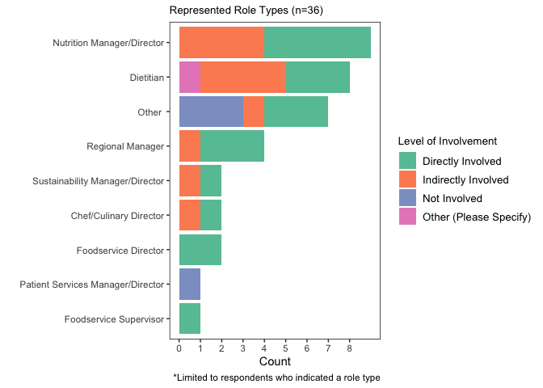
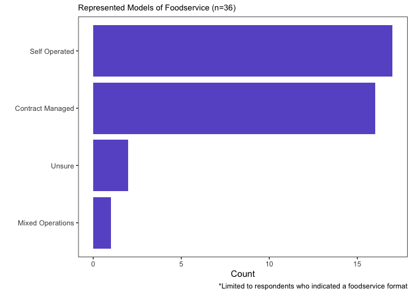
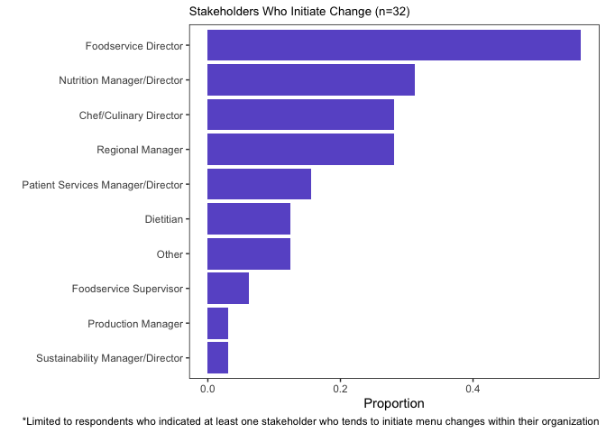
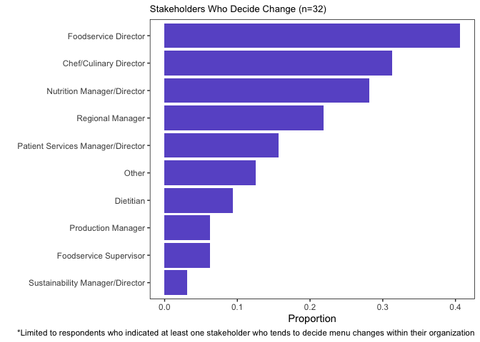
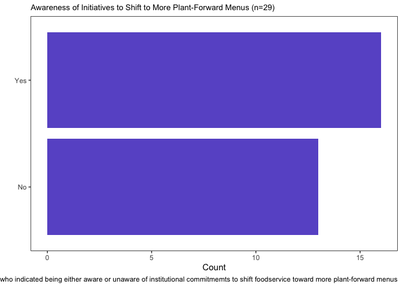
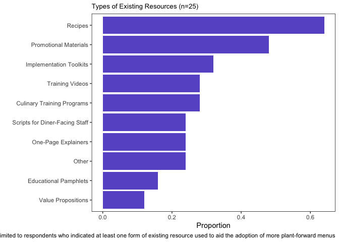
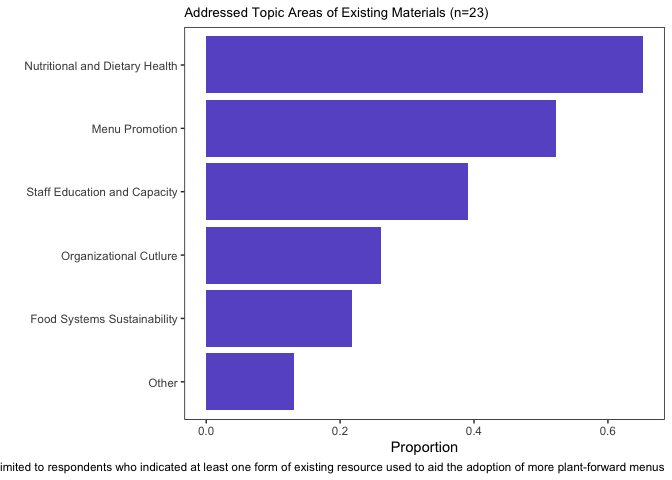
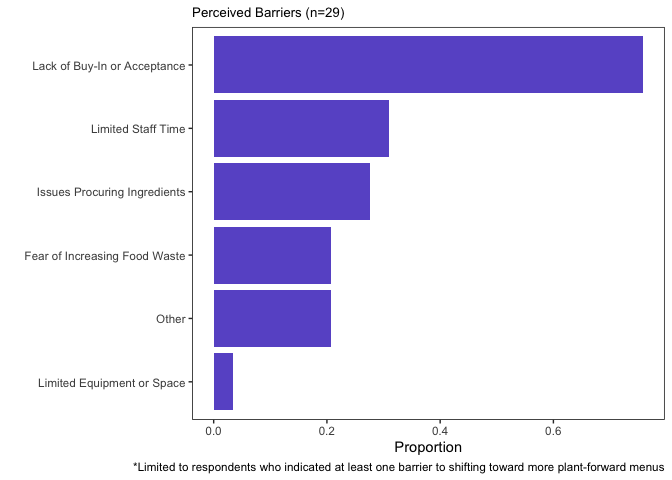
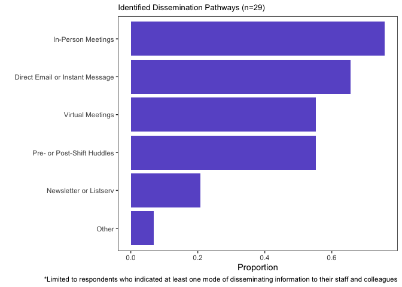

## packages

``` r
library(tidyverse)
```

    ## ── Attaching core tidyverse packages ──────────────────────── tidyverse 2.0.0 ──
    ## ✔ dplyr     1.1.4     ✔ readr     2.1.5
    ## ✔ forcats   1.0.0     ✔ stringr   1.5.1
    ## ✔ ggplot2   3.5.1     ✔ tibble    3.2.1
    ## ✔ lubridate 1.9.3     ✔ tidyr     1.3.1
    ## ✔ purrr     1.0.2     
    ## ── Conflicts ────────────────────────────────────────── tidyverse_conflicts() ──
    ## ✖ dplyr::filter() masks stats::filter()
    ## ✖ dplyr::lag()    masks stats::lag()
    ## ℹ Use the conflicted package (<http://conflicted.r-lib.org/>) to force all conflicts to become errors

``` r
library(scales) 
```

    ## 
    ## Attaching package: 'scales'
    ## 
    ## The following object is masked from 'package:purrr':
    ## 
    ##     discard
    ## 
    ## The following object is masked from 'package:readr':
    ## 
    ##     col_factor

``` r
library(ggpubr)
library(forcats)
```

## data

``` r
change_management <- read.csv("/Users/kenjinchang/github/change-management-materials/data/closed-change-management-survey.csv")
```

``` r
change_management <- change_management %>% select(StartDate,Progress,SI1,SI1_10_TEXT,SI2,SI2_4_TEXT,SI3,SI4,SI4_15_TEXT,SI5_1,SI5_2,SI5_3,SI5_4,SI5_5,SI5_6,SI5_7,SI5_8,SI5_9,SI5_10,SI5_11,SI5_12,SI5_13,SI5_14,SI5_15,SI5_15_TEXT,SI6,SI6_10_TEXT,SI7,SI7_10_TEXT,Q13,SI8,SI8_8_TEXT,SI9,SI9_10_TEXT,SI10,SI10_6_TEXT,SI11,SI11.1,SI11_6_TEXT,SI12,SI12_6_TEXT,SI13,SI13_5_TEXT) %>%
  rename(date=StartDate,completion=Progress,role=SI1,role_other=SI1_10_TEXT,involvement_level=SI2,involvement_level_other=SI2_4_TEXT,foodservice_model=SI3,involved_processes=SI4,involved_processes_other=SI4_15_TEXT,creating_new_recipes_ranking=SI5_1,identifying_existing_recipes_ranking=SI5_2,conducting_nutritional_analysis_ranking=SI5_3,assessing_dietary_alignment_ranking=SI5_4,sourcing_ingredients_ranking=SI5_5,preparing_recipes_ranking=SI5_6,training_foodservice_staff_ranking=SI5_7,managing_staff_time_ranking=SI5_8,kitchen_equipment_ranking=SI5_9,marketing_materials_ranking=SI5_10,persuading_executive_leadership_ranking=SI5_11,persuading_colleagues_ranking=SI5_12,communicating_to_patients_ranking=SI5_13,communicating_to_clinicians_ranking=SI5_14,other_ranking=SI5_15,other_ranking_other=SI5_15_TEXT,initiate_change=SI6,initiate_change_other=SI6_10_TEXT,decide_chang=SI7,decide_change_other=SI7_10_TEXT,awareness=Q13,goal_conficts=SI8,goal_conficts_other=SI8_8_TEXT,existing_resources=SI9,existing_resources_other=SI9_10_TEXT,existing_topic_areas=SI10,existing_topic_areas_other=SI10_6_TEXT,perceived_use=SI11,perceived_barriers=SI11.1,perceived_barriers_other=SI11_6_TEXT,dissemination_pathway=SI12,dissemination_pathway_other=SI12_6_TEXT,hosting_preference=SI13,hosting_preference_other=SI13_5_TEXT) %>%
  slice(3:n()) %>%
  mutate(id=row_number(),.before=date) %>%
  mutate(count=1,.before=date)
```

``` r
change_management %>%
  select(count,role,involvement_level) %>%
  filter(role!="") 
```

    ##    count                                 role      involvement_level
    ## 1      1                            Dietitian      Directly Involved
    ## 2      1        Nutrition Manager or Director      Directly Involved
    ## 3      1                     Regional Manager      Directly Involved
    ## 4      1        Nutrition Manager or Director    Indirectly Involved
    ## 5      1              Director of Foodservice      Directly Involved
    ## 6      1               Other (Please Specify)    Indirectly Involved
    ## 7      1               Other (Please Specify)           Not Involved
    ## 8      1               Other (Please Specify)           Not Involved
    ## 9      1 Patient Services Manager or Director           Not Involved
    ## 10     1                     Regional Manager    Indirectly Involved
    ## 11     1                            Dietitian    Indirectly Involved
    ## 12     1                     Regional Manager      Directly Involved
    ## 13     1   Sustainability Manager or Director      Directly Involved
    ## 14     1                            Dietitian    Indirectly Involved
    ## 15     1                            Dietitian      Directly Involved
    ## 16     1              Director of Foodservice      Directly Involved
    ## 17     1               Foodservice Supervisor      Directly Involved
    ## 18     1        Nutrition Manager or Director    Indirectly Involved
    ## 19     1        Nutrition Manager or Director    Indirectly Involved
    ## 20     1        Nutrition Manager or Director    Indirectly Involved
    ## 21     1                     Regional Manager      Directly Involved
    ## 22     1        Nutrition Manager or Director      Directly Involved
    ## 23     1                            Dietitian    Indirectly Involved
    ## 24     1               Other (Please Specify)           Not Involved
    ## 25     1            Chef or Culinary Director    Indirectly Involved
    ## 26     1                            Dietitian      Directly Involved
    ## 27     1        Nutrition Manager or Director      Directly Involved
    ## 28     1        Nutrition Manager or Director      Directly Involved
    ## 29     1        Nutrition Manager or Director      Directly Involved
    ## 30     1               Other (Please Specify)      Directly Involved
    ## 31     1   Sustainability Manager or Director    Indirectly Involved
    ## 32     1               Other (Please Specify)      Directly Involved
    ## 33     1            Chef or Culinary Director      Directly Involved
    ## 34     1                            Dietitian Other (Please Specify)
    ## 35     1               Other (Please Specify)      Directly Involved
    ## 36     1                            Dietitian    Indirectly Involved

``` r
cm_role_distribution <- change_management %>%
  select(count,role,involvement_level) %>%
  filter(role!="") %>%
  ggplot(aes(x=count,y=role,fill=involvement_level)) +
  geom_col() + 
  scale_fill_brewer(palette="Set2",name="Level of Involvement") +
  scale_y_discrete(limits=c("Foodservice Supervisor","Patient Services Manager or Director","Director of Foodservice","Chef or Culinary Director","Sustainability Manager or Director","Regional Manager","Other (Please Specify)","Dietitian","Nutrition Manager or Director"),labels=c("Foodservice Supervisor","Patient Services Manager/Director","Foodservice Director","Chef/Culinary Director","Sustainability Manager/Director","Regional Manager","Other ","Dietitian","Nutrition Manager/Director")) +
  scale_x_continuous(breaks=c(0,1,2,3,4,5,6,7,8)) +
  xlab("Count") + 
  ylab("") +
  labs(title="Represented Role Types (n=36)",caption="*Limited to respondents who indicated a role type") +
  theme(panel.grid=element_blank(),panel.background=element_rect(fill="white"),panel.border=element_rect(fill=NA),legend.title=element_text(size=10),legend.text=element_text(size=10),plot.title=element_text(size=10)) 
ggsave(filename="cm_role_distribution.png",plot=cm_role_distribution,path="/Users/kenjinchang/github/change-management-materials/figures",width=22,height=16,units="cm",dpi=150,limitsize=TRUE)
cm_role_distribution
```

<!-- -->

``` r
change_management
```

    ##    id count                date completion                                 role
    ## 1   1     1 2026-02-06 14:59:36        100                            Dietitian
    ## 2   2     1 2026-02-06 15:11:06        100        Nutrition Manager or Director
    ## 3   3     1 2026-02-09 10:35:48        100                                     
    ## 4   4     1 2026-02-09 11:01:18        100                     Regional Manager
    ## 5   5     1 2026-02-09 12:45:11        100        Nutrition Manager or Director
    ## 6   6     1 2026-02-09 13:28:29        100              Director of Foodservice
    ## 7   7     1 2026-02-09 14:33:25        100               Other (Please Specify)
    ## 8   8     1 2026-02-09 15:30:41        100               Other (Please Specify)
    ## 9   9     1 2026-02-09 17:53:23        100               Other (Please Specify)
    ## 10 10     1 2026-02-09 19:02:16        100 Patient Services Manager or Director
    ## 11 11     1 2026-02-10 08:21:53        100                     Regional Manager
    ## 12 12     1 2026-02-10 08:47:13        100                            Dietitian
    ## 13 13     1 2026-02-10 09:58:32        100                     Regional Manager
    ## 14 14     1 2026-02-10 14:09:38        100   Sustainability Manager or Director
    ## 15 15     1 2026-02-11 09:40:31        100                            Dietitian
    ## 16 16     1 2026-02-11 10:04:36        100                            Dietitian
    ## 17 17     1 2026-02-11 11:19:07        100              Director of Foodservice
    ## 18 18     1 2026-02-13 06:02:51        100               Foodservice Supervisor
    ## 19 19     1 2026-02-13 10:07:05        100                                     
    ## 20 20     1 2026-02-13 11:44:25        100        Nutrition Manager or Director
    ## 21 21     1 2026-02-13 11:41:09        100        Nutrition Manager or Director
    ## 22 22     1 2026-02-13 12:33:25        100        Nutrition Manager or Director
    ## 23 23     1 2026-02-13 12:35:54        100                     Regional Manager
    ## 24 24     1 2026-02-06 15:15:10         35        Nutrition Manager or Director
    ## 25 25     1 2026-02-06 15:30:31          6                                     
    ## 26 26     1 2026-02-13 16:25:23        100                            Dietitian
    ## 27 27     1 2026-02-09 11:16:26          6                                     
    ## 28 28     1 2026-02-09 11:27:13          6                                     
    ## 29 29     1 2026-02-09 11:29:19          6                                     
    ## 30 30     1 2026-02-16 13:11:52        100               Other (Please Specify)
    ## 31 31     1 2026-02-17 12:19:36        100            Chef or Culinary Director
    ## 32 32     1 2026-02-10 13:18:30          6                                     
    ## 33 33     1 2026-02-17 16:04:16        100                            Dietitian
    ## 34 34     1 2026-02-17 18:58:47        100        Nutrition Manager or Director
    ## 35 35     1 2026-02-18 07:47:47        100        Nutrition Manager or Director
    ## 36 36     1 2026-02-18 15:59:59        100        Nutrition Manager or Director
    ## 37 37     1 2026-02-09 09:55:04         47               Other (Please Specify)
    ## 38 38     1 2026-02-12 14:31:47         47                                     
    ## 39 39     1 2026-02-13 03:18:50          6                                     
    ## 40 40     1 2026-02-11 04:52:26         47   Sustainability Manager or Director
    ## 41 41     1 2026-02-13 11:13:00         35               Other (Please Specify)
    ## 42 42     1 2026-02-15 05:14:23         29            Chef or Culinary Director
    ## 43 43     1 2026-02-22 14:55:52        100                            Dietitian
    ## 44 44     1 2026-02-23 13:50:46        100               Other (Please Specify)
    ## 45 45     1 2026-02-16 13:03:22          6                                     
    ## 46 46     1 2026-02-16 17:11:52         47                            Dietitian
    ##                                                 role_other
    ## 1                                                         
    ## 2                                                         
    ## 3                                                         
    ## 4                                                         
    ## 5                                                         
    ## 6                                                         
    ## 7              Assistant Vice President Nutrition Services
    ## 8                                                physician
    ## 9                                            Cardiologist 
    ## 10                                                        
    ## 11                                                        
    ## 12                                                        
    ## 13                                                        
    ## 14                                                        
    ## 15                                                        
    ## 16                                                        
    ## 17                                                        
    ## 18                                                        
    ## 19                                                        
    ## 20                                                        
    ## 21                                                        
    ## 22                                                        
    ## 23                                                        
    ## 24                                                        
    ## 25                                                        
    ## 26                                                        
    ## 27                                                        
    ## 28                                                        
    ## 29                                                        
    ## 30 National Director of Population Health & Sustainability
    ## 31                                                        
    ## 32                                                        
    ## 33                                                        
    ## 34                                                        
    ## 35                                                        
    ## 36                                                        
    ## 37                                                        
    ## 38                                                        
    ## 39                                                        
    ## 40                                                        
    ## 41                     VP, Pharmacy and clinical nutrition
    ## 42                                                        
    ## 43                                                        
    ## 44                                         Project manager
    ## 45                                                        
    ## 46                                                        
    ##         involvement_level
    ## 1       Directly Involved
    ## 2       Directly Involved
    ## 3                        
    ## 4       Directly Involved
    ## 5     Indirectly Involved
    ## 6       Directly Involved
    ## 7     Indirectly Involved
    ## 8            Not Involved
    ## 9            Not Involved
    ## 10           Not Involved
    ## 11    Indirectly Involved
    ## 12    Indirectly Involved
    ## 13      Directly Involved
    ## 14      Directly Involved
    ## 15    Indirectly Involved
    ## 16      Directly Involved
    ## 17      Directly Involved
    ## 18      Directly Involved
    ## 19                       
    ## 20    Indirectly Involved
    ## 21    Indirectly Involved
    ## 22    Indirectly Involved
    ## 23      Directly Involved
    ## 24      Directly Involved
    ## 25                       
    ## 26    Indirectly Involved
    ## 27                       
    ## 28                       
    ## 29                       
    ## 30           Not Involved
    ## 31    Indirectly Involved
    ## 32                       
    ## 33      Directly Involved
    ## 34      Directly Involved
    ## 35      Directly Involved
    ## 36      Directly Involved
    ## 37      Directly Involved
    ## 38                       
    ## 39                       
    ## 40    Indirectly Involved
    ## 41      Directly Involved
    ## 42      Directly Involved
    ## 43 Other (Please Specify)
    ## 44      Directly Involved
    ## 45                       
    ## 46    Indirectly Involved
    ##                                                 involvement_level_other
    ## 1                                                                      
    ## 2                                                                      
    ## 3                                                                      
    ## 4                                                                      
    ## 5                                                                      
    ## 6                                                                      
    ## 7                                                                      
    ## 8                                                                      
    ## 9                                                                      
    ## 10                                                                     
    ## 11                                                                     
    ## 12                                                                     
    ## 13                                                                     
    ## 14                                                                     
    ## 15                                                                     
    ## 16                                                                     
    ## 17                                                                     
    ## 18                                                                     
    ## 19                                                                     
    ## 20                                                                     
    ## 21                                                                     
    ## 22                                                                     
    ## 23                                                                     
    ## 24                                                                     
    ## 25                                                                     
    ## 26                                                                     
    ## 27                                                                     
    ## 28                                                                     
    ## 29                                                                     
    ## 30                                                                     
    ## 31                                                                     
    ## 32                                                                     
    ## 33                                                                     
    ## 34                                                                     
    ## 35                                                                     
    ## 36                                                                     
    ## 37                                                                     
    ## 38                                                                     
    ## 39                                                                     
    ## 40                                                                     
    ## 41                                                                     
    ## 42                                                                     
    ## 43 indirectly with cafeteria menus and more directly with patient menus
    ## 44                                                                     
    ## 45                                                                     
    ## 46                                                                     
    ##                 foodservice_model
    ## 1                   Self Operated
    ## 2                   Self Operated
    ## 3                                
    ## 4                Contract Managed
    ## 5                Contract Managed
    ## 6                   Self Operated
    ## 7                   Self Operated
    ## 8                          Unsure
    ## 9                Contract Managed
    ## 10               Contract Managed
    ## 11                  Self Operated
    ## 12               Contract Managed
    ## 13                  Self Operated
    ## 14                  Self Operated
    ## 15                  Self Operated
    ## 16                  Self Operated
    ## 17                  Self Operated
    ## 18                         Unsure
    ## 19                               
    ## 20               Contract Managed
    ## 21               Contract Managed
    ## 22               Contract Managed
    ## 23               Contract Managed
    ## 24                  Self Operated
    ## 25                               
    ## 26               Contract Managed
    ## 27                               
    ## 28                               
    ## 29                               
    ## 30               Contract Managed
    ## 31               Contract Managed
    ## 32                               
    ## 33                  Self Operated
    ## 34                  Self Operated
    ## 35                  Self Operated
    ## 36 Self Operated,Contract Managed
    ## 37               Contract Managed
    ## 38                               
    ## 39                               
    ## 40               Contract Managed
    ## 41               Contract Managed
    ## 42                  Self Operated
    ## 43                  Self Operated
    ## 44                  Self Operated
    ## 45                               
    ## 46               Contract Managed
    ##                                                                                                                                                                                                                                                                                                                                                                                                                                                                                    involved_processes
    ## 1                                                                                                                                                                                                                Creating and Testing New Recipes,Identifying Existing Recipes,Conducting Nutritional Analysis,Assessing Alignment with Therapeutic Diets,Creating Marketing and Promotional Materials,Communicating Menu Options to Patients and Diners,Communicating Menu Changes to Clinical Staff
    ## 2                                                                                                                                                                                                                Creating and Testing New Recipes,Identifying Existing Recipes,Conducting Nutritional Analysis,Assessing Alignment with Therapeutic Diets,Creating Marketing and Promotional Materials,Communicating Menu Options to Patients and Diners,Communicating Menu Changes to Clinical Staff
    ## 3                                                                                                                                                                                                                                                                                                                                                                                                                                                                                                    
    ## 4                                                                   Identifying Existing Recipes,Assessing Alignment with Therapeutic Diets,Sourcing Ingredients,Preparing Recipes,Training Foodservice Staff,Managing Staff Time and Workflows,Securing Kitchen Equipment and Appliances,Creating Marketing and Promotional Materials,Persuading Executive Leadership,Persuading Staff and Colleagues,Communicating Menu Options to Patients and Diners,Communicating Menu Changes to Clinical Staff
    ## 5                                               Creating and Testing New Recipes,Identifying Existing Recipes,Conducting Nutritional Analysis,Assessing Alignment with Therapeutic Diets,Sourcing Ingredients,Preparing Recipes,Training Foodservice Staff,Managing Staff Time and Workflows,Securing Kitchen Equipment and Appliances,Persuading Executive Leadership,Persuading Staff and Colleagues,Communicating Menu Options to Patients and Diners,Communicating Menu Changes to Clinical Staff
    ## 6                                               Creating and Testing New Recipes,Identifying Existing Recipes,Conducting Nutritional Analysis,Assessing Alignment with Therapeutic Diets,Sourcing Ingredients,Preparing Recipes,Training Foodservice Staff,Managing Staff Time and Workflows,Securing Kitchen Equipment and Appliances,Persuading Executive Leadership,Persuading Staff and Colleagues,Communicating Menu Options to Patients and Diners,Communicating Menu Changes to Clinical Staff
    ## 7                                                                                                                                                                                                                                                                                                                                                                                                              Persuading Executive Leadership,Persuading Staff and Colleagues,Other (Please Specify)
    ## 8                                                                                                                                                                                                                                                                                                                                                                                                                                                                     Persuading Executive Leadership
    ## 9                                                                                                                                                                                                                                                                                                                                                                                                                                                                                                    
    ## 10                                                                                                                                                                                                                                                                                                                                                                                                                                                                    Persuading Staff and Colleagues
    ## 11                                                                                                                                                                                                                                                                                        Conducting Nutritional Analysis,Creating Marketing and Promotional Materials,Persuading Staff and Colleagues,Communicating Menu Options to Patients and Diners,Communicating Menu Changes to Clinical Staff
    ## 12                                                                                                                                                                                                                                                                                                                                                                                                             Persuading Executive Leadership,Persuading Staff and Colleagues,Other (Please Specify)
    ## 13                                                                Creating and Testing New Recipes,Identifying Existing Recipes,Conducting Nutritional Analysis,Assessing Alignment with Therapeutic Diets,Sourcing Ingredients,Training Foodservice Staff,Managing Staff Time and Workflows,Securing Kitchen Equipment and Appliances,Persuading Executive Leadership,Persuading Staff and Colleagues,Communicating Menu Options to Patients and Diners,Communicating Menu Changes to Clinical Staff
    ## 14                                                                                                                                                                                                                                                                                                                                                 Creating and Testing New Recipes,Identifying Existing Recipes,Sourcing Ingredients,Persuading Executive Leadership,Persuading Staff and Colleagues
    ## 15                                                                                                                                                                                                                                                                                                                                                                                                                                                                       Identifying Existing Recipes
    ## 16                                                                                                                                                                                                                                                                                                                          Conducting Nutritional Analysis,Assessing Alignment with Therapeutic Diets,Communicating Menu Options to Patients and Diners,Communicating Menu Changes to Clinical Staff
    ## 17 Creating and Testing New Recipes,Identifying Existing Recipes,Conducting Nutritional Analysis,Assessing Alignment with Therapeutic Diets,Sourcing Ingredients,Preparing Recipes,Training Foodservice Staff,Managing Staff Time and Workflows,Securing Kitchen Equipment and Appliances,Creating Marketing and Promotional Materials,Persuading Executive Leadership,Persuading Staff and Colleagues,Communicating Menu Options to Patients and Diners,Communicating Menu Changes to Clinical Staff
    ## 18                                                                                                              Creating and Testing New Recipes,Identifying Existing Recipes,Assessing Alignment with Therapeutic Diets,Sourcing Ingredients,Preparing Recipes,Training Foodservice Staff,Managing Staff Time and Workflows,Securing Kitchen Equipment and Appliances,Persuading Staff and Colleagues,Communicating Menu Options to Patients and Diners,Communicating Menu Changes to Clinical Staff
    ## 19                                                                                                                                                                                                                                                                                                                                                                                                                                                                                                   
    ## 20                                                                                                                                                                                                                                                                                                                                            Assessing Alignment with Therapeutic Diets,Persuading Executive Leadership,Persuading Staff and Colleagues,Communicating Menu Changes to Clinical Staff
    ## 21                                                                                                                                                                                                                                                                                                                                                                                                            Assessing Alignment with Therapeutic Diets,Communicating Menu Changes to Clinical Staff
    ## 22                                                                                                                                                                                                                                                                                                                                                                                                            Assessing Alignment with Therapeutic Diets,Communicating Menu Changes to Clinical Staff
    ## 23                                                                                                                                                                   Conducting Nutritional Analysis,Assessing Alignment with Therapeutic Diets,Securing Kitchen Equipment and Appliances,Creating Marketing and Promotional Materials,Persuading Executive Leadership,Persuading Staff and Colleagues,Communicating Menu Options to Patients and Diners,Communicating Menu Changes to Clinical Staff
    ## 24                                                                                                                                                                                                                                                                                                                                                           Creating and Testing New Recipes,Identifying Existing Recipes,Conducting Nutritional Analysis,Assessing Alignment with Therapeutic Diets
    ## 25                                                                                                                                                                                                                                                                                                                                                                                                                                                                                                   
    ## 26                                                                                                                                                                                                                                                                                                                                                          Assessing Alignment with Therapeutic Diets,Communicating Menu Options to Patients and Diners,Communicating Menu Changes to Clinical Staff
    ## 27                                                                                                                                                                                                                                                                                                                                                                                                                                                                                                   
    ## 28                                                                                                                                                                                                                                                                                                                                                                                                                                                                                                   
    ## 29                                                                                                                                                                                                                                                                                                                                                                                                                                                                                                   
    ## 30                                                                                                                                         Identifying Existing Recipes,Conducting Nutritional Analysis,Assessing Alignment with Therapeutic Diets,Sourcing Ingredients,Training Foodservice Staff,Creating Marketing and Promotional Materials,Persuading Executive Leadership,Communicating Menu Options to Patients and Diners,Communicating Menu Changes to Clinical Staff,Other (Please Specify)
    ## 31                                                                                                                                                                                                                                                                Creating and Testing New Recipes,Identifying Existing Recipes,Conducting Nutritional Analysis,Assessing Alignment with Therapeutic Diets,Training Foodservice Staff,Persuading Executive Leadership,Persuading Staff and Colleagues
    ## 32                                                                                                                                                                                                                                                                                                                                                                                                                                                                                                   
    ## 33                                                                                                                                                                                                             Identifying Existing Recipes,Assessing Alignment with Therapeutic Diets,Sourcing Ingredients,Training Foodservice Staff,Creating Marketing and Promotional Materials,Persuading Executive Leadership,Persuading Staff and Colleagues,Communicating Menu Options to Patients and Diners
    ## 34                                                                                                                                      Assessing Alignment with Therapeutic Diets,Training Foodservice Staff,Managing Staff Time and Workflows,Securing Kitchen Equipment and Appliances,Creating Marketing and Promotional Materials,Persuading Executive Leadership,Persuading Staff and Colleagues,Communicating Menu Options to Patients and Diners,Communicating Menu Changes to Clinical Staff
    ## 35                                                                                                                                                                                                                                                                                     Creating and Testing New Recipes,Identifying Existing Recipes,Sourcing Ingredients,Preparing Recipes,Training Foodservice Staff,Managing Staff Time and Workflows,Communicating Menu Changes to Clinical Staff
    ## 36                                                                                                                                                                                                                               Conducting Nutritional Analysis,Assessing Alignment with Therapeutic Diets,Training Foodservice Staff,Persuading Executive Leadership,Persuading Staff and Colleagues,Communicating Menu Options to Patients and Diners,Communicating Menu Changes to Clinical Staff
    ## 37                                                                                                                                                                                                                                                                                                                                                                                           Creating and Testing New Recipes,Identifying Existing Recipes,Assessing Alignment with Therapeutic Diets
    ## 38                                                                                                                                                                                                                                                                                                                                                                                                                                                                                                   
    ## 39                                                                                                                                                                                                                                                                                                                                                                                                                                                                                                   
    ## 40                                                                                                                                                                                                                                                                                                                                                                                                                                                                               Sourcing Ingredients
    ## 41                                                                                                                                                                                                                                                                                                                                                                                                                                                         Assessing Alignment with Therapeutic Diets
    ## 42                                                                                                                                                                      Creating and Testing New Recipes,Identifying Existing Recipes,Conducting Nutritional Analysis,Sourcing Ingredients,Preparing Recipes,Training Foodservice Staff,Managing Staff Time and Workflows,Securing Kitchen Equipment and Appliances,Persuading Executive Leadership,Communicating Menu Options to Patients and Diners
    ## 43                                                                                                                                                                                                                                                                                                                                                              Conducting Nutritional Analysis,Assessing Alignment with Therapeutic Diets,Training Foodservice Staff,Persuading Staff and Colleagues
    ## 44                                                                                                                                                                                                                                            Creating and Testing New Recipes,Identifying Existing Recipes,Assessing Alignment with Therapeutic Diets,Sourcing Ingredients,Creating Marketing and Promotional Materials,Persuading Staff and Colleagues,Communicating Menu Changes to Clinical Staff
    ## 45                                                                                                                                                                                                                                                                                                                                                                                                                                                                                                   
    ## 46                                                                                                                                                                                                                                                                                                                                                              Conducting Nutritional Analysis,Assessing Alignment with Therapeutic Diets,Training Foodservice Staff,Persuading Executive Leadership
    ##                                                              involved_processes_other
    ## 1                                                                                    
    ## 2                                                                                    
    ## 3                                                                                    
    ## 4                                                                                    
    ## 5                                                                                    
    ## 6                                                                                    
    ## 7                       Service line strategy, initiatives, stewardship, and branding
    ## 8                                                                                    
    ## 9                                                                                    
    ## 10                                                                                   
    ## 11                                                                                   
    ## 12                               Healthy Food and Beverage Environment Policy changes
    ## 13                                                                                   
    ## 14                                                                                   
    ## 15                                                                                   
    ## 16                                                                                   
    ## 17                                                                                   
    ## 18                                                                                   
    ## 19                                                                                   
    ## 20                                                                                   
    ## 21                                                                                   
    ## 22                                                                                   
    ## 23                                                                                   
    ## 24                                                                                   
    ## 25                                                                                   
    ## 26                                                                                   
    ## 27                                                                                   
    ## 28                                                                                   
    ## 29                                                                                   
    ## 30 Conduit to suggest modifications to menus based on client requests and contracting
    ## 31                                                                                   
    ## 32                                                                                   
    ## 33                                                                                   
    ## 34                                                                                   
    ## 35                                                                                   
    ## 36                                                                                   
    ## 37                                                                                   
    ## 38                                                                                   
    ## 39                                                                                   
    ## 40                                                                                   
    ## 41                                                                                   
    ## 42                                                                                   
    ## 43                                                                                   
    ## 44                                                                                   
    ## 45                                                                                   
    ## 46                                                                                   
    ##    creating_new_recipes_ranking identifying_existing_recipes_ranking
    ## 1                                                                   
    ## 2                                                                   
    ## 3                                                                   
    ## 4                                                                  6
    ## 5                            12                                    5
    ## 6                             3                                    7
    ## 7                                                                   
    ## 8                                                                   
    ## 9                                                                   
    ## 10                                                                  
    ## 11                                                                  
    ## 12                                                                  
    ## 13                            3                                    5
    ## 14                            5                                    4
    ## 15                                                                  
    ## 16                                                                  
    ## 17                            1                                    2
    ## 18                            3                                    9
    ## 19                                                                  
    ## 20                                                                  
    ## 21                                                                  
    ## 22                                                                  
    ## 23                                                                  
    ## 24                            3                                    4
    ## 25                                                                  
    ## 26                                                                  
    ## 27                                                                  
    ## 28                                                                  
    ## 29                                                                  
    ## 30                                                                 9
    ## 31                            1                                    4
    ## 32                                                                  
    ## 33                                                                 8
    ## 34                                                                  
    ## 35                            4                                    5
    ## 36                                                                  
    ## 37                            2                                    1
    ## 38                                                                  
    ## 39                                                                  
    ## 40                                                                  
    ## 41                                                                  
    ## 42                                                                  
    ## 43                                                                  
    ## 44                            3                                    5
    ## 45                                                                  
    ## 46                                                                  
    ##    conducting_nutritional_analysis_ranking assessing_dietary_alignment_ranking
    ## 1                                                                             
    ## 2                                                                             
    ## 3                                                                             
    ## 4                                                                            8
    ## 5                                        6                                   7
    ## 6                                        8                                   1
    ## 7                                                                             
    ## 8                                                                             
    ## 9                                                                             
    ## 10                                                                            
    ## 11                                       3                                    
    ## 12                                                                            
    ## 13                                       6                                   2
    ## 14                                                                            
    ## 15                                                                            
    ## 16                                       4                                   2
    ## 17                                       3                                   4
    ## 18                                                                           2
    ## 19                                                                            
    ## 20                                                                           3
    ## 21                                                                            
    ## 22                                                                           1
    ## 23                                       2                                   3
    ## 24                                       2                                   1
    ## 25                                                                            
    ## 26                                                                            
    ## 27                                                                            
    ## 28                                                                            
    ## 29                                                                            
    ## 30                                       3                                   2
    ## 31                                       5                                   6
    ## 32                                                                            
    ## 33                                                                           2
    ## 34                                                                           3
    ## 35                                                                            
    ## 36                                       3                                   4
    ## 37                                                                           3
    ## 38                                                                            
    ## 39                                                                            
    ## 40                                                                            
    ## 41                                                                            
    ## 42                                                                            
    ## 43                                       3                                   4
    ## 44                                                                           1
    ## 45                                                                            
    ## 46                                       3                                   2
    ##    sourcing_ingredients_ranking preparing_recipes_ranking
    ## 1                                                        
    ## 2                                                        
    ## 3                                                        
    ## 4                             7                         9
    ## 5                             8                         9
    ## 6                             4                         5
    ## 7                                                        
    ## 8                                                        
    ## 9                                                        
    ## 10                                                       
    ## 11                                                       
    ## 12                                                       
    ## 13                            7                          
    ## 14                            3                          
    ## 15                                                       
    ## 16                                                       
    ## 17                            5                         6
    ## 18                            7                         4
    ## 19                                                       
    ## 20                                                       
    ## 21                                                       
    ## 22                                                       
    ## 23                                                       
    ## 24                                                       
    ## 25                                                       
    ## 26                                                       
    ## 27                                                       
    ## 28                                                       
    ## 29                                                       
    ## 30                            6                          
    ## 31                                                       
    ## 32                                                       
    ## 33                            3                          
    ## 34                                                       
    ## 35                            1                         3
    ## 36                                                       
    ## 37                                                       
    ## 38                                                       
    ## 39                                                       
    ## 40                                                       
    ## 41                                                       
    ## 42                                                       
    ## 43                                                       
    ## 44                            4                          
    ## 45                                                       
    ## 46                                                       
    ##    training_foodservice_staff_ranking managing_staff_time_ranking
    ## 1                                                                
    ## 2                                                                
    ## 3                                                                
    ## 4                                   4                          10
    ## 5                                   3                           1
    ## 6                                   9                           2
    ## 7                                                                
    ## 8                                                                
    ## 9                                                                
    ## 10                                                               
    ## 11                                                               
    ## 12                                                               
    ## 13                                  4                           8
    ## 14                                                               
    ## 15                                                               
    ## 16                                                               
    ## 17                                  7                           8
    ## 18                                  5                           1
    ## 19                                                               
    ## 20                                                               
    ## 21                                                               
    ## 22                                                               
    ## 23                                                               
    ## 24                                                               
    ## 25                                                               
    ## 26                                                               
    ## 27                                                               
    ## 28                                                               
    ## 29                                                               
    ## 30                                  5                            
    ## 31                                  2                            
    ## 32                                                               
    ## 33                                  1                            
    ## 34                                  5                           6
    ## 35                                  6                           2
    ## 36                                  1                            
    ## 37                                                               
    ## 38                                                               
    ## 39                                                               
    ## 40                                                               
    ## 41                                                               
    ## 42                                                               
    ## 43                                  2                            
    ## 44                                                               
    ## 45                                                               
    ## 46                                  4                            
    ##    kitchen_equipment_ranking marketing_materials_ranking
    ## 1                                                       
    ## 2                                                       
    ## 3                                                       
    ## 4                          2                          12
    ## 5                         10                            
    ## 6                         10                            
    ## 7                                                       
    ## 8                                                       
    ## 9                                                       
    ## 10                                                      
    ## 11                                                     4
    ## 12                                                      
    ## 13                         9                            
    ## 14                                                      
    ## 15                                                      
    ## 16                                                      
    ## 17                         9                          10
    ## 18                         8                            
    ## 19                                                      
    ## 20                                                      
    ## 21                                                      
    ## 22                                                      
    ## 23                         1                           7
    ## 24                                                      
    ## 25                                                      
    ## 26                                                      
    ## 27                                                      
    ## 28                                                      
    ## 29                                                      
    ## 30                                                     8
    ## 31                                                      
    ## 32                                                      
    ## 33                                                     6
    ## 34                         9                           8
    ## 35                                                      
    ## 36                                                      
    ## 37                                                      
    ## 38                                                      
    ## 39                                                      
    ## 40                                                      
    ## 41                                                      
    ## 42                                                      
    ## 43                                                      
    ## 44                                                     7
    ## 45                                                      
    ## 46                                                      
    ##    persuading_executive_leadership_ranking persuading_colleagues_ranking
    ## 1                                                                       
    ## 2                                                                       
    ## 3                                                                       
    ## 4                                        1                             3
    ## 5                                       11                             2
    ## 6                                       11                             6
    ## 7                                                                       
    ## 8                                                                       
    ## 9                                                                       
    ## 10                                                                      
    ## 11                                                                     2
    ## 12                                       2                             1
    ## 13                                      10                             1
    ## 14                                       2                             1
    ## 15                                                                      
    ## 16                                                                      
    ## 17                                      11                            12
    ## 18                                                                     6
    ## 19                                                                      
    ## 20                                       2                             1
    ## 21                                                                      
    ## 22                                                                      
    ## 23                                       8                             6
    ## 24                                                                      
    ## 25                                                                      
    ## 26                                                                      
    ## 27                                                                      
    ## 28                                                                      
    ## 29                                                                      
    ## 30                                       1                              
    ## 31                                       3                             7
    ## 32                                                                      
    ## 33                                       4                             5
    ## 34                                       7                             4
    ## 35                                                                      
    ## 36                                       5                             2
    ## 37                                                                      
    ## 38                                                                      
    ## 39                                                                      
    ## 40                                                                      
    ## 41                                                                      
    ## 42                                                                      
    ## 43                                                                     1
    ## 44                                                                     2
    ## 45                                                                      
    ## 46                                       1                              
    ##    communicating_to_patients_ranking communicating_to_clinicians_ranking
    ## 1                                                                       
    ## 2                                                                       
    ## 3                                                                       
    ## 4                                 11                                   5
    ## 5                                 13                                   4
    ## 6                                 12                                  13
    ## 7                                                                       
    ## 8                                                                       
    ## 9                                                                       
    ## 10                                                                      
    ## 11                                 5                                   1
    ## 12                                                                      
    ## 13                                11                                  12
    ## 14                                                                      
    ## 15                                                                      
    ## 16                                 3                                   1
    ## 17                                13                                  14
    ## 18                                10                                  11
    ## 19                                                                      
    ## 20                                                                     4
    ## 21                                                                      
    ## 22                                                                     2
    ## 23                                 4                                   5
    ## 24                                                                      
    ## 25                                                                      
    ## 26                                                                      
    ## 27                                                                      
    ## 28                                                                      
    ## 29                                                                      
    ## 30                                 7                                   4
    ## 31                                                                      
    ## 32                                                                      
    ## 33                                 7                                    
    ## 34                                 1                                   2
    ## 35                                                                     7
    ## 36                                 6                                   7
    ## 37                                                                      
    ## 38                                                                      
    ## 39                                                                      
    ## 40                                                                      
    ## 41                                                                      
    ## 42                                                                      
    ## 43                                                                      
    ## 44                                                                     6
    ## 45                                                                      
    ## 46                                                                      
    ##    other_ranking other_ranking_other
    ## 1                                   
    ## 2                                   
    ## 3                                   
    ## 4                                   
    ## 5                                   
    ## 6                                   
    ## 7                                   
    ## 8                                   
    ## 9                                   
    ## 10                                  
    ## 11                                  
    ## 12             3      policy changes
    ## 13                                  
    ## 14                                  
    ## 15                                  
    ## 16                                  
    ## 17                                  
    ## 18                                  
    ## 19                                  
    ## 20                                  
    ## 21                                  
    ## 22                                  
    ## 23                                  
    ## 24                                  
    ## 25                                  
    ## 26                                  
    ## 27                                  
    ## 28                                  
    ## 29                                  
    ## 30            10                    
    ## 31                                  
    ## 32                                  
    ## 33                                  
    ## 34                                  
    ## 35                                  
    ## 36                                  
    ## 37                                  
    ## 38                                  
    ## 39                                  
    ## 40                                  
    ## 41                                  
    ## 42                                  
    ## 43                                  
    ## 44                                  
    ## 45                                  
    ## 46                                  
    ##                                                                                                                                      initiate_change
    ## 1                                                                                                                            Director of Foodservice
    ## 2                                                                                              Nutrition Manager or Director,Director of Foodservice
    ## 3                                                                                                                                                   
    ## 4                                                                                                                                   Regional Manager
    ## 5                                                                                                                          Chef or Culinary Director
    ## 6                                                                                                               Patient Services Manager or Director
    ## 7  Nutrition Manager or Director,Director of Foodservice,Chef or Culinary Director,Patient Services Manager or Director,Dietitian,Production Manager
    ## 8                                                                                                           Director of Foodservice,Regional Manager
    ## 9                                                                                                                                                   
    ## 10                                                                                                                           Director of Foodservice
    ## 11                                                                                                                                  Regional Manager
    ## 12                                                                                                                            Other (Please Specify)
    ## 13                                                                                                                                  Regional Manager
    ## 14                                       Nutrition Manager or Director,Chef or Culinary Director,Regional Manager,Sustainability Manager or Director
    ## 15                                                                                                    Director of Foodservice,Foodservice Supervisor
    ## 16                                                                                                                           Director of Foodservice
    ## 17                                                                                             Nutrition Manager or Director,Director of Foodservice
    ## 18                                                             Nutrition Manager or Director,Dietitian,Foodservice Supervisor,Other (Please Specify)
    ## 19                                                                                                                                                  
    ## 20                                                                                                                           Director of Foodservice
    ## 21                                                                                                          Director of Foodservice,Regional Manager
    ## 22                                                                                                                     Nutrition Manager or Director
    ## 23                                                                                                                                  Regional Manager
    ## 24                                                                                                                                                  
    ## 25                                                                                                                                                  
    ## 26                                                                                                                           Director of Foodservice
    ## 27                                                                                                                                                  
    ## 28                                                                                                                                                  
    ## 29                                                                                                                                                  
    ## 30       Nutrition Manager or Director,Director of Foodservice,Chef or Culinary Director,Patient Services Manager or Director,Other (Please Specify)
    ## 31                                                                                                                           Director of Foodservice
    ## 32                                                                                                                                                  
    ## 33                                                                   Nutrition Manager or Director,Director of Foodservice,Chef or Culinary Director
    ## 34                                                                                                                                  Regional Manager
    ## 35                                                                                                                           Director of Foodservice
    ## 36             Nutrition Manager or Director,Director of Foodservice,Chef or Culinary Director,Patient Services Manager or Director,Regional Manager
    ## 37                                                                                                               Chef or Culinary Director,Dietitian
    ## 38                                                                                                                                                  
    ## 39                                                                                                                                                  
    ## 40                                                                                                 Director of Foodservice,Chef or Culinary Director
    ## 41                                                                                                                                                  
    ## 42                                                                                                                                                  
    ## 43                                                                                   Nutrition Manager or Director,Director of Foodservice,Dietitian
    ## 44                                                                                    Chef or Culinary Director,Patient Services Manager or Director
    ## 45                                                                                                                                                  
    ## 46                                                                                                                            Other (Please Specify)
    ##                                                                                                                                                            initiate_change_other
    ## 1                                                                                                                                                                               
    ## 2                                                                                                                                                                               
    ## 3                                                                                                                                                                               
    ## 4                                                                                                                                                                               
    ## 5                                                                                                                                                                               
    ## 6                                                                                                                                                                               
    ## 7                                                                                                                                                                               
    ## 8                                                                                                                                                                               
    ## 9                                                                                                                                                                               
    ## 10                                                                                                                                                                              
    ## 11                                                                                                                                                                              
    ## 12                                                                                                                                                                        unsure
    ## 13                                                                                                                                                                              
    ## 14                                                                                                                                                                              
    ## 15                                                                                                                                                                              
    ## 16                                                                                                                                                                              
    ## 17                                                                                                                                                                              
    ## 18                                                                                                                                                                           SLT
    ## 19                                                                                                                                                                              
    ## 20                                                                                                                                                                              
    ## 21                                                                                                                                                                              
    ## 22                                                                                                                                                                              
    ## 23                                                                                                                                                                              
    ## 24                                                                                                                                                                              
    ## 25                                                                                                                                                                              
    ## 26                                                                                                                                                                              
    ## 27                                                                                                                                                                              
    ## 28                                                                                                                                                                              
    ## 29                                                                                                                                                                              
    ## 30 Depends- corporate team sets up corporate menu and operations team at each hospital have flexibility within the framework to align with the DRIs of their hospital population
    ## 31                                                                                                                                                                              
    ## 32                                                                                                                                                                              
    ## 33                                                                                                                                                                              
    ## 34                                                                                                                                                                              
    ## 35                                                                                                                                                                              
    ## 36                                                                                                                                                                              
    ## 37                                                                                                                                                                              
    ## 38                                                                                                                                                                              
    ## 39                                                                                                                                                                              
    ## 40                                                                                                                                                                              
    ## 41                                                                                                                                                                              
    ## 42                                                                                                                                                                              
    ## 43                                                                                                                                                                              
    ## 44                                                                                                                                                                              
    ## 45                                                                                                                                                                              
    ## 46                                                                                                                                                          Patient satisfaction
    ##                                                                                                                                                                                                                    decide_chang
    ## 1                                                                                                                                                                                                     Chef or Culinary Director
    ## 2                                                                                                                                                                         Nutrition Manager or Director,Director of Foodservice
    ## 3                                                                                                                                                                                                                              
    ## 4                                                                                                                                                                                                        Other (Please Specify)
    ## 5                                                                                                                                                                                                     Chef or Culinary Director
    ## 6                                                                                                                                                                                                            Production Manager
    ## 7                                                                                                          Nutrition Manager or Director,Director of Foodservice,Chef or Culinary Director,Patient Services Manager or Director
    ## 8                                                                                                                                                                                                       Director of Foodservice
    ## 9                                                                                                                                                                                                                              
    ## 10                                                                                                                                                                                                      Director of Foodservice
    ## 11                                                                                        Nutrition Manager or Director,Director of Foodservice,Chef or Culinary Director,Patient Services Manager or Director,Regional Manager
    ## 12                                                                                                                                                                                                       Other (Please Specify)
    ## 13                                                                                                                                                                                                    Chef or Culinary Director
    ## 14 Nutrition Manager or Director,Director of Foodservice,Chef or Culinary Director,Patient Services Manager or Director,Dietitian,Production Manager,Foodservice Supervisor,Regional Manager,Sustainability Manager or Director
    ## 15                                                                                                                                                                  Patient Services Manager or Director,Foodservice Supervisor
    ## 16                                                                                                                                                                                                      Director of Foodservice
    ## 17                                                                                                                                                                        Nutrition Manager or Director,Director of Foodservice
    ## 18                                                                                                                                                                                             Dietitian,Other (Please Specify)
    ## 19                                                                                                                                                                                                                             
    ## 20                                                                                                                                                                                                      Director of Foodservice
    ## 21                                                                                                                                                                                                             Regional Manager
    ## 22                                                                                                                                                                                                Nutrition Manager or Director
    ## 23                                                                                                                                                                                                             Regional Manager
    ## 24                                                                                                                                                                                                                             
    ## 25                                                                                                                                                                                                                             
    ## 26                                                                                                                                                                                                      Director of Foodservice
    ## 27                                                                                                                                                                                                                             
    ## 28                                                                                                                                                                                                                             
    ## 29                                                                                                                                                                                                                             
    ## 30                                                                                                                                                                                                    Chef or Culinary Director
    ## 31                                                                                                                                                                                                      Director of Foodservice
    ## 32                                                                                                                                                                                                                             
    ## 33                                                                                                                                                                        Nutrition Manager or Director,Director of Foodservice
    ## 34                                                                                                                                                                                                             Regional Manager
    ## 35                                                                                                                                                                               Patient Services Manager or Director,Dietitian
    ## 36                                                                                                                                                                                   Chef or Culinary Director,Regional Manager
    ## 37                                                                                                                                                                               Nutrition Manager or Director,Regional Manager
    ## 38                                                                                                                                                                                                                             
    ## 39                                                                                                                                                                                                                             
    ## 40                                                                                                                                                                                                    Chef or Culinary Director
    ## 41                                                                                                                                                                                                                             
    ## 42                                                                                                                                                                                                                             
    ## 43                                                                                                                                                                        Nutrition Manager or Director,Director of Foodservice
    ## 44                                                                                                                                                                                                    Chef or Culinary Director
    ## 45                                                                                                                                                                                                                             
    ## 46                                                                                                                                                                                                       Other (Please Specify)
    ##                                                                    decide_change_other
    ## 1                                                                                     
    ## 2                                                                                     
    ## 3                                                                                     
    ## 4  Local CEO's have the strongest opinion. Often at odds with client senior leadership
    ## 5                                                                                     
    ## 6                                                                                     
    ## 7                                                                                     
    ## 8                                                                                     
    ## 9                                                                                     
    ## 10                                                                                    
    ## 11                                                                                    
    ## 12                                                                              unsure
    ## 13                                                                                    
    ## 14                                                                                    
    ## 15                                                                                    
    ## 16                                                                                    
    ## 17                                                                                    
    ## 18                                                                                 SLT
    ## 19                                                                                    
    ## 20                                                                                    
    ## 21                                                                                    
    ## 22                                                                                    
    ## 23                                                                                    
    ## 24                                                                                    
    ## 25                                                                                    
    ## 26                                                                                    
    ## 27                                                                                    
    ## 28                                                                                    
    ## 29                                                                                    
    ## 30                                                                                    
    ## 31                                                                                    
    ## 32                                                                                    
    ## 33                                                                                    
    ## 34                                                                                    
    ## 35                                                                                    
    ## 36                                                                                    
    ## 37                                                                                    
    ## 38                                                                                    
    ## 39                                                                                    
    ## 40                                                                                    
    ## 41                                                                                    
    ## 42                                                                                    
    ## 43                                                                                    
    ## 44                                                                                    
    ## 45                                                                                    
    ## 46                                                                            Patients
    ##    awareness
    ## 1         No
    ## 2           
    ## 3           
    ## 4        Yes
    ## 5        Yes
    ## 6         No
    ## 7        Yes
    ## 8         No
    ## 9         No
    ## 10        No
    ## 11        No
    ## 12       Yes
    ## 13       Yes
    ## 14       Yes
    ## 15        No
    ## 16        No
    ## 17       Yes
    ## 18        No
    ## 19          
    ## 20        No
    ## 21       Yes
    ## 22        No
    ## 23       Yes
    ## 24          
    ## 25          
    ## 26        No
    ## 27          
    ## 28          
    ## 29          
    ## 30       Yes
    ## 31       Yes
    ## 32          
    ## 33       Yes
    ## 34       Yes
    ## 35        No
    ## 36       Yes
    ## 37          
    ## 38          
    ## 39          
    ## 40          
    ## 41          
    ## 42          
    ## 43       Yes
    ## 44       Yes
    ## 45          
    ## 46          
    ##                                                                                                goal_conficts
    ## 1                                                        Profitability,Patient Satisfaction,Cost Containment
    ## 2                                                                                                           
    ## 3                                                                                                           
    ## 4                                            Patient Satisfaction,Client Satisfaction,Other (Please Specify)
    ## 5                                                                    Patient Satisfaction,Diner Satisfaction
    ## 6                                                                    Patient Satisfaction,Diner Satisfaction
    ## 7                                                                                                           
    ## 8                                                                                                           
    ## 9                                                                                         Diner Satisfaction
    ## 10                                                                                      Patient Satisfaction
    ## 11                                                       Profitability,Patient Satisfaction,Cost Containment
    ## 12                                                                                                          
    ## 13                                                                         Profitability,Client Satisfaction
    ## 14                                                                                                          
    ## 15                                                                                                          
    ## 16                                                                                        Diner Satisfaction
    ## 17                                    Profitability,Patient Satisfaction,Diner Satisfaction,Cost Containment
    ## 18 Profitability,Patient Satisfaction,Diner Satisfaction,Client Satisfaction,Cost Containment,Sustainability
    ## 19                                                                                                          
    ## 20                                                       Profitability,Patient Satisfaction,Cost Containment
    ## 21                                                                                      Patient Satisfaction
    ## 22                                                                                      Patient Satisfaction
    ## 23                                                                                      Patient Satisfaction
    ## 24                                                                                                          
    ## 25                                                                                                          
    ## 26                                                                                      Patient Satisfaction
    ## 27                                                                                                          
    ## 28                                                                                                          
    ## 29                                                                                                          
    ## 30         Patient Satisfaction,Diner Satisfaction,Client Satisfaction,Sustainability,Other (Please Specify)
    ## 31                                                                                                          
    ## 32                                                                                                          
    ## 33                                                                                    Other (Please Specify)
    ## 34                                 Profitability,Patient Satisfaction,Diner Satisfaction,Client Satisfaction
    ## 35                                                                     Patient Satisfaction,Cost Containment
    ## 36                                                                     Patient Satisfaction,Cost Containment
    ## 37                                                                                                          
    ## 38                                                                                                          
    ## 39                                                                                                          
    ## 40                                                                                                          
    ## 41                                                                                                          
    ## 42                                                                                                          
    ## 43                                               Patient Satisfaction,Diner Satisfaction,Client Satisfaction
    ## 44                                                                                      Patient Satisfaction
    ## 45                                                                                                          
    ## 46                                                                                                          
    ##                                                                                 goal_conficts_other
    ## 1                                                                                                  
    ## 2                                                                                                  
    ## 3                                                                                                  
    ## 4                                                  not embraced by client. Fully embraced by Sodexo
    ## 5                                                                                                  
    ## 6                                                                                                  
    ## 7                                                                                                  
    ## 8                                                                                                  
    ## 9                                                                                                  
    ## 10                                                                                                 
    ## 11                                                                                                 
    ## 12                                                                                                 
    ## 13                                                                                                 
    ## 14                                                                                                 
    ## 15                                                                                                 
    ## 16                                                                                                 
    ## 17                                                                                                 
    ## 18                                                                                                 
    ## 19                                                                                                 
    ## 20                                                                                                 
    ## 21                                                                                                 
    ## 22                                                                                                 
    ## 23                                                                                                 
    ## 24                                                                                                 
    ## 25                                                                                                 
    ## 26                                                                                                 
    ## 27                                                                                                 
    ## 28                                                                                                 
    ## 29                                                                                                 
    ## 30 While I personally support plant based initiatives, these are the challenges that we come across
    ## 31                                                                                                 
    ## 32                                                                                                 
    ## 33                                                                                             None
    ## 34                                                                                                 
    ## 35                                                                                                 
    ## 36                                                                                                 
    ## 37                                                                                                 
    ## 38                                                                                                 
    ## 39                                                                                                 
    ## 40                                                                                                 
    ## 41                                                                                                 
    ## 42                                                                                                 
    ## 43                                                                                                 
    ## 44                                                                                                 
    ## 45                                                                                                 
    ## 46                                                                                                 
    ##                                                                                                                                                                                             existing_resources
    ## 1                                                                                                                                                                                                      Recipes
    ## 2                                                                                                                                                                                                             
    ## 3                                                                                                                                                                                                             
    ## 4                                                                                                                                                                                       Other (Please Specify)
    ## 5                                                           Implementation Toolkits,Training Videos,Culinary Training Programs,Scripts for Diner-Facing Staff,Educational Pamphlets,Recipes,Value Propositions
    ## 6                                                                                                                                                                                                             
    ## 7                                                                                                                    Implementation Toolkits,Culinary Training Programs,One-Page Explainers,Value Propositions
    ## 8                                                                                                                                                                                                             
    ## 9  Implementation Toolkits,Training Videos,Culinary Training Programs,Scripts for Diner-Facing Staff,Educational Pamphlets,Recipes,One-Page Explainers,Promotional Materials or Signage,Other (Please Specify)
    ## 10                                                                                                                                                                            Promotional Materials or Signage
    ## 11                                                                                                                                                                                                     Recipes
    ## 12                                                                                                                                                                    Recipes,Promotional Materials or Signage
    ## 13                                                                                                                                                    Training Videos,Recipes,Promotional Materials or Signage
    ## 14                                                                                                                                                                    Recipes,Promotional Materials or Signage
    ## 15                                                                                                                                                                                                     Recipes
    ## 16                                                                                                                                                                                      Other (Please Specify)
    ## 17                                                                                                                                                                                                            
    ## 18                                                                                                                                                                    Recipes,Promotional Materials or Signage
    ## 19                                                                                                                                                                                                            
    ## 20                                                                                                                                                                                      Other (Please Specify)
    ## 21                                                                                                                                                                                         One-Page Explainers
    ## 22                                                                                                                                                                                      Other (Please Specify)
    ## 23     Implementation Toolkits,Training Videos,Culinary Training Programs,Scripts for Diner-Facing Staff,Educational Pamphlets,Recipes,One-Page Explainers,Value Propositions,Promotional Materials or Signage
    ## 24                                                                                                                                                                                                            
    ## 25                                                                                                                                                                                                            
    ## 26                                                                                                                                                                                                            
    ## 27                                                                                                                                                                                                            
    ## 28                                                                                                                                                                                                            
    ## 29                                                                                                                                                                                                            
    ## 30                                           Implementation Toolkits,Training Videos,Culinary Training Programs,Scripts for Diner-Facing Staff,Recipes,Promotional Materials or Signage,Other (Please Specify)
    ## 31                                                                                                                Training Videos,Culinary Training Programs,Educational Pamphlets,Recipes,One-Page Explainers
    ## 32                                                                                                                                                                                                            
    ## 33                                                                                                                                                                    Recipes,Promotional Materials or Signage
    ## 34                                                                                                                                      Implementation Toolkits,Training Videos,Scripts for Diner-Facing Staff
    ## 35                                                                                                                                                                                                     Recipes
    ## 36                                                                                                                                            Implementation Toolkits,Recipes,Promotional Materials or Signage
    ## 37                                                                                                                                                                                                            
    ## 38                                                                                                                                                                                                            
    ## 39                                                                                                                                                                                                            
    ## 40                                                                                                                                                                                                            
    ## 41                                                                                                                                                                                                            
    ## 42                                                                                                                                                                                                            
    ## 43                                                                                                                         Implementation Toolkits,Culinary Training Programs,Promotional Materials or Signage
    ## 44                                                                                                                 Scripts for Diner-Facing Staff,Recipes,One-Page Explainers,Promotional Materials or Signage
    ## 45                                                                                                                                                                                                            
    ## 46                                                                                                                                                                                                            
    ##                                                                        existing_resources_other
    ## 1                                                                                              
    ## 2                                                                                              
    ## 3                                                                                              
    ## 4                                                      Client engagement at the local CEO level
    ## 5                                                                                              
    ## 6                                                                                              
    ## 7                                                                                              
    ## 8                                                                                              
    ## 9                             Education from physicians about food as cause for chronic disease
    ## 10                                                                                             
    ## 11                                                                                             
    ## 12                                                                                             
    ## 13                                                                                             
    ## 14                                                                                             
    ## 15                                                                                             
    ## 16                                                    Simple Health Programs-Lifestyle Medicine
    ## 17                                                                                             
    ## 18                                                                                             
    ## 19                                                                                             
    ## 20                                                                                        none 
    ## 21                                                                                             
    ## 22                                                             Don't know of specific resources
    ## 23                                                                                             
    ## 24                                                                                             
    ## 25                                                                                             
    ## 26                                                                                             
    ## 27                                                                                             
    ## 28                                                                                             
    ## 29                                                                                             
    ## 30 Many of these toolkits exist for a one time promotion - we could benefit from a core toolkit
    ## 31                                                                                             
    ## 32                                                                                             
    ## 33                                                                                             
    ## 34                                                                                             
    ## 35                                                                                             
    ## 36                                                                                             
    ## 37                                                                                             
    ## 38                                                                                             
    ## 39                                                                                             
    ## 40                                                                                             
    ## 41                                                                                             
    ## 42                                                                                             
    ## 43                                                                                             
    ## 44                                                                                             
    ## 45                                                                                             
    ## 46                                                                                             
    ##                                                                                                                                                                                existing_topic_areas
    ## 1                                                                                                                                                                                                  
    ## 2                                                                                                                                                                                                  
    ## 3                                                                                                                                                                                                  
    ## 4                                                                            Organizational Culture (creating a culture of health and sustainability, creating buy-in),Staff Education and Capacity
    ## 5                                                                                            Menu Promotion,Staff Education and Capacity,Food Systems Sustainability,Nutritional and Dietary Health
    ## 6                                                                                                                                                                                                  
    ## 7                                                                             Organizational Culture (creating a culture of health and sustainability, creating buy-in),Food Systems Sustainability
    ## 8                                                                                                                                                                                                  
    ## 9                              Menu Promotion,Organizational Culture (creating a culture of health and sustainability, creating buy-in),Staff Education and Capacity,Nutritional and Dietary Health
    ## 10                                                                                                                                                    Menu Promotion,Nutritional and Dietary Health
    ## 11                                                                                                                                                                   Nutritional and Dietary Health
    ## 12                                                                                                                                                                   Nutritional and Dietary Health
    ## 13                                                                                                                                              Staff Education and Capacity,Other (Please Specify)
    ## 14 Menu Promotion,Organizational Culture (creating a culture of health and sustainability, creating buy-in),Staff Education and Capacity,Food Systems Sustainability,Nutritional and Dietary Health
    ## 15                                                                                                                                                                   Nutritional and Dietary Health
    ## 16                                                                                                                                                                   Nutritional and Dietary Health
    ## 17                                                                                                                                                                                                 
    ## 18                                                                                                                                                    Menu Promotion,Nutritional and Dietary Health
    ## 19                                                                                                                                                                                                 
    ## 20                                                                                                                                                                           Other (Please Specify)
    ## 21                                                                                                                                                                   Nutritional and Dietary Health
    ## 22                                                                                                                                                                                                 
    ## 23                                                                                                                                      Staff Education and Capacity,Nutritional and Dietary Health
    ## 24                                                                                                                                                                                                 
    ## 25                                                                                                                                                                                                 
    ## 26                                                                                                                                                                                                 
    ## 27                                                                                                                                                                                                 
    ## 28                                                                                                                                                                                                 
    ## 29                                                                                                                                                                                                 
    ## 30                                                                                                                                                                                   Menu Promotion
    ## 31                                                                                           Menu Promotion,Staff Education and Capacity,Food Systems Sustainability,Nutritional and Dietary Health
    ## 32                                                                                                                                                                                                 
    ## 33                                                                                                                                                            Menu Promotion,Other (Please Specify)
    ## 34 Menu Promotion,Organizational Culture (creating a culture of health and sustainability, creating buy-in),Staff Education and Capacity,Food Systems Sustainability,Nutritional and Dietary Health
    ## 35                                                                         Organizational Culture (creating a culture of health and sustainability, creating buy-in),Nutritional and Dietary Health
    ## 36                                                                                                                                                                                   Menu Promotion
    ## 37                                                                                                                                                                                                 
    ## 38                                                                                                                                                                                                 
    ## 39                                                                                                                                                                                                 
    ## 40                                                                                                                                                                                                 
    ## 41                                                                                                                                                                                                 
    ## 42                                                                                                                                                                                                 
    ## 43                                                                                                                                                      Menu Promotion,Staff Education and Capacity
    ## 44                                                                                                                                                    Menu Promotion,Nutritional and Dietary Health
    ## 45                                                                                                                                                                                                 
    ## 46                                                                                                                                                                                                 
    ##                  existing_topic_areas_other
    ## 1                                          
    ## 2                                          
    ## 3                                          
    ## 4                                          
    ## 5                                          
    ## 6                                          
    ## 7                                          
    ## 8                                          
    ## 9                                          
    ## 10                                         
    ## 11                                         
    ## 12                                         
    ## 13 How to prepare these items appropriately
    ## 14                                         
    ## 15                                         
    ## 16                                         
    ## 17                                         
    ## 18                                         
    ## 19                                         
    ## 20                                    none 
    ## 21                                         
    ## 22                                         
    ## 23                                         
    ## 24                                         
    ## 25                                         
    ## 26                                         
    ## 27                                         
    ## 28                                         
    ## 29                                         
    ## 30                                         
    ## 31                                         
    ## 32                                         
    ## 33    Recipes and Justification for Recipes
    ## 34                                         
    ## 35                                         
    ## 36                                         
    ## 37                                         
    ## 38                                         
    ## 39                                         
    ## 40                                         
    ## 41                                         
    ## 42                                         
    ## 43                                         
    ## 44                                         
    ## 45                                         
    ## 46                                         
    ##                                                                                                                                                                                                                                                                                                                                                                                                                                                                                                                                                                       perceived_use
    ## 1                                                                                                                                                                                                                                                                                                                                                                                                                                                                                                                                                                                  
    ## 2                                                                                                                                                                                                                                                                                                                                                                                                                                                                                                                                                                                  
    ## 3                                                                                                                                                                                                                                                                                                                                                                                                                                                                                                                                                                                  
    ## 4                                                                                                                                                                                                                                                                                                                                                                                                                                                                                       No - The is a gap between what corporate leadership values and what the local CEO's promote
    ## 5                                                                                                                                                                                                                                                                                                                                                                                                                                                                                                                                                                               Yes
    ## 6                                                                                                                                                                                                                                                                                                                                                                                                                                                                                                                                                                                  
    ## 7                                                                                                                                                                                                                                                                                                                                                                                                                                                                                                                                                                                  
    ## 8                                                                                                                                                                                                                                                                                                                                                                                                                                                                                                                                                                                  
    ## 9                                                                                                                                                                                                                                                                                                                                                                                                                                                                                                                                            Not much.  Needs to be more prominent 
    ## 10                                                                                                                                                                                                                                                                                                                                                                                                                                                                                                                                                  Probably not to the full extend
    ## 11                                                                                                                                                                                                                                                                                                                                                                                                                                                                                                                                                                                 
    ## 12                                                                                                                                                                                                                                                                                                                                                                                                                                                                                                                                                                              yes
    ## 13                                                                                                                                                                                                                                                                                                                                                                                                                                                                                                                                                                                 
    ## 14                                                                                                                                                                                                                                                                                                                                                                                                                                                                                                                                     no, because no one is driving the work yet. 
    ## 15                                                                                                                                                                                                                                                                                                                                                                                                                                                                                                                                                                        uncertain
    ## 16                                                                                                                                                                                                                                                                                                                                                                                                                                                                                                                                                                                 
    ## 17                                                                                                                                                                                                                                                                                                                                                                                                                                                                                                                 Sometimes if they are easy to use and relevant to your vendors. 
    ## 18                                                                                                                                                                                                                                                                                                                                                                                                                                                                                                                                           Yes. Primarily just signage (my plate)
    ## 19                                                                                                                                                                                                                                                                                                                                                                                                                                                                                                                                                                                 
    ## 20                                                                                                                                                                                                                                                                                                                                                                                                                                                                                                                                                                                 
    ## 21                                                                                                                                                                                                                                                                                                                                                                                                                                                                                                                  Patients are provided a menu with a description of their diet. 
    ## 22                                                                                                                                                                                                                                                                                                                                                                                                                                                                                                                                                                              N/A
    ## 23                                                                                                                                                                                                                                                                                                                                                                                                                                                                                                                                           Iin use, especially for staff training
    ## 24                                                                                                                                                                                                                                                                                                                                                                                                                                                                                                                                                                                 
    ## 25                                                                                                                                                                                                                                                                                                                                                                                                                                                                                                                                                                                 
    ## 26                                                                                                                                                                                                                                                                                                                                                                                                                                                                                                                                                                                 
    ## 27                                                                                                                                                                                                                                                                                                                                                                                                                                                                                                                                                                                 
    ## 28                                                                                                                                                                                                                                                                                                                                                                                                                                                                                                                                                                                 
    ## 29                                                                                                                                                                                                                                                                                                                                                                                                                                                                                                                                                                                 
    ## 30 Yes but we could benefit from a broader platform that is corporate facing that leads with health as to why we support plant based eating; we could also benefit from a document that addresses out partnership with GBD and our hospital clients needs a fresher platform for plant based eating. They cling to Meatless Monday as a way to activate plant based eating in hospitals because they feel it’s the only thing out there but no one loves their marketing and would like a modern, fresh take on that includes broader social benefits in addition to health impact.
    ## 31                                                                                                                                                                                                                                                                                                                                                                                                                                                                                                                                                                             Time
    ## 32                                                                                                                                                                                                                                                                                                                                                                                                                                                                                                                                                                                 
    ## 33                                                                                                                                                                                                                                                                                                                                                                                                                                                                                                                                                                              Yes
    ## 34                                                                                                                                                                                                                                                                                                                                                                                                                                                                                                                                                                              Yes
    ## 35                                                                                                                                                                                                                                                                                                                                                                                                                                                                                                                                                                              yes
    ## 36                                                                                                                                                                                                                                                                                                                                                                                                                                                                                         Consistent use is challenging when you do not have a dedicated person responsible for it
    ## 37                                                                                                                                                                                                                                                                                                                                                                                                                                                                                                                                                                                 
    ## 38                                                                                                                                                                                                                                                                                                                                                                                                                                                                                                                                                                                 
    ## 39                                                                                                                                                                                                                                                                                                                                                                                                                                                                                                                                                                                 
    ## 40                                                                                                                                                                                                                                                                                                                                                                                                                                                                                                                                                                                 
    ## 41                                                                                                                                                                                                                                                                                                                                                                                                                                                                                                                                                                                 
    ## 42                                                                                                                                                                                                                                                                                                                                                                                                                                                                                                                                                                                 
    ## 43                                                                                                                                                                                                                                                                                                                                                                                                                                                                                                                                                                                 
    ## 44                                                                                                                                                                                                                                                                                                                                                                                                                                                                                                                                                                   Generally, yes
    ## 45                                                                                                                                                                                                                                                                                                                                                                                                                                                                                                                                                                                 
    ## 46                                                                                                                                                                                                                                                                                                                                                                                                                                                                                                                                                                                 
    ##                                                                                                                                        perceived_barriers
    ## 1                                                Lack of Buy-In or Acceptance,Issues with Procurement of Ingredients,Perceptions of Increasing Food Waste
    ## 2                                                                                                                                                        
    ## 3                                                                                                                                                        
    ## 4                                                                                                                            Lack of Buy-In or Acceptance
    ## 5                                                                                                                            Lack of Buy-In or Acceptance
    ## 6                                                                                                               Limited Staff Time,Other (Please Specify)
    ## 7                                                                                                                            Lack of Buy-In or Acceptance
    ## 8                                                                                                         Limited Staff Time,Lack of Buy-In or Acceptance
    ## 9                                                                                                                            Lack of Buy-In or Acceptance
    ## 10                                                                                                                           Lack of Buy-In or Acceptance
    ## 11                                                                                    Lack of Buy-In or Acceptance,Issues with Procurement of Ingredients
    ## 12                                                                                      Lack of Buy-In or Acceptance,Perceptions of Increasing Food Waste
    ## 13                                                                                 Limited Staff Time,Lack of Buy-In or Acceptance,Other (Please Specify)
    ## 14                                                                                                                           Lack of Buy-In or Acceptance
    ## 15                                                                                                                           Lack of Buy-In or Acceptance
    ## 16                                                                                                                                 Other (Please Specify)
    ## 17                                                                   Limited Staff Time,Lack of Buy-In or Acceptance,Perceptions of Increasing Food Waste
    ## 18                                               Lack of Buy-In or Acceptance,Issues with Procurement of Ingredients,Perceptions of Increasing Food Waste
    ## 19                                                                                                                                                       
    ## 20                                                                                                                                 Other (Please Specify)
    ## 21                                                                                                                           Lack of Buy-In or Acceptance
    ## 22                                                                                                                           Lack of Buy-In or Acceptance
    ## 23 Limited Staff Time,Lack of Equipment or Space,Lack of Buy-In or Acceptance,Issues with Procurement of Ingredients,Perceptions of Increasing Food Waste
    ## 24                                                                                                                                                       
    ## 25                                                                                                                                                       
    ## 26                                                                                                                           Lack of Buy-In or Acceptance
    ## 27                                                                                                                                                       
    ## 28                                                                                                                                                       
    ## 29                                                                                                                                                       
    ## 30                                                                                      Lack of Buy-In or Acceptance,Perceptions of Increasing Food Waste
    ## 31                                                                                                                                 Other (Please Specify)
    ## 32                                                                                                                                                       
    ## 33                                                                 Limited Staff Time,Lack of Buy-In or Acceptance,Issues with Procurement of Ingredients
    ## 34                                                                                                                                 Other (Please Specify)
    ## 35                                                                 Limited Staff Time,Lack of Buy-In or Acceptance,Issues with Procurement of Ingredients
    ## 36                                                                                              Limited Staff Time,Issues with Procurement of Ingredients
    ## 37                                                                                                                                                       
    ## 38                                                                                                                                                       
    ## 39                                                                                                                                                       
    ## 40                                                                                                                                                       
    ## 41                                                                                                                                                       
    ## 42                                                                                                                                                       
    ## 43                                                                                                                           Lack of Buy-In or Acceptance
    ## 44                                                                                              Limited Staff Time,Issues with Procurement of Ingredients
    ## 45                                                                                                                                                       
    ## 46                                                                                                                                                       
    ##                                                                                                                                                           perceived_barriers_other
    ## 1                                                                                                                                                                                 
    ## 2                                                                                                                                                                                 
    ## 3                                                                                                                                                                                 
    ## 4                                                                                                                                                                                 
    ## 5                                                                                                                                                                                 
    ## 6  CHanges to menus is more complicated than swapping recipes. It requires modifying the printed menus and this is a huge undertaking and has significant costs associated with it
    ## 7                                                                                                                                                                                 
    ## 8                                                                                                                                                                                 
    ## 9                                                                                                                                                                                 
    ## 10                                                                                                                                                                                
    ## 11                                                                                                                                                                                
    ## 12                                                                                                                                                                                
    ## 13                                                                                                                                                   General population wants meat
    ## 14                                                                                                                                                                                
    ## 15                                                                                                                                                                                
    ## 16                                                                                                                                                                        Not sure
    ## 17                                                                                                                                                                                
    ## 18                                                                                                                                                                                
    ## 19                                                                                                                                                                                
    ## 20                                                                                                                                                                           none 
    ## 21                                                                                                                                                                                
    ## 22                                                                                                                                                                                
    ## 23                                                                                                                                                                                
    ## 24                                                                                                                                                                                
    ## 25                                                                                                                                                                                
    ## 26                                                                                                                                                                                
    ## 27                                                                                                                                                                                
    ## 28                                                                                                                                                                                
    ## 29                                                                                                                                                                                
    ## 30                                                                                                                                                                                
    ## 31                                                                                                                                                                       Education
    ## 32                                                                                                                                                                                
    ## 33                                                                                                                                                                                
    ## 34                                                                                                                                                            patient satisfaction
    ## 35                                                                                                                                                                                
    ## 36                                                                                                                                                                                
    ## 37                                                                                                                                                                                
    ## 38                                                                                                                                                                                
    ## 39                                                                                                                                                                                
    ## 40                                                                                                                                                                                
    ## 41                                                                                                                                                                                
    ## 42                                                                                                                                                                                
    ## 43                                                                                                                                                                                
    ## 44                                                                                                                                                                                
    ## 45                                                                                                                                                                                
    ## 46                                                                                                                                                                                
    ##                                                                                                    dissemination_pathway
    ## 1                                                   In-Person Meetings,Pre- or Post-Shift Huddles,Newsletter or Listserv
    ## 2                                                                                                                       
    ## 3                                                                                                                       
    ## 4                         In-Person Meetings,Virtual Meetings,Direct Email or Instant Message,Pre- or Post-Shift Huddles
    ## 5                                                         In-Person Meetings,Virtual Meetings,Pre- or Post-Shift Huddles
    ## 6                                          In-Person Meetings,Direct Email or Instant Message,Pre- or Post-Shift Huddles
    ## 7      In-Person Meetings,Virtual Meetings,Direct Email or Instant Message,Newsletter or Listserv,Other (Please Specify)
    ## 8                                                                     In-Person Meetings,Direct Email or Instant Message
    ## 9                                                    In-Person Meetings,Virtual Meetings,Direct Email or Instant Message
    ## 10 In-Person Meetings,Virtual Meetings,Direct Email or Instant Message,Pre- or Post-Shift Huddles,Newsletter or Listserv
    ## 11                                                                                   In-Person Meetings,Virtual Meetings
    ## 12                                                                      Virtual Meetings,Direct Email or Instant Message
    ## 13                                                                         In-Person Meetings,Pre- or Post-Shift Huddles
    ## 14                                                   In-Person Meetings,Virtual Meetings,Direct Email or Instant Message
    ## 15                                                                                       Direct Email or Instant Message
    ## 16                                                                    In-Person Meetings,Direct Email or Instant Message
    ## 17                                                            Direct Email or Instant Message,Pre- or Post-Shift Huddles
    ## 18                  In-Person Meetings,Direct Email or Instant Message,Pre- or Post-Shift Huddles,Newsletter or Listserv
    ## 19                                                                                                                      
    ## 20                                                   In-Person Meetings,Virtual Meetings,Direct Email or Instant Message
    ## 21                        In-Person Meetings,Virtual Meetings,Direct Email or Instant Message,Pre- or Post-Shift Huddles
    ## 22                                         In-Person Meetings,Direct Email or Instant Message,Pre- or Post-Shift Huddles
    ## 23                                                        In-Person Meetings,Virtual Meetings,Pre- or Post-Shift Huddles
    ## 24                                                                                                                      
    ## 25                                                                                                                      
    ## 26                                                   In-Person Meetings,Virtual Meetings,Direct Email or Instant Message
    ## 27                                                                                                                      
    ## 28                                                                                                                      
    ## 29                                                                                                                      
    ## 30                                                    Virtual Meetings,Pre- or Post-Shift Huddles,Newsletter or Listserv
    ## 31                                                                                   In-Person Meetings,Virtual Meetings
    ## 32                                                                                                                      
    ## 33                                                                      Virtual Meetings,Direct Email or Instant Message
    ## 34                                                                                            Pre- or Post-Shift Huddles
    ## 35                                                  In-Person Meetings,Pre- or Post-Shift Huddles,Other (Please Specify)
    ## 36                  In-Person Meetings,Direct Email or Instant Message,Pre- or Post-Shift Huddles,Newsletter or Listserv
    ## 37                                                                                                                      
    ## 38                                                                                                                      
    ## 39                                                                                                                      
    ## 40                                                                                                                      
    ## 41                                                                                                                      
    ## 42                                                                                                                      
    ## 43                                                   In-Person Meetings,Virtual Meetings,Direct Email or Instant Message
    ## 44                                                                                            Pre- or Post-Shift Huddles
    ## 45                                                                                                                      
    ## 46                                                                                                                      
    ##    dissemination_pathway_other
    ## 1                             
    ## 2                             
    ## 3                             
    ## 4                             
    ## 5                             
    ## 6                             
    ## 7                             
    ## 8                             
    ## 9                             
    ## 10                            
    ## 11                            
    ## 12                            
    ## 13                            
    ## 14                            
    ## 15                            
    ## 16                            
    ## 17                            
    ## 18                            
    ## 19                            
    ## 20                            
    ## 21                            
    ## 22                            
    ## 23                            
    ## 24                            
    ## 25                            
    ## 26                            
    ## 27                            
    ## 28                            
    ## 29                            
    ## 30                            
    ## 31                            
    ## 32                            
    ## 33                            
    ## 34                            
    ## 35              bulletin board
    ## 36                            
    ## 37                            
    ## 38                            
    ## 39                            
    ## 40                            
    ## 41                            
    ## 42                            
    ## 43                            
    ## 44                            
    ## 45                            
    ## 46                            
    ##                                                                                                                          hosting_preference
    ## 1                                                                                   Greener by Default (GBD) Website,Other (Please Specify)
    ## 2                                                                                                                                          
    ## 3                                                                                                                                          
    ## 4                                           American College of Lifestyle Medicine (ACLM) Website,Contracted Foodservice Management Company
    ## 5    American College of Lifestyle Medicine (ACLM) Website,Contracted Foodservice Management Company,My Institution's Intranet or Staff Hub
    ## 6                                                                                                                    Other (Please Specify)
    ## 7                                                              American College of Lifestyle Medicine (ACLM) Website,Other (Please Specify)
    ## 8             American College of Lifestyle Medicine (ACLM) Website,Greener by Default (GBD) Website,My Institution's Intranet or Staff Hub
    ## 9                    American College of Lifestyle Medicine (ACLM) Website,Contracted Foodservice Management Company,Other (Please Specify)
    ## 10                                             American College of Lifestyle Medicine (ACLM) Website,My Institution's Intranet or Staff Hub
    ## 11                                                                                                   My Institution's Intranet or Staff Hub
    ## 12                                             American College of Lifestyle Medicine (ACLM) Website,My Institution's Intranet or Staff Hub
    ## 13                                                                                                   My Institution's Intranet or Staff Hub
    ## 14                                                   American College of Lifestyle Medicine (ACLM) Website,Greener by Default (GBD) Website
    ## 15                                                   American College of Lifestyle Medicine (ACLM) Website,Greener by Default (GBD) Website
    ## 16                                                                                    American College of Lifestyle Medicine (ACLM) Website
    ## 17                                                                                    American College of Lifestyle Medicine (ACLM) Website
    ## 18                                                         Contracted Foodservice Management Company,My Institution's Intranet or Staff Hub
    ## 19                                                                                                                                         
    ## 20                                                                                                                   Other (Please Specify)
    ## 21                                                                                                   My Institution's Intranet or Staff Hub
    ## 22                                                                                                   My Institution's Intranet or Staff Hub
    ## 23                                          American College of Lifestyle Medicine (ACLM) Website,Contracted Foodservice Management Company
    ## 24                                                                                                                                         
    ## 25                                                                                                                                         
    ## 26                                             American College of Lifestyle Medicine (ACLM) Website,My Institution's Intranet or Staff Hub
    ## 27                                                                                                                                         
    ## 28                                                                                                                                         
    ## 29                                                                                                                                         
    ## 30 Greener by Default (GBD) Website,Contracted Foodservice Management Company,My Institution's Intranet or Staff Hub,Other (Please Specify)
    ## 31                                             American College of Lifestyle Medicine (ACLM) Website,My Institution's Intranet or Staff Hub
    ## 32                                                                                                                                         
    ## 33                                                                                                   My Institution's Intranet or Staff Hub
    ## 34                                                                                                                   Other (Please Specify)
    ## 35                                           Greener by Default (GBD) Website,My Institution's Intranet or Staff Hub,Other (Please Specify)
    ## 36                        Greener by Default (GBD) Website,Contracted Foodservice Management Company,My Institution's Intranet or Staff Hub
    ## 37                                                                                                                                         
    ## 38                                                                                                                                         
    ## 39                                                                                                                                         
    ## 40                                                                                                                                         
    ## 41                                                                                                                                         
    ## 42                                                                                                                                         
    ## 43                                                                  Greener by Default (GBD) Website,My Institution's Intranet or Staff Hub
    ## 44                                                                                                   My Institution's Intranet or Staff Hub
    ## 45                                                                                                                                         
    ## 46                                                                                                                                         
    ##                                                                                                                        hosting_preference_other
    ## 1                                                                                                                                              
    ## 2                                                                                                                                              
    ## 3                                                                                                                                              
    ## 4                                                                                                                                              
    ## 5                                                                                                                                              
    ## 6  I do not feel resources are necessary. We have the power to make this change within our dept and need to overcome the costs for menu changes
    ## 7                                                                              Food as Medicine Association; Academy of Nutrition and Dietetics
    ## 8                                                                                                                                              
    ## 9                                                                                              Other medical institutions that incorporate thus
    ## 10                                                                                                                                             
    ## 11                                                                                                                                             
    ## 12                                                                                                                                             
    ## 13                                                                                                                                             
    ## 14                                                                                                                                             
    ## 15                                                                                                                                             
    ## 16                                                                                                                                             
    ## 17                                                                                                                                             
    ## 18                                                                                                                                             
    ## 19                                                                                                                                             
    ## 20                                                                                               no preference, would need to review materials 
    ## 21                                                                                                                                             
    ## 22                                                                                                                                             
    ## 23                                                                                                                                             
    ## 24                                                                                                                                             
    ## 25                                                                                                                                             
    ## 26                                                                                                                                             
    ## 27                                                                                                                                             
    ## 28                                                                                                                                             
    ## 29                                                                                                                                             
    ## 30                      Corporate teams would access from GBD and then disseminate to all hotels across out internal channels for communication
    ## 31                                                                                                                                             
    ## 32                                                                                                                                             
    ## 33                                                                                                                                             
    ## 34                                                                                                                                          AND
    ## 35                                                                                                                           Nourish Leadership
    ## 36                                                                                                                                             
    ## 37                                                                                                                                             
    ## 38                                                                                                                                             
    ## 39                                                                                                                                             
    ## 40                                                                                                                                             
    ## 41                                                                                                                                             
    ## 42                                                                                                                                             
    ## 43                                                                                                                                             
    ## 44                                                                                                                                             
    ## 45                                                                                                                                             
    ## 46

``` r
change_management %>%
  select(count,foodservice_model) %>%
  filter(foodservice_model!="") %>%
  group_by(foodservice_model) %>%
  summarise(total=sum(count))
```

    ## # A tibble: 4 × 2
    ##   foodservice_model              total
    ##   <chr>                          <dbl>
    ## 1 Contract Managed                  16
    ## 2 Self Operated                     17
    ## 3 Self Operated,Contract Managed     1
    ## 4 Unsure                             2

``` r
cm_foodservice_format <- change_management %>%
  select(count,foodservice_model) %>%
  filter(foodservice_model!="") %>%
  group_by(foodservice_model) %>%
  summarise(total=sum(count)) %>%
  ggplot(aes(x=total,y=foodservice_model)) + 
  geom_col(fill="slateblue") +
  scale_y_discrete(limits=c("Self Operated,Contract Managed","Unsure","Contract Managed","Self Operated"),labels=c("Mixed Operations","Unsure","Contract Managed","Self Operated")) +
  xlab("Count") + 
  ylab("") +
  labs(title="Represented Models of Foodservice (n=36)",caption="*Limited to respondents who indicated a foodservice format") +
  theme(panel.grid=element_blank(),panel.background=element_rect(fill="white"),panel.border=element_rect(fill=NA),legend.title=element_text(size=10),legend.text=element_text(size=10),plot.title=element_text(size=10)) 
ggsave(filename="cm_foodservice_format.png",plot=cm_foodservice_format,path="/Users/kenjinchang/github/change-management-materials/figures",width=22,height=16,units="cm",dpi=150,limitsize=TRUE)
cm_foodservice_format
```

<!-- -->

``` r
change_management %>%
  select(involved_processes,involved_processes_other) %>%
  filter(involved_processes!="") 
```

    ##                                                                                                                                                                                                                                                                                                                                                                                                                                                                                    involved_processes
    ## 1                                                                                                                                                                                                                Creating and Testing New Recipes,Identifying Existing Recipes,Conducting Nutritional Analysis,Assessing Alignment with Therapeutic Diets,Creating Marketing and Promotional Materials,Communicating Menu Options to Patients and Diners,Communicating Menu Changes to Clinical Staff
    ## 2                                                                                                                                                                                                                Creating and Testing New Recipes,Identifying Existing Recipes,Conducting Nutritional Analysis,Assessing Alignment with Therapeutic Diets,Creating Marketing and Promotional Materials,Communicating Menu Options to Patients and Diners,Communicating Menu Changes to Clinical Staff
    ## 3                                                                   Identifying Existing Recipes,Assessing Alignment with Therapeutic Diets,Sourcing Ingredients,Preparing Recipes,Training Foodservice Staff,Managing Staff Time and Workflows,Securing Kitchen Equipment and Appliances,Creating Marketing and Promotional Materials,Persuading Executive Leadership,Persuading Staff and Colleagues,Communicating Menu Options to Patients and Diners,Communicating Menu Changes to Clinical Staff
    ## 4                                               Creating and Testing New Recipes,Identifying Existing Recipes,Conducting Nutritional Analysis,Assessing Alignment with Therapeutic Diets,Sourcing Ingredients,Preparing Recipes,Training Foodservice Staff,Managing Staff Time and Workflows,Securing Kitchen Equipment and Appliances,Persuading Executive Leadership,Persuading Staff and Colleagues,Communicating Menu Options to Patients and Diners,Communicating Menu Changes to Clinical Staff
    ## 5                                               Creating and Testing New Recipes,Identifying Existing Recipes,Conducting Nutritional Analysis,Assessing Alignment with Therapeutic Diets,Sourcing Ingredients,Preparing Recipes,Training Foodservice Staff,Managing Staff Time and Workflows,Securing Kitchen Equipment and Appliances,Persuading Executive Leadership,Persuading Staff and Colleagues,Communicating Menu Options to Patients and Diners,Communicating Menu Changes to Clinical Staff
    ## 6                                                                                                                                                                                                                                                                                                                                                                                                              Persuading Executive Leadership,Persuading Staff and Colleagues,Other (Please Specify)
    ## 7                                                                                                                                                                                                                                                                                                                                                                                                                                                                     Persuading Executive Leadership
    ## 8                                                                                                                                                                                                                                                                                                                                                                                                                                                                     Persuading Staff and Colleagues
    ## 9                                                                                                                                                                                                                                                                                         Conducting Nutritional Analysis,Creating Marketing and Promotional Materials,Persuading Staff and Colleagues,Communicating Menu Options to Patients and Diners,Communicating Menu Changes to Clinical Staff
    ## 10                                                                                                                                                                                                                                                                                                                                                                                                             Persuading Executive Leadership,Persuading Staff and Colleagues,Other (Please Specify)
    ## 11                                                                Creating and Testing New Recipes,Identifying Existing Recipes,Conducting Nutritional Analysis,Assessing Alignment with Therapeutic Diets,Sourcing Ingredients,Training Foodservice Staff,Managing Staff Time and Workflows,Securing Kitchen Equipment and Appliances,Persuading Executive Leadership,Persuading Staff and Colleagues,Communicating Menu Options to Patients and Diners,Communicating Menu Changes to Clinical Staff
    ## 12                                                                                                                                                                                                                                                                                                                                                 Creating and Testing New Recipes,Identifying Existing Recipes,Sourcing Ingredients,Persuading Executive Leadership,Persuading Staff and Colleagues
    ## 13                                                                                                                                                                                                                                                                                                                                                                                                                                                                       Identifying Existing Recipes
    ## 14                                                                                                                                                                                                                                                                                                                          Conducting Nutritional Analysis,Assessing Alignment with Therapeutic Diets,Communicating Menu Options to Patients and Diners,Communicating Menu Changes to Clinical Staff
    ## 15 Creating and Testing New Recipes,Identifying Existing Recipes,Conducting Nutritional Analysis,Assessing Alignment with Therapeutic Diets,Sourcing Ingredients,Preparing Recipes,Training Foodservice Staff,Managing Staff Time and Workflows,Securing Kitchen Equipment and Appliances,Creating Marketing and Promotional Materials,Persuading Executive Leadership,Persuading Staff and Colleagues,Communicating Menu Options to Patients and Diners,Communicating Menu Changes to Clinical Staff
    ## 16                                                                                                              Creating and Testing New Recipes,Identifying Existing Recipes,Assessing Alignment with Therapeutic Diets,Sourcing Ingredients,Preparing Recipes,Training Foodservice Staff,Managing Staff Time and Workflows,Securing Kitchen Equipment and Appliances,Persuading Staff and Colleagues,Communicating Menu Options to Patients and Diners,Communicating Menu Changes to Clinical Staff
    ## 17                                                                                                                                                                                                                                                                                                                                            Assessing Alignment with Therapeutic Diets,Persuading Executive Leadership,Persuading Staff and Colleagues,Communicating Menu Changes to Clinical Staff
    ## 18                                                                                                                                                                                                                                                                                                                                                                                                            Assessing Alignment with Therapeutic Diets,Communicating Menu Changes to Clinical Staff
    ## 19                                                                                                                                                                                                                                                                                                                                                                                                            Assessing Alignment with Therapeutic Diets,Communicating Menu Changes to Clinical Staff
    ## 20                                                                                                                                                                   Conducting Nutritional Analysis,Assessing Alignment with Therapeutic Diets,Securing Kitchen Equipment and Appliances,Creating Marketing and Promotional Materials,Persuading Executive Leadership,Persuading Staff and Colleagues,Communicating Menu Options to Patients and Diners,Communicating Menu Changes to Clinical Staff
    ## 21                                                                                                                                                                                                                                                                                                                                                           Creating and Testing New Recipes,Identifying Existing Recipes,Conducting Nutritional Analysis,Assessing Alignment with Therapeutic Diets
    ## 22                                                                                                                                                                                                                                                                                                                                                          Assessing Alignment with Therapeutic Diets,Communicating Menu Options to Patients and Diners,Communicating Menu Changes to Clinical Staff
    ## 23                                                                                                                                         Identifying Existing Recipes,Conducting Nutritional Analysis,Assessing Alignment with Therapeutic Diets,Sourcing Ingredients,Training Foodservice Staff,Creating Marketing and Promotional Materials,Persuading Executive Leadership,Communicating Menu Options to Patients and Diners,Communicating Menu Changes to Clinical Staff,Other (Please Specify)
    ## 24                                                                                                                                                                                                                                                                Creating and Testing New Recipes,Identifying Existing Recipes,Conducting Nutritional Analysis,Assessing Alignment with Therapeutic Diets,Training Foodservice Staff,Persuading Executive Leadership,Persuading Staff and Colleagues
    ## 25                                                                                                                                                                                                             Identifying Existing Recipes,Assessing Alignment with Therapeutic Diets,Sourcing Ingredients,Training Foodservice Staff,Creating Marketing and Promotional Materials,Persuading Executive Leadership,Persuading Staff and Colleagues,Communicating Menu Options to Patients and Diners
    ## 26                                                                                                                                      Assessing Alignment with Therapeutic Diets,Training Foodservice Staff,Managing Staff Time and Workflows,Securing Kitchen Equipment and Appliances,Creating Marketing and Promotional Materials,Persuading Executive Leadership,Persuading Staff and Colleagues,Communicating Menu Options to Patients and Diners,Communicating Menu Changes to Clinical Staff
    ## 27                                                                                                                                                                                                                                                                                     Creating and Testing New Recipes,Identifying Existing Recipes,Sourcing Ingredients,Preparing Recipes,Training Foodservice Staff,Managing Staff Time and Workflows,Communicating Menu Changes to Clinical Staff
    ## 28                                                                                                                                                                                                                               Conducting Nutritional Analysis,Assessing Alignment with Therapeutic Diets,Training Foodservice Staff,Persuading Executive Leadership,Persuading Staff and Colleagues,Communicating Menu Options to Patients and Diners,Communicating Menu Changes to Clinical Staff
    ## 29                                                                                                                                                                                                                                                                                                                                                                                           Creating and Testing New Recipes,Identifying Existing Recipes,Assessing Alignment with Therapeutic Diets
    ## 30                                                                                                                                                                                                                                                                                                                                                                                                                                                                               Sourcing Ingredients
    ## 31                                                                                                                                                                                                                                                                                                                                                                                                                                                         Assessing Alignment with Therapeutic Diets
    ## 32                                                                                                                                                                      Creating and Testing New Recipes,Identifying Existing Recipes,Conducting Nutritional Analysis,Sourcing Ingredients,Preparing Recipes,Training Foodservice Staff,Managing Staff Time and Workflows,Securing Kitchen Equipment and Appliances,Persuading Executive Leadership,Communicating Menu Options to Patients and Diners
    ## 33                                                                                                                                                                                                                                                                                                                                                              Conducting Nutritional Analysis,Assessing Alignment with Therapeutic Diets,Training Foodservice Staff,Persuading Staff and Colleagues
    ## 34                                                                                                                                                                                                                                            Creating and Testing New Recipes,Identifying Existing Recipes,Assessing Alignment with Therapeutic Diets,Sourcing Ingredients,Creating Marketing and Promotional Materials,Persuading Staff and Colleagues,Communicating Menu Changes to Clinical Staff
    ## 35                                                                                                                                                                                                                                                                                                                                                              Conducting Nutritional Analysis,Assessing Alignment with Therapeutic Diets,Training Foodservice Staff,Persuading Executive Leadership
    ##                                                              involved_processes_other
    ## 1                                                                                    
    ## 2                                                                                    
    ## 3                                                                                    
    ## 4                                                                                    
    ## 5                                                                                    
    ## 6                       Service line strategy, initiatives, stewardship, and branding
    ## 7                                                                                    
    ## 8                                                                                    
    ## 9                                                                                    
    ## 10                               Healthy Food and Beverage Environment Policy changes
    ## 11                                                                                   
    ## 12                                                                                   
    ## 13                                                                                   
    ## 14                                                                                   
    ## 15                                                                                   
    ## 16                                                                                   
    ## 17                                                                                   
    ## 18                                                                                   
    ## 19                                                                                   
    ## 20                                                                                   
    ## 21                                                                                   
    ## 22                                                                                   
    ## 23 Conduit to suggest modifications to menus based on client requests and contracting
    ## 24                                                                                   
    ## 25                                                                                   
    ## 26                                                                                   
    ## 27                                                                                   
    ## 28                                                                                   
    ## 29                                                                                   
    ## 30                                                                                   
    ## 31                                                                                   
    ## 32                                                                                   
    ## 33                                                                                   
    ## 34                                                                                   
    ## 35

``` r
change_management %>%
  select(involved_processes,involved_processes_other) %>%
  filter(involved_processes!="") %>%
  str_count("Creating and Testing New Recipes")
```

    ## Warning in stri_count_regex(string, pattern, opts_regex = opts(pattern)):
    ## argument is not an atomic vector; coercing

    ## [1] 14  0

``` r
change_management %>%
  select(involved_processes,involved_processes_other) %>%
  filter(involved_processes!="") %>%
  str_count("Identifying Existing Recipes")
```

    ## Warning in stri_count_regex(string, pattern, opts_regex = opts(pattern)):
    ## argument is not an atomic vector; coercing

    ## [1] 18  0

``` r
change_management %>%
  select(involved_processes,involved_processes_other) %>%
  filter(involved_processes!="") %>%
  str_count("Conducting Nutritional Analysis")
```

    ## Warning in stri_count_regex(string, pattern, opts_regex = opts(pattern)):
    ## argument is not an atomic vector; coercing

    ## [1] 16  0

``` r
change_management %>%
  select(involved_processes,involved_processes_other) %>%
  filter(involved_processes!="") %>%
  str_count("Assessing Alignment with Therapeutic Diets")
```

    ## Warning in stri_count_regex(string, pattern, opts_regex = opts(pattern)):
    ## argument is not an atomic vector; coercing

    ## [1] 25  0

``` r
change_management %>%
  select(involved_processes,involved_processes_other) %>%
  filter(involved_processes!="") %>%
  str_count("Sourcing Ingredients")
```

    ## Warning in stri_count_regex(string, pattern, opts_regex = opts(pattern)):
    ## argument is not an atomic vector; coercing

    ## [1] 13  0

``` r
change_management %>%
  select(involved_processes,involved_processes_other) %>%
  filter(involved_processes!="") %>%
  str_count("Preparing Recipes")
```

    ## Warning in stri_count_regex(string, pattern, opts_regex = opts(pattern)):
    ## argument is not an atomic vector; coercing

    ## [1] 7 0

``` r
change_management %>%
  select(involved_processes,involved_processes_other) %>%
  filter(involved_processes!="") %>%
  str_count("Training Foodservice Staff")
```

    ## Warning in stri_count_regex(string, pattern, opts_regex = opts(pattern)):
    ## argument is not an atomic vector; coercing

    ## [1] 15  0

``` r
change_management %>%
  select(involved_processes,involved_processes_other) %>%
  filter(involved_processes!="") %>%
  str_count("Managing Staff Time and Workflows")
```

    ## Warning in stri_count_regex(string, pattern, opts_regex = opts(pattern)):
    ## argument is not an atomic vector; coercing

    ## [1] 9 0

``` r
change_management %>%
  select(involved_processes,involved_processes_other) %>%
  filter(involved_processes!="") %>%
  str_count("Securing Kitchen Equipment and Appliances")
```

    ## Warning in stri_count_regex(string, pattern, opts_regex = opts(pattern)):
    ## argument is not an atomic vector; coercing

    ## [1] 9 0

``` r
change_management %>%
  select(involved_processes,involved_processes_other) %>%
  filter(involved_processes!="") %>%
  str_count("Creating Marketing and Promotional Materials")
```

    ## Warning in stri_count_regex(string, pattern, opts_regex = opts(pattern)):
    ## argument is not an atomic vector; coercing

    ## [1] 10  0

``` r
change_management %>%
  select(involved_processes,involved_processes_other) %>%
  filter(involved_processes!="") %>%
  str_count("Persuading Executive Leadership")
```

    ## Warning in stri_count_regex(string, pattern, opts_regex = opts(pattern)):
    ## argument is not an atomic vector; coercing

    ## [1] 18  0

``` r
change_management %>%
  select(involved_processes,involved_processes_other) %>%
  filter(involved_processes!="") %>%
  str_count("Persuading Staff and Colleagues")
```

    ## Warning in stri_count_regex(string, pattern, opts_regex = opts(pattern)):
    ## argument is not an atomic vector; coercing

    ## [1] 19  0

``` r
change_management %>%
  select(involved_processes,involved_processes_other) %>%
  filter(involved_processes!="") %>%
  str_count("Communicating Menu Options to Patients and Diners")
```

    ## Warning in stri_count_regex(string, pattern, opts_regex = opts(pattern)):
    ## argument is not an atomic vector; coercing

    ## [1] 17  0

``` r
change_management %>%
  select(involved_processes,involved_processes_other) %>%
  filter(involved_processes!="") %>%
  str_count("Communicating Menu Changes to Clinical Staff")
```

    ## Warning in stri_count_regex(string, pattern, opts_regex = opts(pattern)):
    ## argument is not an atomic vector; coercing

    ## [1] 20  0

``` r
change_management %>%
  select(involved_processes,involved_processes_other) %>%
  filter(involved_processes!="") %>%
  str_count("Other")
```

    ## Warning in stri_count_regex(string, pattern, opts_regex = opts(pattern)):
    ## argument is not an atomic vector; coercing

    ## [1] 3 0

``` r
involved_processes_list <- c("Creating New Recipes","Identifying Existing Recipes","Conducting Nutritional Analysis","Assessing Recipe Alignment with Therapeutic Diets","Sourcing Ingredients","Preparing Recipes","Training Foodservice Staff","Managing Staff Time","Securing Kitchen Equipment","Creating Marketing Materials","Persuading Executive Leadership","Persuading Staff and Colleagues","Communicating Menu Options to Patients","Communicating Menu Changes to Clinical Staff","Other")
involved_processes_count <- c(14,18,16,25,13,7,15,9,9,10,18,19,17,20,3)
involved_processes_tibble <- tibble(involved_processes_list,involved_processes_count) %>%
  mutate(involved_processes_proportion=involved_processes_count/35) %>%
  arrange(desc(involved_processes_count))
involved_processes_tibble
```

    ## # A tibble: 15 × 3
    ##    involved_processes_list         involved_processes_c…¹ involved_processes_p…²
    ##    <chr>                                            <dbl>                  <dbl>
    ##  1 Assessing Recipe Alignment wit…                     25                 0.714 
    ##  2 Communicating Menu Changes to …                     20                 0.571 
    ##  3 Persuading Staff and Colleagues                     19                 0.543 
    ##  4 Identifying Existing Recipes                        18                 0.514 
    ##  5 Persuading Executive Leadership                     18                 0.514 
    ##  6 Communicating Menu Options to …                     17                 0.486 
    ##  7 Conducting Nutritional Analysis                     16                 0.457 
    ##  8 Training Foodservice Staff                          15                 0.429 
    ##  9 Creating New Recipes                                14                 0.4   
    ## 10 Sourcing Ingredients                                13                 0.371 
    ## 11 Creating Marketing Materials                        10                 0.286 
    ## 12 Managing Staff Time                                  9                 0.257 
    ## 13 Securing Kitchen Equipment                           9                 0.257 
    ## 14 Preparing Recipes                                    7                 0.2   
    ## 15 Other                                                3                 0.0857
    ## # ℹ abbreviated names: ¹​involved_processes_count,
    ## #   ²​involved_processes_proportion

``` r
cm_processes_undertaken <- involved_processes_tibble %>%
  ggplot(aes(x=involved_processes_proportion,y=involved_processes_list)) +
  geom_col(fill="slateblue") +
  scale_y_discrete(limits=c("Other","Preparing Recipes","Securing Kitchen Equipment","Managing Staff Time","Creating Marketing Materials","Sourcing Ingredients","Creating New Recipes","Training Foodservice Staff","Conducting Nutritional Analysis","Communicating Menu Options to Patients","Persuading Executive Leadership","Identifying Existing Recipes","Persuading Staff and Colleagues","Communicating Menu Changes to Clinical Staff","Assessing Recipe Alignment with Therapeutic Diets")) +
  xlab("Proportion") + 
  ylab("") +
  labs(title="Processes Undertaken by Respondents (n=35)",caption="*Limited to respondents who indicated being involved in at least one of the 15 pre-specified processes") +
  theme(panel.grid=element_blank(),panel.background=element_rect(fill="white"),panel.border=element_rect(fill=NA),legend.title=element_text(size=10),legend.text=element_text(size=10),plot.title=element_text(size=10)) 
ggsave(filename="cm_processes_undertaken.png",plot=cm_processes_undertaken,path="/Users/kenjinchang/github/change-management-materials/figures",width=22,height=16,units="cm",dpi=150,limitsize=TRUE)
cm_processes_undertaken
```

<!-- -->

``` r
change_management %>%
  select(initiate_change,count) %>%
  filter(initiate_change!="") 
```

    ##                                                                                                                                      initiate_change
    ## 1                                                                                                                            Director of Foodservice
    ## 2                                                                                              Nutrition Manager or Director,Director of Foodservice
    ## 3                                                                                                                                   Regional Manager
    ## 4                                                                                                                          Chef or Culinary Director
    ## 5                                                                                                               Patient Services Manager or Director
    ## 6  Nutrition Manager or Director,Director of Foodservice,Chef or Culinary Director,Patient Services Manager or Director,Dietitian,Production Manager
    ## 7                                                                                                           Director of Foodservice,Regional Manager
    ## 8                                                                                                                            Director of Foodservice
    ## 9                                                                                                                                   Regional Manager
    ## 10                                                                                                                            Other (Please Specify)
    ## 11                                                                                                                                  Regional Manager
    ## 12                                       Nutrition Manager or Director,Chef or Culinary Director,Regional Manager,Sustainability Manager or Director
    ## 13                                                                                                    Director of Foodservice,Foodservice Supervisor
    ## 14                                                                                                                           Director of Foodservice
    ## 15                                                                                             Nutrition Manager or Director,Director of Foodservice
    ## 16                                                             Nutrition Manager or Director,Dietitian,Foodservice Supervisor,Other (Please Specify)
    ## 17                                                                                                                           Director of Foodservice
    ## 18                                                                                                          Director of Foodservice,Regional Manager
    ## 19                                                                                                                     Nutrition Manager or Director
    ## 20                                                                                                                                  Regional Manager
    ## 21                                                                                                                           Director of Foodservice
    ## 22       Nutrition Manager or Director,Director of Foodservice,Chef or Culinary Director,Patient Services Manager or Director,Other (Please Specify)
    ## 23                                                                                                                           Director of Foodservice
    ## 24                                                                   Nutrition Manager or Director,Director of Foodservice,Chef or Culinary Director
    ## 25                                                                                                                                  Regional Manager
    ## 26                                                                                                                           Director of Foodservice
    ## 27             Nutrition Manager or Director,Director of Foodservice,Chef or Culinary Director,Patient Services Manager or Director,Regional Manager
    ## 28                                                                                                               Chef or Culinary Director,Dietitian
    ## 29                                                                                                 Director of Foodservice,Chef or Culinary Director
    ## 30                                                                                   Nutrition Manager or Director,Director of Foodservice,Dietitian
    ## 31                                                                                    Chef or Culinary Director,Patient Services Manager or Director
    ## 32                                                                                                                            Other (Please Specify)
    ##    count
    ## 1      1
    ## 2      1
    ## 3      1
    ## 4      1
    ## 5      1
    ## 6      1
    ## 7      1
    ## 8      1
    ## 9      1
    ## 10     1
    ## 11     1
    ## 12     1
    ## 13     1
    ## 14     1
    ## 15     1
    ## 16     1
    ## 17     1
    ## 18     1
    ## 19     1
    ## 20     1
    ## 21     1
    ## 22     1
    ## 23     1
    ## 24     1
    ## 25     1
    ## 26     1
    ## 27     1
    ## 28     1
    ## 29     1
    ## 30     1
    ## 31     1
    ## 32     1

``` r
change_management %>%
  select(initiate_change) %>%
  filter(initiate_change!="") %>%
  str_count("Nutrition Manager or Director")
```

    ## Warning in stri_count_regex(string, pattern, opts_regex = opts(pattern)):
    ## argument is not an atomic vector; coercing

    ## [1] 10

``` r
change_management %>%
  select(initiate_change) %>%
  filter(initiate_change!="") %>%
  str_count("Director of Foodservice")
```

    ## Warning in stri_count_regex(string, pattern, opts_regex = opts(pattern)):
    ## argument is not an atomic vector; coercing

    ## [1] 18

``` r
change_management %>%
  select(initiate_change) %>%
  filter(initiate_change!="") %>%
  str_count("Chef or Culinary Director")
```

    ## Warning in stri_count_regex(string, pattern, opts_regex = opts(pattern)):
    ## argument is not an atomic vector; coercing

    ## [1] 9

``` r
change_management %>%
  select(initiate_change) %>%
  filter(initiate_change!="") %>%
  str_count("Patient Services Manager or Director")
```

    ## Warning in stri_count_regex(string, pattern, opts_regex = opts(pattern)):
    ## argument is not an atomic vector; coercing

    ## [1] 5

``` r
change_management %>%
  select(initiate_change) %>%
  filter(initiate_change!="") %>%
  str_count("Dietitian")
```

    ## Warning in stri_count_regex(string, pattern, opts_regex = opts(pattern)):
    ## argument is not an atomic vector; coercing

    ## [1] 4

``` r
change_management %>%
  select(initiate_change) %>%
  filter(initiate_change!="") %>%
  str_count("Production Manager")
```

    ## Warning in stri_count_regex(string, pattern, opts_regex = opts(pattern)):
    ## argument is not an atomic vector; coercing

    ## [1] 1

``` r
change_management %>%
  select(initiate_change) %>%
  filter(initiate_change!="") %>%
  str_count("Foodservice Supervisor")
```

    ## Warning in stri_count_regex(string, pattern, opts_regex = opts(pattern)):
    ## argument is not an atomic vector; coercing

    ## [1] 2

``` r
change_management %>%
  select(initiate_change) %>%
  filter(initiate_change!="") %>%
  str_count("Regional Manager")
```

    ## Warning in stri_count_regex(string, pattern, opts_regex = opts(pattern)):
    ## argument is not an atomic vector; coercing

    ## [1] 9

``` r
change_management %>%
  select(initiate_change) %>%
  filter(initiate_change!="") %>%
  str_count("Sustainability Manager or Director")
```

    ## Warning in stri_count_regex(string, pattern, opts_regex = opts(pattern)):
    ## argument is not an atomic vector; coercing

    ## [1] 1

``` r
change_management %>%
  select(initiate_change) %>%
  filter(initiate_change!="") %>%
  str_count("Other")
```

    ## Warning in stri_count_regex(string, pattern, opts_regex = opts(pattern)):
    ## argument is not an atomic vector; coercing

    ## [1] 4

``` r
initiate_change_list <- c("Nutrition Manager/Director","Foodservice Director","Chef/Culinary Director","Patient Services Manager/Director","Dietitian","Production Manager","Foodservice Supervisor","Regional Manager","Sustainability Manager/Director","Other")
initiate_change_count <- c(10,18,9,5,4,1,2,9,1,4)
initiate_change_tibble <- tibble(initiate_change_list,initiate_change_count) %>%
  mutate(initiate_change_proportion=initiate_change_count/32) %>%
  arrange(desc(initiate_change_count))
initiate_change_tibble
```

    ## # A tibble: 10 × 3
    ##    initiate_change_list             initiate_change_count initiate_change_prop…¹
    ##    <chr>                                            <dbl>                  <dbl>
    ##  1 Foodservice Director                                18                 0.562 
    ##  2 Nutrition Manager/Director                          10                 0.312 
    ##  3 Chef/Culinary Director                               9                 0.281 
    ##  4 Regional Manager                                     9                 0.281 
    ##  5 Patient Services Manager/Direct…                     5                 0.156 
    ##  6 Dietitian                                            4                 0.125 
    ##  7 Other                                                4                 0.125 
    ##  8 Foodservice Supervisor                               2                 0.0625
    ##  9 Production Manager                                   1                 0.0312
    ## 10 Sustainability Manager/Director                      1                 0.0312
    ## # ℹ abbreviated name: ¹​initiate_change_proportion

``` r
cm_intiate_change <- initiate_change_tibble %>%
  ggplot(aes(x=initiate_change_proportion,y=initiate_change_list)) + 
  geom_col(fill="slateblue") +
  scale_y_discrete(limits=c("Sustainability Manager/Director","Production Manager","Foodservice Supervisor","Other","Dietitian","Patient Services Manager/Director","Regional Manager","Chef/Culinary Director","Nutrition Manager/Director","Foodservice Director")) + 
  xlab("Proportion") + 
  ylab("") +
  labs(title="Stakeholders Who Initiate Change (n=32)",caption="*Limited to respondents who indicated at least one stakeholder who tends to initiate menu changes within their organization") +
  theme(panel.grid=element_blank(),panel.background=element_rect(fill="white"),panel.border=element_rect(fill=NA),legend.title=element_text(size=10),legend.text=element_text(size=10),plot.title=element_text(size=10)) 
ggsave(filename="cm_initiate_chang.png",plot=cm_intiate_change,path="/Users/kenjinchang/github/change-management-materials/figures",width=22,height=16,units="cm",dpi=150,limitsize=TRUE)
cm_intiate_change
```

<!-- -->

``` r
change_management %>%
  select(decide_chang,count) %>%
  filter(decide_chang!="") 
```

    ##                                                                                                                                                                                                                    decide_chang
    ## 1                                                                                                                                                                                                     Chef or Culinary Director
    ## 2                                                                                                                                                                         Nutrition Manager or Director,Director of Foodservice
    ## 3                                                                                                                                                                                                        Other (Please Specify)
    ## 4                                                                                                                                                                                                     Chef or Culinary Director
    ## 5                                                                                                                                                                                                            Production Manager
    ## 6                                                                                                          Nutrition Manager or Director,Director of Foodservice,Chef or Culinary Director,Patient Services Manager or Director
    ## 7                                                                                                                                                                                                       Director of Foodservice
    ## 8                                                                                                                                                                                                       Director of Foodservice
    ## 9                                                                                         Nutrition Manager or Director,Director of Foodservice,Chef or Culinary Director,Patient Services Manager or Director,Regional Manager
    ## 10                                                                                                                                                                                                       Other (Please Specify)
    ## 11                                                                                                                                                                                                    Chef or Culinary Director
    ## 12 Nutrition Manager or Director,Director of Foodservice,Chef or Culinary Director,Patient Services Manager or Director,Dietitian,Production Manager,Foodservice Supervisor,Regional Manager,Sustainability Manager or Director
    ## 13                                                                                                                                                                  Patient Services Manager or Director,Foodservice Supervisor
    ## 14                                                                                                                                                                                                      Director of Foodservice
    ## 15                                                                                                                                                                        Nutrition Manager or Director,Director of Foodservice
    ## 16                                                                                                                                                                                             Dietitian,Other (Please Specify)
    ## 17                                                                                                                                                                                                      Director of Foodservice
    ## 18                                                                                                                                                                                                             Regional Manager
    ## 19                                                                                                                                                                                                Nutrition Manager or Director
    ## 20                                                                                                                                                                                                             Regional Manager
    ## 21                                                                                                                                                                                                      Director of Foodservice
    ## 22                                                                                                                                                                                                    Chef or Culinary Director
    ## 23                                                                                                                                                                                                      Director of Foodservice
    ## 24                                                                                                                                                                        Nutrition Manager or Director,Director of Foodservice
    ## 25                                                                                                                                                                                                             Regional Manager
    ## 26                                                                                                                                                                               Patient Services Manager or Director,Dietitian
    ## 27                                                                                                                                                                                   Chef or Culinary Director,Regional Manager
    ## 28                                                                                                                                                                               Nutrition Manager or Director,Regional Manager
    ## 29                                                                                                                                                                                                    Chef or Culinary Director
    ## 30                                                                                                                                                                        Nutrition Manager or Director,Director of Foodservice
    ## 31                                                                                                                                                                                                    Chef or Culinary Director
    ## 32                                                                                                                                                                                                       Other (Please Specify)
    ##    count
    ## 1      1
    ## 2      1
    ## 3      1
    ## 4      1
    ## 5      1
    ## 6      1
    ## 7      1
    ## 8      1
    ## 9      1
    ## 10     1
    ## 11     1
    ## 12     1
    ## 13     1
    ## 14     1
    ## 15     1
    ## 16     1
    ## 17     1
    ## 18     1
    ## 19     1
    ## 20     1
    ## 21     1
    ## 22     1
    ## 23     1
    ## 24     1
    ## 25     1
    ## 26     1
    ## 27     1
    ## 28     1
    ## 29     1
    ## 30     1
    ## 31     1
    ## 32     1

``` r
change_management %>%
  select(decide_chang) %>%
  filter(decide_chang!="") %>%
  str_count("Nutrition Manager or Director")
```

    ## Warning in stri_count_regex(string, pattern, opts_regex = opts(pattern)):
    ## argument is not an atomic vector; coercing

    ## [1] 9

``` r
change_management %>%
  select(decide_chang) %>%
  filter(decide_chang!="") %>%
  str_count("Director of Foodservice")
```

    ## Warning in stri_count_regex(string, pattern, opts_regex = opts(pattern)):
    ## argument is not an atomic vector; coercing

    ## [1] 13

``` r
change_management %>%
  select(decide_chang) %>%
  filter(decide_chang!="") %>%
  str_count("Chef or Culinary Director")
```

    ## Warning in stri_count_regex(string, pattern, opts_regex = opts(pattern)):
    ## argument is not an atomic vector; coercing

    ## [1] 10

``` r
change_management %>%
  select(decide_chang) %>%
  filter(decide_chang!="") %>%
  str_count("Patient Services Manager or Director")
```

    ## Warning in stri_count_regex(string, pattern, opts_regex = opts(pattern)):
    ## argument is not an atomic vector; coercing

    ## [1] 5

``` r
change_management %>%
  select(decide_chang) %>%
  filter(decide_chang!="") %>%
  str_count("Dietitian")
```

    ## Warning in stri_count_regex(string, pattern, opts_regex = opts(pattern)):
    ## argument is not an atomic vector; coercing

    ## [1] 3

``` r
change_management %>%
  select(decide_chang) %>%
  filter(decide_chang!="") %>%
  str_count("Production Manager")
```

    ## Warning in stri_count_regex(string, pattern, opts_regex = opts(pattern)):
    ## argument is not an atomic vector; coercing

    ## [1] 2

``` r
change_management %>%
  select(decide_chang) %>%
  filter(decide_chang!="") %>%
  str_count("Foodservice Supervisor")
```

    ## Warning in stri_count_regex(string, pattern, opts_regex = opts(pattern)):
    ## argument is not an atomic vector; coercing

    ## [1] 2

``` r
change_management %>%
  select(decide_chang) %>%
  filter(decide_chang!="") %>%
  str_count("Regional Manager")
```

    ## Warning in stri_count_regex(string, pattern, opts_regex = opts(pattern)):
    ## argument is not an atomic vector; coercing

    ## [1] 7

``` r
change_management %>%
  select(decide_chang) %>%
  filter(decide_chang!="") %>%
  str_count("Sustainability Manager or Director")
```

    ## Warning in stri_count_regex(string, pattern, opts_regex = opts(pattern)):
    ## argument is not an atomic vector; coercing

    ## [1] 1

``` r
change_management %>%
  select(decide_chang) %>%
  filter(decide_chang!="") %>%
  str_count("Other")
```

    ## Warning in stri_count_regex(string, pattern, opts_regex = opts(pattern)):
    ## argument is not an atomic vector; coercing

    ## [1] 4

``` r
decide_change_list <- c("Nutrition Manager/Director","Foodservice Director","Chef/Culinary Director","Patient Services Manager/Director","Dietitian","Production Manager","Foodservice Supervisor","Regional Manager","Sustainability Manager/Director","Other")
decide_change_count <- c(9,13,10,5,3,2,2,7,1,4)
decide_change_tibble <- tibble(decide_change_list,decide_change_count) %>%
  mutate(decide_change_proportion=decide_change_count/32) %>%
  arrange(desc(decide_change_count))
decide_change_tibble
```

    ## # A tibble: 10 × 3
    ##    decide_change_list                decide_change_count decide_change_proport…¹
    ##    <chr>                                           <dbl>                   <dbl>
    ##  1 Foodservice Director                               13                  0.406 
    ##  2 Chef/Culinary Director                             10                  0.312 
    ##  3 Nutrition Manager/Director                          9                  0.281 
    ##  4 Regional Manager                                    7                  0.219 
    ##  5 Patient Services Manager/Director                   5                  0.156 
    ##  6 Other                                               4                  0.125 
    ##  7 Dietitian                                           3                  0.0938
    ##  8 Production Manager                                  2                  0.0625
    ##  9 Foodservice Supervisor                              2                  0.0625
    ## 10 Sustainability Manager/Director                     1                  0.0312
    ## # ℹ abbreviated name: ¹​decide_change_proportion

``` r
cm_decide_change <- decide_change_tibble %>%
  ggplot(aes(x=decide_change_proportion,y=decide_change_list)) + 
  geom_col(fill="slateblue") +
  xlab("Proportion") + 
  ylab("") +
  scale_y_discrete(limits=c("Sustainability Manager/Director","Foodservice Supervisor","Production Manager","Dietitian","Other","Patient Services Manager/Director","Regional Manager","Nutrition Manager/Director","Chef/Culinary Director","Foodservice Director")) + 
  labs(title="Stakeholders Who Decide Change (n=32)",caption="*Limited to respondents who indicated at least one stakeholder who tends to decide menu changes within their organization") +
  theme(panel.grid=element_blank(),panel.background=element_rect(fill="white"),panel.border=element_rect(fill=NA),legend.title=element_text(size=10),legend.text=element_text(size=10),plot.title=element_text(size=10)) 
ggsave(filename="cm_decide_chang.png",plot=cm_decide_change,path="/Users/kenjinchang/github/change-management-materials/figures",width=22,height=16,units="cm",dpi=150,limitsize=TRUE)
cm_decide_change
```

<!-- -->

``` r
change_management %>%
  select(awareness,count) %>%
  filter(awareness!="")
```

    ##    awareness count
    ## 1         No     1
    ## 2        Yes     1
    ## 3        Yes     1
    ## 4         No     1
    ## 5        Yes     1
    ## 6         No     1
    ## 7         No     1
    ## 8         No     1
    ## 9         No     1
    ## 10       Yes     1
    ## 11       Yes     1
    ## 12       Yes     1
    ## 13        No     1
    ## 14        No     1
    ## 15       Yes     1
    ## 16        No     1
    ## 17        No     1
    ## 18       Yes     1
    ## 19        No     1
    ## 20       Yes     1
    ## 21        No     1
    ## 22       Yes     1
    ## 23       Yes     1
    ## 24       Yes     1
    ## 25       Yes     1
    ## 26        No     1
    ## 27       Yes     1
    ## 28       Yes     1
    ## 29       Yes     1

``` r
cm_initiative_awareness <- change_management %>%
  select(awareness,count) %>%
  filter(awareness!="") %>%
  ggplot(aes(x=count,y=awareness,)) + 
  geom_col(fill="slateblue") +
  xlab("Count") + 
  ylab("") +
  labs(title="Awareness of Initiatives to Shift to More Plant-Forward Menus (n=29)",caption="*Limited to respondents who indicated being either aware or unaware of institutional commitmemts to shift foodservice toward more plant-forward menus") +
  theme(panel.grid=element_blank(),panel.background=element_rect(fill="white"),panel.border=element_rect(fill=NA),legend.title=element_text(size=10),legend.text=element_text(size=10),plot.title=element_text(size=10)) 
ggsave(filename="cm_initiative_awareness.png",plot=cm_initiative_awareness,path="/Users/kenjinchang/github/change-management-materials/figures",width=22,height=16,units="cm",dpi=150,limitsize=TRUE)
cm_initiative_awareness
```

<!-- -->

``` r
change_management %>% select(goal_conficts,goal_conficts_other) %>%
  filter(goal_conficts!="")
```

    ##                                                                                                goal_conficts
    ## 1                                                        Profitability,Patient Satisfaction,Cost Containment
    ## 2                                            Patient Satisfaction,Client Satisfaction,Other (Please Specify)
    ## 3                                                                    Patient Satisfaction,Diner Satisfaction
    ## 4                                                                    Patient Satisfaction,Diner Satisfaction
    ## 5                                                                                         Diner Satisfaction
    ## 6                                                                                       Patient Satisfaction
    ## 7                                                        Profitability,Patient Satisfaction,Cost Containment
    ## 8                                                                          Profitability,Client Satisfaction
    ## 9                                                                                         Diner Satisfaction
    ## 10                                    Profitability,Patient Satisfaction,Diner Satisfaction,Cost Containment
    ## 11 Profitability,Patient Satisfaction,Diner Satisfaction,Client Satisfaction,Cost Containment,Sustainability
    ## 12                                                       Profitability,Patient Satisfaction,Cost Containment
    ## 13                                                                                      Patient Satisfaction
    ## 14                                                                                      Patient Satisfaction
    ## 15                                                                                      Patient Satisfaction
    ## 16                                                                                      Patient Satisfaction
    ## 17         Patient Satisfaction,Diner Satisfaction,Client Satisfaction,Sustainability,Other (Please Specify)
    ## 18                                                                                    Other (Please Specify)
    ## 19                                 Profitability,Patient Satisfaction,Diner Satisfaction,Client Satisfaction
    ## 20                                                                     Patient Satisfaction,Cost Containment
    ## 21                                                                     Patient Satisfaction,Cost Containment
    ## 22                                               Patient Satisfaction,Diner Satisfaction,Client Satisfaction
    ## 23                                                                                      Patient Satisfaction
    ##                                                                                 goal_conficts_other
    ## 1                                                                                                  
    ## 2                                                  not embraced by client. Fully embraced by Sodexo
    ## 3                                                                                                  
    ## 4                                                                                                  
    ## 5                                                                                                  
    ## 6                                                                                                  
    ## 7                                                                                                  
    ## 8                                                                                                  
    ## 9                                                                                                  
    ## 10                                                                                                 
    ## 11                                                                                                 
    ## 12                                                                                                 
    ## 13                                                                                                 
    ## 14                                                                                                 
    ## 15                                                                                                 
    ## 16                                                                                                 
    ## 17 While I personally support plant based initiatives, these are the challenges that we come across
    ## 18                                                                                             None
    ## 19                                                                                                 
    ## 20                                                                                                 
    ## 21                                                                                                 
    ## 22                                                                                                 
    ## 23

``` r
change_management %>% select(goal_conficts,goal_conficts_other) %>%
  filter(goal_conficts!="") %>%
  str_count("Profitability")
```

    ## Warning in stri_count_regex(string, pattern, opts_regex = opts(pattern)):
    ## argument is not an atomic vector; coercing

    ## [1] 7 0

``` r
change_management %>% select(goal_conficts,goal_conficts_other) %>%
  filter(goal_conficts!="") %>%
  str_count("Patient Satisfaction")
```

    ## Warning in stri_count_regex(string, pattern, opts_regex = opts(pattern)):
    ## argument is not an atomic vector; coercing

    ## [1] 19  0

``` r
change_management %>% select(goal_conficts,goal_conficts_other) %>%
  filter(goal_conficts!="") %>%
  str_count("Diner Satisfaction")
```

    ## Warning in stri_count_regex(string, pattern, opts_regex = opts(pattern)):
    ## argument is not an atomic vector; coercing

    ## [1] 9 0

``` r
change_management %>% select(goal_conficts,goal_conficts_other) %>%
  filter(goal_conficts!="") %>%
  str_count("Client Satisfaction")
```

    ## Warning in stri_count_regex(string, pattern, opts_regex = opts(pattern)):
    ## argument is not an atomic vector; coercing

    ## [1] 6 0

``` r
change_management %>% select(goal_conficts,goal_conficts_other) %>%
  filter(goal_conficts!="") %>%
  str_count("Food Safety")
```

    ## Warning in stri_count_regex(string, pattern, opts_regex = opts(pattern)):
    ## argument is not an atomic vector; coercing

    ## [1] 0 0

``` r
change_management %>% select(goal_conficts,goal_conficts_other) %>%
  filter(goal_conficts!="") %>%
  str_count("Cost Containment")
```

    ## Warning in stri_count_regex(string, pattern, opts_regex = opts(pattern)):
    ## argument is not an atomic vector; coercing

    ## [1] 7 0

``` r
change_management %>% select(goal_conficts,goal_conficts_other) %>%
  filter(goal_conficts!="") %>%
  str_count("Sustainability")
```

    ## Warning in stri_count_regex(string, pattern, opts_regex = opts(pattern)):
    ## argument is not an atomic vector; coercing

    ## [1] 2 0

``` r
change_management %>% select(goal_conficts,goal_conficts_other) %>%
  filter(goal_conficts!="") %>%
  str_count("Other")
```

    ## Warning in stri_count_regex(string, pattern, opts_regex = opts(pattern)):
    ## argument is not an atomic vector; coercing

    ## [1] 3 0

``` r
goal_conflicts_list <- c("Profitability","Patient Satisfaction","Diner Satisfaction","Client Satisfaction","Food Safety","Cost Containment","Sustainability","Other")
goal_conflicts_count <- c(7,19,9,6,0,7,2,3)
goal_conflicts_tibble <- tibble(goal_conflicts_list,goal_conflicts_count) %>%
  mutate(goal_conflicts_proportion=goal_conflicts_count/23) %>%
  arrange(desc(goal_conflicts_count))
goal_conflicts_tibble
```

    ## # A tibble: 8 × 3
    ##   goal_conflicts_list  goal_conflicts_count goal_conflicts_proportion
    ##   <chr>                               <dbl>                     <dbl>
    ## 1 Patient Satisfaction                   19                    0.826 
    ## 2 Diner Satisfaction                      9                    0.391 
    ## 3 Profitability                           7                    0.304 
    ## 4 Cost Containment                        7                    0.304 
    ## 5 Client Satisfaction                     6                    0.261 
    ## 6 Other                                   3                    0.130 
    ## 7 Sustainability                          2                    0.0870
    ## 8 Food Safety                             0                    0

``` r
 cm_goal_conflicts <- goal_conflicts_tibble %>%
  ggplot(aes(x=goal_conflicts_proportion,y=goal_conflicts_list)) + 
  geom_col(fill="slateblue") +
  scale_y_discrete(limits=c("Food Safety","Sustainability","Other","Client Satisfaction","Cost Containment","Profitability","Diner Satisfaction","Patient Satisfaction")) + 
  xlab("Proportion") + 
  ylab("") +
  labs(title="Perceived Conflicts (n=23)",caption="*Limited to respondents who indicated at least one conflict associated with shifting toward more plant-forward menus") +
  theme(panel.grid=element_blank(),panel.background=element_rect(fill="white"),panel.border=element_rect(fill=NA),legend.title=element_text(size=10),legend.text=element_text(size=10),plot.title=element_text(size=10)) 
ggsave(filename="cm_goal_conflicts.png",plot=cm_goal_conflicts,path="/Users/kenjinchang/github/change-management-materials/figures",width=22,height=16,units="cm",dpi=150,limitsize=TRUE)
cm_goal_conflicts
```

<!-- -->

``` r
change_management %>%
  select(existing_resources,existing_resources_other) %>%
  filter(existing_resources!="")
```

    ##                                                                                                                                                                                             existing_resources
    ## 1                                                                                                                                                                                                      Recipes
    ## 2                                                                                                                                                                                       Other (Please Specify)
    ## 3                                                           Implementation Toolkits,Training Videos,Culinary Training Programs,Scripts for Diner-Facing Staff,Educational Pamphlets,Recipes,Value Propositions
    ## 4                                                                                                                    Implementation Toolkits,Culinary Training Programs,One-Page Explainers,Value Propositions
    ## 5  Implementation Toolkits,Training Videos,Culinary Training Programs,Scripts for Diner-Facing Staff,Educational Pamphlets,Recipes,One-Page Explainers,Promotional Materials or Signage,Other (Please Specify)
    ## 6                                                                                                                                                                             Promotional Materials or Signage
    ## 7                                                                                                                                                                                                      Recipes
    ## 8                                                                                                                                                                     Recipes,Promotional Materials or Signage
    ## 9                                                                                                                                                     Training Videos,Recipes,Promotional Materials or Signage
    ## 10                                                                                                                                                                    Recipes,Promotional Materials or Signage
    ## 11                                                                                                                                                                                                     Recipes
    ## 12                                                                                                                                                                                      Other (Please Specify)
    ## 13                                                                                                                                                                    Recipes,Promotional Materials or Signage
    ## 14                                                                                                                                                                                      Other (Please Specify)
    ## 15                                                                                                                                                                                         One-Page Explainers
    ## 16                                                                                                                                                                                      Other (Please Specify)
    ## 17     Implementation Toolkits,Training Videos,Culinary Training Programs,Scripts for Diner-Facing Staff,Educational Pamphlets,Recipes,One-Page Explainers,Value Propositions,Promotional Materials or Signage
    ## 18                                           Implementation Toolkits,Training Videos,Culinary Training Programs,Scripts for Diner-Facing Staff,Recipes,Promotional Materials or Signage,Other (Please Specify)
    ## 19                                                                                                                Training Videos,Culinary Training Programs,Educational Pamphlets,Recipes,One-Page Explainers
    ## 20                                                                                                                                                                    Recipes,Promotional Materials or Signage
    ## 21                                                                                                                                      Implementation Toolkits,Training Videos,Scripts for Diner-Facing Staff
    ## 22                                                                                                                                                                                                     Recipes
    ## 23                                                                                                                                            Implementation Toolkits,Recipes,Promotional Materials or Signage
    ## 24                                                                                                                         Implementation Toolkits,Culinary Training Programs,Promotional Materials or Signage
    ## 25                                                                                                                 Scripts for Diner-Facing Staff,Recipes,One-Page Explainers,Promotional Materials or Signage
    ##                                                                        existing_resources_other
    ## 1                                                                                              
    ## 2                                                      Client engagement at the local CEO level
    ## 3                                                                                              
    ## 4                                                                                              
    ## 5                             Education from physicians about food as cause for chronic disease
    ## 6                                                                                              
    ## 7                                                                                              
    ## 8                                                                                              
    ## 9                                                                                              
    ## 10                                                                                             
    ## 11                                                                                             
    ## 12                                                    Simple Health Programs-Lifestyle Medicine
    ## 13                                                                                             
    ## 14                                                                                        none 
    ## 15                                                                                             
    ## 16                                                             Don't know of specific resources
    ## 17                                                                                             
    ## 18 Many of these toolkits exist for a one time promotion - we could benefit from a core toolkit
    ## 19                                                                                             
    ## 20                                                                                             
    ## 21                                                                                             
    ## 22                                                                                             
    ## 23                                                                                             
    ## 24                                                                                             
    ## 25

``` r
change_management %>%
  select(existing_resources) %>%
  filter(existing_resources!="") %>%
  str_count("Implementation Toolkits") 
```

    ## Warning in stri_count_regex(string, pattern, opts_regex = opts(pattern)):
    ## argument is not an atomic vector; coercing

    ## [1] 8

``` r
change_management %>%
  select(existing_resources) %>%
  filter(existing_resources!="") %>%
  str_count("Training Videos") 
```

    ## Warning in stri_count_regex(string, pattern, opts_regex = opts(pattern)):
    ## argument is not an atomic vector; coercing

    ## [1] 7

``` r
change_management %>%
  select(existing_resources) %>%
  filter(existing_resources!="") %>%
  str_count("Culinary Training Programs") 
```

    ## Warning in stri_count_regex(string, pattern, opts_regex = opts(pattern)):
    ## argument is not an atomic vector; coercing

    ## [1] 7

``` r
change_management %>%
  select(existing_resources) %>%
  filter(existing_resources!="") %>%
  str_count("Scripts for Diner-Facing Staff") 
```

    ## Warning in stri_count_regex(string, pattern, opts_regex = opts(pattern)):
    ## argument is not an atomic vector; coercing

    ## [1] 6

``` r
change_management %>%
  select(existing_resources) %>%
  filter(existing_resources!="") %>%
  str_count("Educational Pamphlets") 
```

    ## Warning in stri_count_regex(string, pattern, opts_regex = opts(pattern)):
    ## argument is not an atomic vector; coercing

    ## [1] 4

``` r
change_management %>%
  select(existing_resources) %>%
  filter(existing_resources!="") %>%
  str_count("Recipes") 
```

    ## Warning in stri_count_regex(string, pattern, opts_regex = opts(pattern)):
    ## argument is not an atomic vector; coercing

    ## [1] 16

``` r
change_management %>%
  select(existing_resources) %>%
  filter(existing_resources!="") %>%
  str_count("One-Page Explainers") 
```

    ## Warning in stri_count_regex(string, pattern, opts_regex = opts(pattern)):
    ## argument is not an atomic vector; coercing

    ## [1] 6

``` r
change_management %>%
  select(existing_resources) %>%
  filter(existing_resources!="") %>%
  str_count("Value Propositions") 
```

    ## Warning in stri_count_regex(string, pattern, opts_regex = opts(pattern)):
    ## argument is not an atomic vector; coercing

    ## [1] 3

``` r
change_management %>%
  select(existing_resources) %>%
  filter(existing_resources!="") %>%
  str_count("Promotional Materials or Signage") 
```

    ## Warning in stri_count_regex(string, pattern, opts_regex = opts(pattern)):
    ## argument is not an atomic vector; coercing

    ## [1] 12

``` r
change_management %>%
  select(existing_resources) %>%
  filter(existing_resources!="") %>%
  str_count("Other") 
```

    ## Warning in stri_count_regex(string, pattern, opts_regex = opts(pattern)):
    ## argument is not an atomic vector; coercing

    ## [1] 6

``` r
existing_resources_list <- c("Implementation Toolkits","Training Videos","Culinary Training Programs","Scripts for Diner-Facing Staff","Educational Pamphlets","Recipes","One-Page Explainers","Value Propositions","Promotional Materials","Other")
existing_resources_count <- c(8,7,7,6,4,16,6,3,12,6)
existing_resources_tibble <- tibble(existing_resources_list,existing_resources_count) %>%
  mutate(existing_resources_proportion=existing_resources_count/25) %>%
  arrange(desc(existing_resources_count))
existing_resources_tibble
```

    ## # A tibble: 10 × 3
    ##    existing_resources_list        existing_resources_co…¹ existing_resources_p…²
    ##    <chr>                                            <dbl>                  <dbl>
    ##  1 Recipes                                             16                   0.64
    ##  2 Promotional Materials                               12                   0.48
    ##  3 Implementation Toolkits                              8                   0.32
    ##  4 Training Videos                                      7                   0.28
    ##  5 Culinary Training Programs                           7                   0.28
    ##  6 Scripts for Diner-Facing Staff                       6                   0.24
    ##  7 One-Page Explainers                                  6                   0.24
    ##  8 Other                                                6                   0.24
    ##  9 Educational Pamphlets                                4                   0.16
    ## 10 Value Propositions                                   3                   0.12
    ## # ℹ abbreviated names: ¹​existing_resources_count,
    ## #   ²​existing_resources_proportion

``` r
cm_existing_resources <- 
  existing_resources_tibble %>%
  ggplot(aes(x=existing_resources_proportion,y=existing_resources_list)) + 
  geom_col(fill="slateblue") +
  scale_y_discrete(limits=c("Value Propositions","Educational Pamphlets","Other","One-Page Explainers","Scripts for Diner-Facing Staff","Culinary Training Programs","Training Videos","Implementation Toolkits","Promotional Materials","Recipes")) + 
  xlab("Proportion") + 
  ylab("") +
  labs(title="Types of Existing Resources (n=25)",caption="*Limited to respondents who indicated at least one form of existing resource used to aid the adoption of more plant-forward menus") +
  theme(panel.grid=element_blank(),panel.background=element_rect(fill="white"),panel.border=element_rect(fill=NA),legend.title=element_text(size=10),legend.text=element_text(size=10),plot.title=element_text(size=10)) 
ggsave(filename="cm_existing_resources.png",plot=cm_existing_resources,path="/Users/kenjinchang/github/change-management-materials/figures",width=22,height=16,units="cm",dpi=150,limitsize=TRUE)
cm_existing_resources
```

<!-- -->

``` r
change_management %>% select(existing_topic_areas,existing_topic_areas_other) %>%
  filter(existing_topic_areas!="") 
```

    ##                                                                                                                                                                                existing_topic_areas
    ## 1                                                                            Organizational Culture (creating a culture of health and sustainability, creating buy-in),Staff Education and Capacity
    ## 2                                                                                            Menu Promotion,Staff Education and Capacity,Food Systems Sustainability,Nutritional and Dietary Health
    ## 3                                                                             Organizational Culture (creating a culture of health and sustainability, creating buy-in),Food Systems Sustainability
    ## 4                              Menu Promotion,Organizational Culture (creating a culture of health and sustainability, creating buy-in),Staff Education and Capacity,Nutritional and Dietary Health
    ## 5                                                                                                                                                     Menu Promotion,Nutritional and Dietary Health
    ## 6                                                                                                                                                                    Nutritional and Dietary Health
    ## 7                                                                                                                                                                    Nutritional and Dietary Health
    ## 8                                                                                                                                               Staff Education and Capacity,Other (Please Specify)
    ## 9  Menu Promotion,Organizational Culture (creating a culture of health and sustainability, creating buy-in),Staff Education and Capacity,Food Systems Sustainability,Nutritional and Dietary Health
    ## 10                                                                                                                                                                   Nutritional and Dietary Health
    ## 11                                                                                                                                                                   Nutritional and Dietary Health
    ## 12                                                                                                                                                    Menu Promotion,Nutritional and Dietary Health
    ## 13                                                                                                                                                                           Other (Please Specify)
    ## 14                                                                                                                                                                   Nutritional and Dietary Health
    ## 15                                                                                                                                      Staff Education and Capacity,Nutritional and Dietary Health
    ## 16                                                                                                                                                                                   Menu Promotion
    ## 17                                                                                           Menu Promotion,Staff Education and Capacity,Food Systems Sustainability,Nutritional and Dietary Health
    ## 18                                                                                                                                                            Menu Promotion,Other (Please Specify)
    ## 19 Menu Promotion,Organizational Culture (creating a culture of health and sustainability, creating buy-in),Staff Education and Capacity,Food Systems Sustainability,Nutritional and Dietary Health
    ## 20                                                                         Organizational Culture (creating a culture of health and sustainability, creating buy-in),Nutritional and Dietary Health
    ## 21                                                                                                                                                                                   Menu Promotion
    ## 22                                                                                                                                                      Menu Promotion,Staff Education and Capacity
    ## 23                                                                                                                                                    Menu Promotion,Nutritional and Dietary Health
    ##                  existing_topic_areas_other
    ## 1                                          
    ## 2                                          
    ## 3                                          
    ## 4                                          
    ## 5                                          
    ## 6                                          
    ## 7                                          
    ## 8  How to prepare these items appropriately
    ## 9                                          
    ## 10                                         
    ## 11                                         
    ## 12                                         
    ## 13                                    none 
    ## 14                                         
    ## 15                                         
    ## 16                                         
    ## 17                                         
    ## 18    Recipes and Justification for Recipes
    ## 19                                         
    ## 20                                         
    ## 21                                         
    ## 22                                         
    ## 23

``` r
change_management %>% select(existing_topic_areas) %>%
  filter(existing_topic_areas!="") %>%
  str_count("Menu Promotion")
```

    ## Warning in stri_count_regex(string, pattern, opts_regex = opts(pattern)):
    ## argument is not an atomic vector; coercing

    ## [1] 12

``` r
change_management %>% select(existing_topic_areas) %>%
  filter(existing_topic_areas!="") %>%
  str_count("Organizational Culture")
```

    ## Warning in stri_count_regex(string, pattern, opts_regex = opts(pattern)):
    ## argument is not an atomic vector; coercing

    ## [1] 6

``` r
change_management %>% select(existing_topic_areas) %>%
  filter(existing_topic_areas!="") %>%
  str_count("Staff Education and Capacity")
```

    ## Warning in stri_count_regex(string, pattern, opts_regex = opts(pattern)):
    ## argument is not an atomic vector; coercing

    ## [1] 9

``` r
change_management %>% select(existing_topic_areas) %>%
  filter(existing_topic_areas!="") %>%
  str_count("Food Systems Sustainability")
```

    ## Warning in stri_count_regex(string, pattern, opts_regex = opts(pattern)):
    ## argument is not an atomic vector; coercing

    ## [1] 5

``` r
change_management %>% select(existing_topic_areas) %>%
  filter(existing_topic_areas!="") %>%
  str_count("Nutritional and Dietary Health")
```

    ## Warning in stri_count_regex(string, pattern, opts_regex = opts(pattern)):
    ## argument is not an atomic vector; coercing

    ## [1] 15

``` r
change_management %>% select(existing_topic_areas) %>%
  filter(existing_topic_areas!="") %>%
  str_count("Other")
```

    ## Warning in stri_count_regex(string, pattern, opts_regex = opts(pattern)):
    ## argument is not an atomic vector; coercing

    ## [1] 3

``` r
existing_topic_areas_list <- c("Menu Promotion","Organizational Cutlure","Staff Education and Capacity","Food Systems Sustainability","Nutritional and Dietary Health","Other")
existing_topic_areas_count <- c(12,6,9,5,15,3)
existing_topic_areas_tibble <- tibble(existing_topic_areas_list,existing_topic_areas_count) %>%
  mutate(existing_topic_areas_proportion=existing_topic_areas_count/23) %>%
  arrange(desc(existing_topic_areas_count))
existing_topic_areas_tibble
```

    ## # A tibble: 6 × 3
    ##   existing_topic_areas_list      existing_topic_areas_c…¹ existing_topic_areas…²
    ##   <chr>                                             <dbl>                  <dbl>
    ## 1 Nutritional and Dietary Health                       15                  0.652
    ## 2 Menu Promotion                                       12                  0.522
    ## 3 Staff Education and Capacity                          9                  0.391
    ## 4 Organizational Cutlure                                6                  0.261
    ## 5 Food Systems Sustainability                           5                  0.217
    ## 6 Other                                                 3                  0.130
    ## # ℹ abbreviated names: ¹​existing_topic_areas_count,
    ## #   ²​existing_topic_areas_proportion

``` r
cm_existing_topic_areas <- existing_topic_areas_tibble %>% ggplot(aes(x=existing_topic_areas_proportion,y=existing_topic_areas_list)) + 
  geom_col(fill="slateblue") +
  scale_y_discrete(limits=c("Other","Food Systems Sustainability","Organizational Cutlure","Staff Education and Capacity","Menu Promotion","Nutritional and Dietary Health")) +
  xlab("Proportion") + 
  ylab("") +
  labs(title="Addressed Topic Areas of Existing Materials (n=23)",caption="*Limited to respondents who indicated at least one form of existing resource used to aid the adoption of more plant-forward menus") +
  theme(panel.grid=element_blank(),panel.background=element_rect(fill="white"),panel.border=element_rect(fill=NA),legend.title=element_text(size=10),legend.text=element_text(size=10),plot.title=element_text(size=10)) 
ggsave(filename="cm_existing_topic_areas.png",plot=cm_existing_topic_areas,path="/Users/kenjinchang/github/change-management-materials/figures",width=22,height=16,units="cm",dpi=150,limitsize=TRUE)
cm_existing_topic_areas
```

<!-- -->

``` r
change_management %>%
  select(perceived_barriers,perceived_barriers_other) %>%
  filter(perceived_barriers!="") 
```

    ##                                                                                                                                        perceived_barriers
    ## 1                                                Lack of Buy-In or Acceptance,Issues with Procurement of Ingredients,Perceptions of Increasing Food Waste
    ## 2                                                                                                                            Lack of Buy-In or Acceptance
    ## 3                                                                                                                            Lack of Buy-In or Acceptance
    ## 4                                                                                                               Limited Staff Time,Other (Please Specify)
    ## 5                                                                                                                            Lack of Buy-In or Acceptance
    ## 6                                                                                                         Limited Staff Time,Lack of Buy-In or Acceptance
    ## 7                                                                                                                            Lack of Buy-In or Acceptance
    ## 8                                                                                                                            Lack of Buy-In or Acceptance
    ## 9                                                                                     Lack of Buy-In or Acceptance,Issues with Procurement of Ingredients
    ## 10                                                                                      Lack of Buy-In or Acceptance,Perceptions of Increasing Food Waste
    ## 11                                                                                 Limited Staff Time,Lack of Buy-In or Acceptance,Other (Please Specify)
    ## 12                                                                                                                           Lack of Buy-In or Acceptance
    ## 13                                                                                                                           Lack of Buy-In or Acceptance
    ## 14                                                                                                                                 Other (Please Specify)
    ## 15                                                                   Limited Staff Time,Lack of Buy-In or Acceptance,Perceptions of Increasing Food Waste
    ## 16                                               Lack of Buy-In or Acceptance,Issues with Procurement of Ingredients,Perceptions of Increasing Food Waste
    ## 17                                                                                                                                 Other (Please Specify)
    ## 18                                                                                                                           Lack of Buy-In or Acceptance
    ## 19                                                                                                                           Lack of Buy-In or Acceptance
    ## 20 Limited Staff Time,Lack of Equipment or Space,Lack of Buy-In or Acceptance,Issues with Procurement of Ingredients,Perceptions of Increasing Food Waste
    ## 21                                                                                                                           Lack of Buy-In or Acceptance
    ## 22                                                                                      Lack of Buy-In or Acceptance,Perceptions of Increasing Food Waste
    ## 23                                                                                                                                 Other (Please Specify)
    ## 24                                                                 Limited Staff Time,Lack of Buy-In or Acceptance,Issues with Procurement of Ingredients
    ## 25                                                                                                                                 Other (Please Specify)
    ## 26                                                                 Limited Staff Time,Lack of Buy-In or Acceptance,Issues with Procurement of Ingredients
    ## 27                                                                                              Limited Staff Time,Issues with Procurement of Ingredients
    ## 28                                                                                                                           Lack of Buy-In or Acceptance
    ## 29                                                                                              Limited Staff Time,Issues with Procurement of Ingredients
    ##                                                                                                                                                           perceived_barriers_other
    ## 1                                                                                                                                                                                 
    ## 2                                                                                                                                                                                 
    ## 3                                                                                                                                                                                 
    ## 4  CHanges to menus is more complicated than swapping recipes. It requires modifying the printed menus and this is a huge undertaking and has significant costs associated with it
    ## 5                                                                                                                                                                                 
    ## 6                                                                                                                                                                                 
    ## 7                                                                                                                                                                                 
    ## 8                                                                                                                                                                                 
    ## 9                                                                                                                                                                                 
    ## 10                                                                                                                                                                                
    ## 11                                                                                                                                                   General population wants meat
    ## 12                                                                                                                                                                                
    ## 13                                                                                                                                                                                
    ## 14                                                                                                                                                                        Not sure
    ## 15                                                                                                                                                                                
    ## 16                                                                                                                                                                                
    ## 17                                                                                                                                                                           none 
    ## 18                                                                                                                                                                                
    ## 19                                                                                                                                                                                
    ## 20                                                                                                                                                                                
    ## 21                                                                                                                                                                                
    ## 22                                                                                                                                                                                
    ## 23                                                                                                                                                                       Education
    ## 24                                                                                                                                                                                
    ## 25                                                                                                                                                            patient satisfaction
    ## 26                                                                                                                                                                                
    ## 27                                                                                                                                                                                
    ## 28                                                                                                                                                                                
    ## 29

``` r
change_management %>%
  select(perceived_barriers,perceived_barriers_other) %>%
  filter(perceived_barriers!="") %>%
  str_count("Limited Staff Time") 
```

    ## Warning in stri_count_regex(string, pattern, opts_regex = opts(pattern)):
    ## argument is not an atomic vector; coercing

    ## [1] 9 0

``` r
change_management %>%
  select(perceived_barriers,perceived_barriers_other) %>%
  filter(perceived_barriers!="") %>%
  str_count("Lack of Equipment or Space") 
```

    ## Warning in stri_count_regex(string, pattern, opts_regex = opts(pattern)):
    ## argument is not an atomic vector; coercing

    ## [1] 1 0

``` r
change_management %>%
  select(perceived_barriers,perceived_barriers_other) %>%
  filter(perceived_barriers!="") %>%
  str_count("Lack of Buy-In or Acceptance") 
```

    ## Warning in stri_count_regex(string, pattern, opts_regex = opts(pattern)):
    ## argument is not an atomic vector; coercing

    ## [1] 22  0

``` r
change_management %>%
  select(perceived_barriers,perceived_barriers_other) %>%
  filter(perceived_barriers!="") %>%
  str_count("Issues with Procurement of Ingredients") 
```

    ## Warning in stri_count_regex(string, pattern, opts_regex = opts(pattern)):
    ## argument is not an atomic vector; coercing

    ## [1] 8 0

``` r
change_management %>%
  select(perceived_barriers,perceived_barriers_other) %>%
  filter(perceived_barriers!="") %>%
  str_count("Perceptions of Increasing Food Waste") 
```

    ## Warning in stri_count_regex(string, pattern, opts_regex = opts(pattern)):
    ## argument is not an atomic vector; coercing

    ## [1] 6 0

``` r
change_management %>%
  select(perceived_barriers,perceived_barriers_other) %>%
  filter(perceived_barriers!="") %>%
  str_count("Other") 
```

    ## Warning in stri_count_regex(string, pattern, opts_regex = opts(pattern)):
    ## argument is not an atomic vector; coercing

    ## [1] 6 0

``` r
perceived_barriers_list <- c("Limited Staff Time","Limited Equipment or Space","Lack of Buy-In or Acceptance","Issues Procuring Ingredients","Fear of Increasing Food Waste","Other")
perceived_barriers_count <- c(9,1,22,8,6,6)
perceived_barriers_tibble <- tibble(perceived_barriers_list,perceived_barriers_count) %>%
  mutate(perceived_barriers_proportion=perceived_barriers_count/29) %>%
  arrange(desc(perceived_barriers_count))
perceived_barriers_tibble
```

    ## # A tibble: 6 × 3
    ##   perceived_barriers_list       perceived_barriers_count perceived_barriers_pr…¹
    ##   <chr>                                            <dbl>                   <dbl>
    ## 1 Lack of Buy-In or Acceptance                        22                  0.759 
    ## 2 Limited Staff Time                                   9                  0.310 
    ## 3 Issues Procuring Ingredients                         8                  0.276 
    ## 4 Fear of Increasing Food Waste                        6                  0.207 
    ## 5 Other                                                6                  0.207 
    ## 6 Limited Equipment or Space                           1                  0.0345
    ## # ℹ abbreviated name: ¹​perceived_barriers_proportion

``` r
cm_perceived_barriers <- perceived_barriers_tibble %>%
  ggplot(aes(x=perceived_barriers_proportion,y=perceived_barriers_list)) + 
  geom_col(fill="slateblue") +
  scale_y_discrete(limits=c("Limited Equipment or Space","Other","Fear of Increasing Food Waste","Issues Procuring Ingredients","Limited Staff Time","Lack of Buy-In or Acceptance")) +
  xlab("Proportion") + 
  ylab("") +
  labs(title="Perceived Barriers (n=29)",caption="*Limited to respondents who indicated at least one barrier to shifting toward more plant-forward menus") +
  theme(panel.grid=element_blank(),panel.background=element_rect(fill="white"),panel.border=element_rect(fill=NA),legend.title=element_text(size=10),legend.text=element_text(size=10),plot.title=element_text(size=10)) 
ggsave(filename="cm_perceived_barriers.png",plot=cm_perceived_barriers,path="/Users/kenjinchang/github/change-management-materials/figures",width=22,height=16,units="cm",dpi=150,limitsize=TRUE)
cm_perceived_barriers
```

<!-- -->

``` r
change_management %>% 
  select(dissemination_pathway,dissemination_pathway_other) %>%
  filter(dissemination_pathway!="")
```

    ##                                                                                                    dissemination_pathway
    ## 1                                                   In-Person Meetings,Pre- or Post-Shift Huddles,Newsletter or Listserv
    ## 2                         In-Person Meetings,Virtual Meetings,Direct Email or Instant Message,Pre- or Post-Shift Huddles
    ## 3                                                         In-Person Meetings,Virtual Meetings,Pre- or Post-Shift Huddles
    ## 4                                          In-Person Meetings,Direct Email or Instant Message,Pre- or Post-Shift Huddles
    ## 5      In-Person Meetings,Virtual Meetings,Direct Email or Instant Message,Newsletter or Listserv,Other (Please Specify)
    ## 6                                                                     In-Person Meetings,Direct Email or Instant Message
    ## 7                                                    In-Person Meetings,Virtual Meetings,Direct Email or Instant Message
    ## 8  In-Person Meetings,Virtual Meetings,Direct Email or Instant Message,Pre- or Post-Shift Huddles,Newsletter or Listserv
    ## 9                                                                                    In-Person Meetings,Virtual Meetings
    ## 10                                                                      Virtual Meetings,Direct Email or Instant Message
    ## 11                                                                         In-Person Meetings,Pre- or Post-Shift Huddles
    ## 12                                                   In-Person Meetings,Virtual Meetings,Direct Email or Instant Message
    ## 13                                                                                       Direct Email or Instant Message
    ## 14                                                                    In-Person Meetings,Direct Email or Instant Message
    ## 15                                                            Direct Email or Instant Message,Pre- or Post-Shift Huddles
    ## 16                  In-Person Meetings,Direct Email or Instant Message,Pre- or Post-Shift Huddles,Newsletter or Listserv
    ## 17                                                   In-Person Meetings,Virtual Meetings,Direct Email or Instant Message
    ## 18                        In-Person Meetings,Virtual Meetings,Direct Email or Instant Message,Pre- or Post-Shift Huddles
    ## 19                                         In-Person Meetings,Direct Email or Instant Message,Pre- or Post-Shift Huddles
    ## 20                                                        In-Person Meetings,Virtual Meetings,Pre- or Post-Shift Huddles
    ## 21                                                   In-Person Meetings,Virtual Meetings,Direct Email or Instant Message
    ## 22                                                    Virtual Meetings,Pre- or Post-Shift Huddles,Newsletter or Listserv
    ## 23                                                                                   In-Person Meetings,Virtual Meetings
    ## 24                                                                      Virtual Meetings,Direct Email or Instant Message
    ## 25                                                                                            Pre- or Post-Shift Huddles
    ## 26                                                  In-Person Meetings,Pre- or Post-Shift Huddles,Other (Please Specify)
    ## 27                  In-Person Meetings,Direct Email or Instant Message,Pre- or Post-Shift Huddles,Newsletter or Listserv
    ## 28                                                   In-Person Meetings,Virtual Meetings,Direct Email or Instant Message
    ## 29                                                                                            Pre- or Post-Shift Huddles
    ##    dissemination_pathway_other
    ## 1                             
    ## 2                             
    ## 3                             
    ## 4                             
    ## 5                             
    ## 6                             
    ## 7                             
    ## 8                             
    ## 9                             
    ## 10                            
    ## 11                            
    ## 12                            
    ## 13                            
    ## 14                            
    ## 15                            
    ## 16                            
    ## 17                            
    ## 18                            
    ## 19                            
    ## 20                            
    ## 21                            
    ## 22                            
    ## 23                            
    ## 24                            
    ## 25                            
    ## 26              bulletin board
    ## 27                            
    ## 28                            
    ## 29

``` r
change_management %>% 
  select(dissemination_pathway) %>%
  filter(dissemination_pathway!="") %>%
  str_count("In-Person Meetings")
```

    ## Warning in stri_count_regex(string, pattern, opts_regex = opts(pattern)):
    ## argument is not an atomic vector; coercing

    ## [1] 22

``` r
change_management %>% 
  select(dissemination_pathway) %>%
  filter(dissemination_pathway!="") %>%
  str_count("Virtual Meetings")
```

    ## Warning in stri_count_regex(string, pattern, opts_regex = opts(pattern)):
    ## argument is not an atomic vector; coercing

    ## [1] 16

``` r
change_management %>% 
  select(dissemination_pathway) %>%
  filter(dissemination_pathway!="") %>%
  str_count("Direct Email or Instant Message")
```

    ## Warning in stri_count_regex(string, pattern, opts_regex = opts(pattern)):
    ## argument is not an atomic vector; coercing

    ## [1] 19

``` r
change_management %>% 
  select(dissemination_pathway) %>%
  filter(dissemination_pathway!="") %>%
  str_count("Pre- or Post-Shift Huddles")
```

    ## Warning in stri_count_regex(string, pattern, opts_regex = opts(pattern)):
    ## argument is not an atomic vector; coercing

    ## [1] 16

``` r
change_management %>% 
  select(dissemination_pathway) %>%
  filter(dissemination_pathway!="") %>%
  str_count("Newsletter or Listserv")
```

    ## Warning in stri_count_regex(string, pattern, opts_regex = opts(pattern)):
    ## argument is not an atomic vector; coercing

    ## [1] 6

``` r
change_management %>% 
  select(dissemination_pathway) %>%
  filter(dissemination_pathway!="") %>%
  str_count("Other")
```

    ## Warning in stri_count_regex(string, pattern, opts_regex = opts(pattern)):
    ## argument is not an atomic vector; coercing

    ## [1] 2

``` r
dissemination_pathway_list <- c("In-Person Meetings","Virtual Meetings","Direct Email or Instant Message","Pre- or Post-Shift Huddles","Newsletter or Listserv","Other")
dissemination_pathway_count <- c(22,16,19,16,6,2)
dissemination_pathway_tibble <- tibble(dissemination_pathway_list,dissemination_pathway_count) %>%
  mutate(dissemination_pathway_proportion=dissemination_pathway_count/29) %>%
  arrange(desc(dissemination_pathway_count))
dissemination_pathway_tibble
```

    ## # A tibble: 6 × 3
    ##   dissemination_pathway_list      dissemination_pathway…¹ dissemination_pathwa…²
    ##   <chr>                                             <dbl>                  <dbl>
    ## 1 In-Person Meetings                                   22                 0.759 
    ## 2 Direct Email or Instant Message                      19                 0.655 
    ## 3 Virtual Meetings                                     16                 0.552 
    ## 4 Pre- or Post-Shift Huddles                           16                 0.552 
    ## 5 Newsletter or Listserv                                6                 0.207 
    ## 6 Other                                                 2                 0.0690
    ## # ℹ abbreviated names: ¹​dissemination_pathway_count,
    ## #   ²​dissemination_pathway_proportion

``` r
cm_dissemination_pathway <- 
  dissemination_pathway_tibble %>%
  ggplot(aes(x=dissemination_pathway_proportion,y=dissemination_pathway_list)) + 
  geom_col(fill="slateblue") +
  scale_y_discrete(limits=c("Other","Newsletter or Listserv","Pre- or Post-Shift Huddles","Virtual Meetings","Direct Email or Instant Message","In-Person Meetings")) + 
  xlab("Proportion") + 
  ylab("") +
  labs(title="Identified Dissemination Pathways (n=29)",caption="*Limited to respondents who indicated at least one mode of disseminating information to their staff and colleagues") +
  theme(panel.grid=element_blank(),panel.background=element_rect(fill="white"),panel.border=element_rect(fill=NA),legend.title=element_text(size=10),legend.text=element_text(size=10),plot.title=element_text(size=10)) 
ggsave(filename="cm_dissemination_pathway.png",plot=cm_dissemination_pathway,path="/Users/kenjinchang/github/change-management-materials/figures",width=22,height=16,units="cm",dpi=150,limitsize=TRUE)
cm_dissemination_pathway
```

<!-- -->
